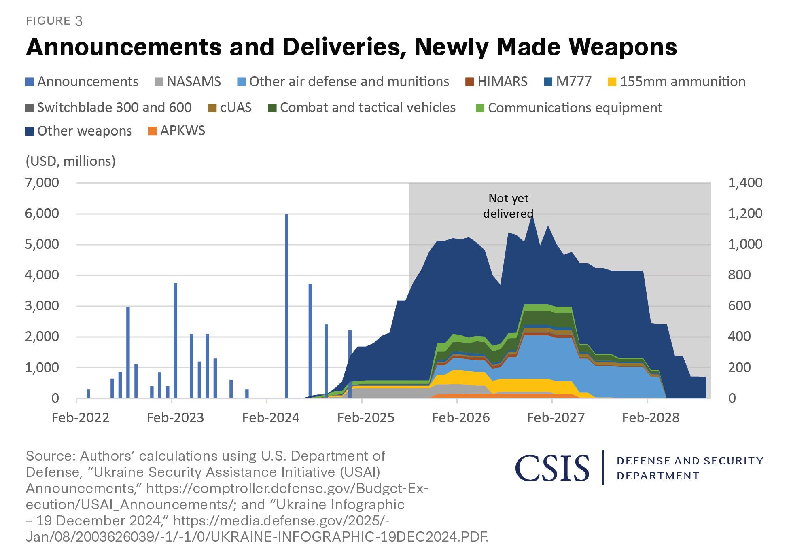

## Claim
Claim: "Ukraine is selling half of the armaments it receives from the United States"

## Actions
```
web_search("Ukraine US arms sales corruption")
web_search("US aid Ukraine arms tracking")
```

## Evidence
### Evidence from `web_search`
Al Jazeera ([https://www.aljazeera.com/news/2025/8/2/ukraine-says-defence-sector-corruption-scheme-uncovered](https://www.aljazeera.com/news/2025/8/2/ukraine-says-defence-sector-corruption-scheme-uncovered)) reported that Ukrainian authorities detained officials over a "large-scale corruption scheme" in the defense sector involving inflated prices for military drones and signal jamming systems, with kickbacks up to 30 percent of contract amounts <image:k>. Politico ([https://www.politico.eu/article/ukraine-uncovers-major-corruption-scheme-defense-procurment-days-after-restoring-anticorruption/](https://www.politico.eu/article/ukraine-uncovers-major-corruption-scheme-defense-procurment-days-after-restoring-anticorruption/)) also reported on a corruption scheme involving the procurement of military equipment at inflated prices, with participants receiving 30 percent of the contract amount.

PBS Frontline World ([https://www.pbs.org/frontlineworld/stories/sierraleone/context.html](https://www.pbs.org/frontlineworld/stories/sierraleone/context.html)) discusses illicit weapons, high-level corruption, and organized crime centered in Ukraine, which inherited huge stockpiles of arms after the collapse of the Soviet Union. The article states that Ukraine lost $32 billion in military assets between 1992 and 1998, in part through theft, discount arms sales, and lack of oversight.


### Evidence from `web_search`
Al Jazeera published an article on August 21, 2025, discussing US aid to Ukraine, which totaled 114.64 billion euros ($134bn) between January 24, 2022, and June 30, 2025. The aid includes military, financial, and humanitarian aid, as well as various weapons systems from allies. ([https://www.aljazeera.com/news/2025/8/21/tracking-us-and-nato-support-for-ukraine-a-full-breakdown](https://www.aljazeera.com/news/2025/8/21/tracking-us-and-nato-support-for-ukraine-a-full-breakdown)) , 

Forumarmstrade.org lists military aid packages to Ukraine from various countries, including the United States, Germany, France, and others. The aid includes artillery shells, ammunition, air defense systems, drones, and other military equipment. The document does not mention Ukraine selling armaments. The Kiel Institute for the World Economy provides a "Ukraine Support Tracker" database quantifying military, financial, and humanitarian aid pledged to Ukraine since January 24, 2022. ([https://www.ifw-kiel.de/topics/war-against-ukraine/ukraine-support-tracker/](https://www.ifw-kiel.de/topics/war-against-ukraine/ukraine-support-tracker/)) <image:k>


## Elaboration
The evidence reveals instances of corruption within Ukraine's defense sector, including inflated prices and kickbacks on procurement contracts. There is also evidence of past illicit arms sales and theft of military assets. However, the provided sources do not directly support the claim that Ukraine is selling half of the armaments it receives from the United States.

The Al Jazeera article ([https://www.aljazeera.com/news/2025/8/21/tracking-us-and-nato-support-for-ukraine-a-full-breakdown](https://www.aljazeera.com/news/2025/8/21/tracking-us-and-nato-support-for-ukraine-a-full-breakdown)) details the substantial US aid to Ukraine, but it does not mention any arms sales by Ukraine. The Kiel Institute for the World Economy's "Ukraine Support Tracker" ([https://www.ifw-kiel.de/topics/war-against-ukraine/ukraine-support-tracker/](https://www.ifw-kiel.de/topics/war-against-ukraine/ukraine-support-tracker/)) quantifies aid but does not address the claim.

To verify the claim, information is needed on the volume of arms received from the US, the volume of arms sold by Ukraine, and evidence linking the two.


## Actions
```
web_search("Ukraine arms sales US aid tracking")
web_search("Ukraine arms trafficking investigations")
```

## Evidence
### Evidence from `web_search`
The Global Initiative Against Transnational Organized Crime ([https://globalinitiative.net/analysis/future-trends-in-arms-trafficking-from-the-ukraine-conflict/](https://globalinitiative.net/analysis/future-trends-in-arms-trafficking-from-the-ukraine-conflict/)) discusses the potential for increased arms trafficking from Ukraine, but does not mention Ukraine selling armaments. The European Union Advisory Mission Ukraine (EUAM) ([https://www.euam-ukraine.eu/news/moia-launches-the-coordination-centre-to-combat-illicit-arms-trafficking/](https://www.euam-ukraine.eu/news/moia-launches-the-coordination-centre-to-combat-illicit-arms-trafficking/)) reported on the launch of a Coordination Centre to Combat Illicit Arms Trafficking by the Ministry of Internal Affairs of Ukraine , , , . The UN Office on Drugs and Crime (UNODC) ([https://news.un.org/en/story/2025/07/1165428](https://news.un.org/en/story/2025/07/1165428)) reported on the rise of arms seizures and violence in Ukraine, but does not mention Ukraine selling armaments received from the US.


## Elaboration
The new evidence continues to highlight concerns about arms trafficking and corruption within Ukraine's defense sector. However, it still does not provide any direct evidence to support the claim that Ukraine is selling half of the armaments it receives from the United States. The sources discuss the potential for arms trafficking and efforts to combat it, but they do not confirm the claim.

To verify the claim, specific data on the volume of arms received from the US, the volume of arms sold by Ukraine, and evidence linking the two is still needed.


## Actions
```
web_search("Ukraine arms sales US aid statistics")
```

## Evidence
### Evidence from `web_search`
The Council on Foreign Relations ([https://www.cfr.org/article/how-much-us-aid-going-ukraine](https://www.cfr.org/article/how-much-us-aid-going-ukraine)) states that Ukraine is the top recipient of U.S. aid, which includes weapons systems, training, and intelligence. The Center for Strategic and International Studies (CSIS) provides data on military aid to Ukraine, including announcements and deliveries of weapons ([https://www.csis.org/analysis/trump-sends-weapons-ukraine-numbers](https://www.csis.org/analysis/trump-sends-weapons-ukraine-numbers)) , . The U.S. State Department approved a Foreign Military Sale to Ukraine for Air Delivered Munitions, estimated at $825 million ([https://www.dsca.mil/Press-Media/Major-Arms-Sales/Article-Display/Article/4289280/ukraine-air-delivered-munitions](https://www.dsca.mil/Press-Media/Major-Arms-Sales/Article-Display/Article/4289280/ukraine-air-delivered-munitions)). None of these sources mention Ukraine selling armaments.


## Elaboration
The evidence consistently shows that Ukraine is a major recipient of U.S. military aid, including weapons systems. However, none of the provided sources support the claim that Ukraine is selling half of the armaments it receives from the United States. While there are reports of corruption and arms trafficking concerns, there is no direct evidence to substantiate the claim.

**Verdict:** The claim is not supported by the evidence.


## Final Judgement
The investigation revealed that Ukraine receives significant military aid from the United States, and there are documented instances of corruption and concerns about arms trafficking within Ukraine. However, the search results do not provide any evidence to support the claim that Ukraine is selling half of the armaments it receives from the United States.

`false`


### Verdict: FALSE

### Justification
The investigation found no evidence to support the claim that Ukraine is selling half of the armaments it receives from the United States. While Ukraine is a major recipient of U.S. military aid, and there are documented concerns about corruption and arms trafficking, the provided sources, including those from Al Jazeera ([https://www.aljazeera.com/news/2025/8/21/tracking-us-and-nato-support-for-ukraine-a-full-breakdown](https://www.aljazeera.com/news/2025/8/21/tracking-us-and-nato-support-for-ukraine-a-full-breakdown)) and the Council on Foreign Relations ([https://www.cfr.org/article/how-much-us-aid-going-ukraine](https://www.cfr.org/article/how-much-us-aid-going-ukraine)), do not mention or confirm any such sales.
