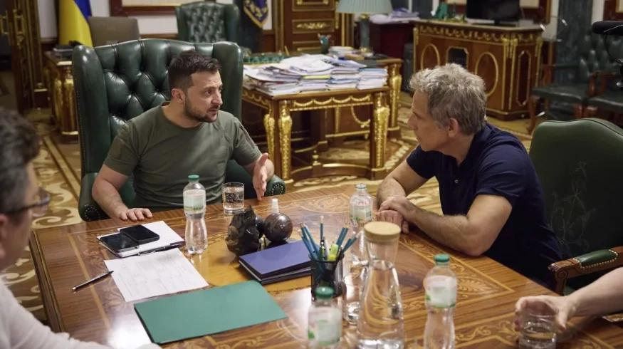
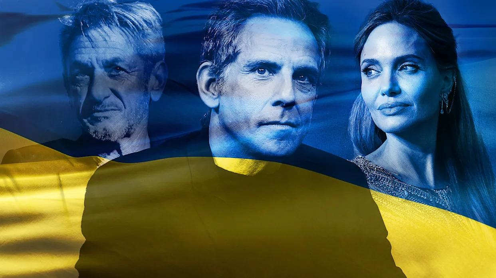
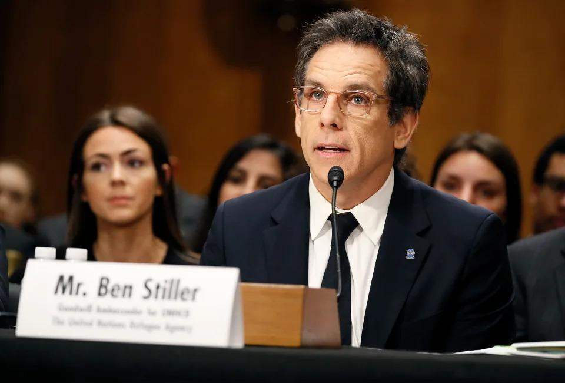
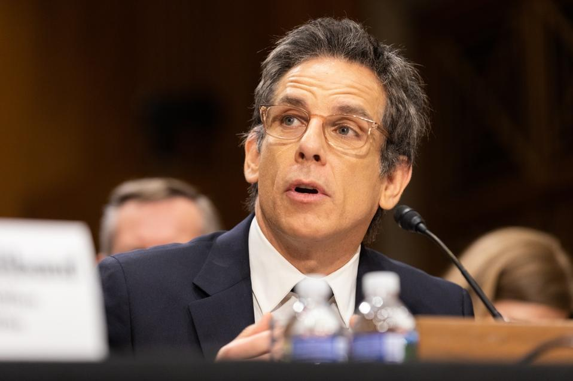

## Claim
Claim: " This image shows Ben Stiller and Ukrainian President Volodymyr Zelensky at their meeting on June 20, 2022, for which Stiller received $4 million from USAID."

## Actions
```
web_search("Ben Stiller Volodymyr Zelensky meeting June 20 2022 USAID")
```

## Evidence
### Evidence from `web_search`
Ben Stiller met with Ukrainian President Volodymyr Zelensky in June 2022, as reported by Vanity Fair, Yahoo News, and Forbes. Stiller denied claims that he received $4 million from USAID for the trip, with Vanity Fair stating that the claims are "totally false." The United Nations High Commissioner for Refugees (UNHCR) confirmed that Stiller self-funds his travel and is not compensated for his work.

Sources: [Vanity Fair](https://www.vanityfair.com/hollywood/story/ben-stiller-denies-elon-musks-retweet-claiming-usaid-funded-the-stars-trip-to-ukraine?srsltid=AfmBOormrIA9ayc8xI0YGRAOTH-4hZYMCTMVpCJtE4EoiLWKOIYPAvQL), [Yahoo News](https://www.yahoo.com/news/ben-stiller-shuts-down-lies-231648290.html), and [Forbes](https://www.forbes.com/sites/petersuciu/2025/02/07/usaid-didnt-pay-celebrities-to-travel-to-ukraine-despite-new-claims/).    


## Elaboration
The claim that Ben Stiller received $4 million from USAID for his meeting with Volodymyr Zelensky is false. Multiple sources, including Vanity Fair, Yahoo News, and Forbes, report that Stiller denied receiving any payment for the trip. The UNHCR confirmed that Stiller self-funds his travel and is not compensated for his work.


## Final Judgement
The image accurately depicts Ben Stiller and Volodymyr Zelensky's meeting on June 20, 2022. However, the claim that Stiller received $4 million from USAID is false. Multiple sources confirm that Stiller denied receiving any payment and that he self-funds his travel.

`false`

### Verdict: FALSE

### Justification
The image accurately depicts Ben Stiller and Volodymyr Zelensky's meeting in June 2022. However, the assertion that Stiller received $4 million from USAID for the trip is false. Multiple sources, including [Vanity Fair](https://www.vanityfair.com/hollywood/story/ben-stiller-denies-elon-musks-retweet-claiming-usaid-funded-the-stars-trip-to-ukraine?srsltid=AfmBOormrIA9ayc8xI0YGRAOTH-4hZYMCTMVpCJtE4EoiLWKOIYPAvQL), [Yahoo News](https://www.yahoo.com/news/ben-stiller-shuts-down-lies-231648290.html), and [Forbes](https://www.forbes.com/sites/petersuciu/2025/02/07/usaid-didnt-pay-celebrities-to-travel-to-ukraine-despite-new-claims/), confirm that Stiller denied receiving payment and self-funds his travel.
