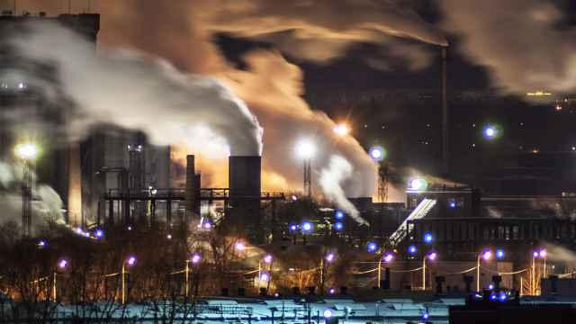

## Claim
Claim: "French President Emmanuel Macron called Russian President Vladimir Putin a 'butcher' during his press conference with Donald Trump on Monday, Feb. 24, 2025."

## Actions
```
web_search("Emmanuel Macron Vladimir Putin butcher February 24 2025")
```

## Evidence
### Evidence from `web_search`
According to a Yahoo News UK article, Emmanuel Macron did not call Vladimir Putin a "butcher" during a press conference with Donald Trump on February 24, 2025. Instead, Macron referred to the killings of Ukrainian civilians in Bucha in 2022. The article includes a video clip and a transcript of the press conference. 

France 24 and The Moscow Times reported that Macron warned against escalating the situation after Joe Biden called Putin a "butcher" in March 2022. <image:i>, , ,  The articles mention Macron's plans to speak with Putin to organize the evacuation of civilians.


## Elaboration
The evidence indicates that the claim is false. A Yahoo News UK article states that Macron did not call Putin a "butcher" during a press conference with Donald Trump on February 24, 2025. Instead, Macron referred to the killings of Ukrainian civilians in Bucha in 2022. Furthermore, France 24 and The Moscow Times reported that Macron warned against escalating the situation after Joe Biden called Putin a "butcher" in March 2022.


## Final Judgement
The claim is demonstrably false. The provided evidence, including a Yahoo News UK article, indicates that Macron did not call Putin a "butcher" during a press conference with Donald Trump on the specified date.

`false`


### Verdict: FALSE

### Justification
The claim is false. According to a Yahoo News UK article, Emmanuel Macron did not call Vladimir Putin a "butcher" during a press conference with Donald Trump on February 24, 2025. Instead, Macron referred to the killings of Ukrainian civilians in Bucha in 2022.
