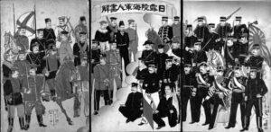
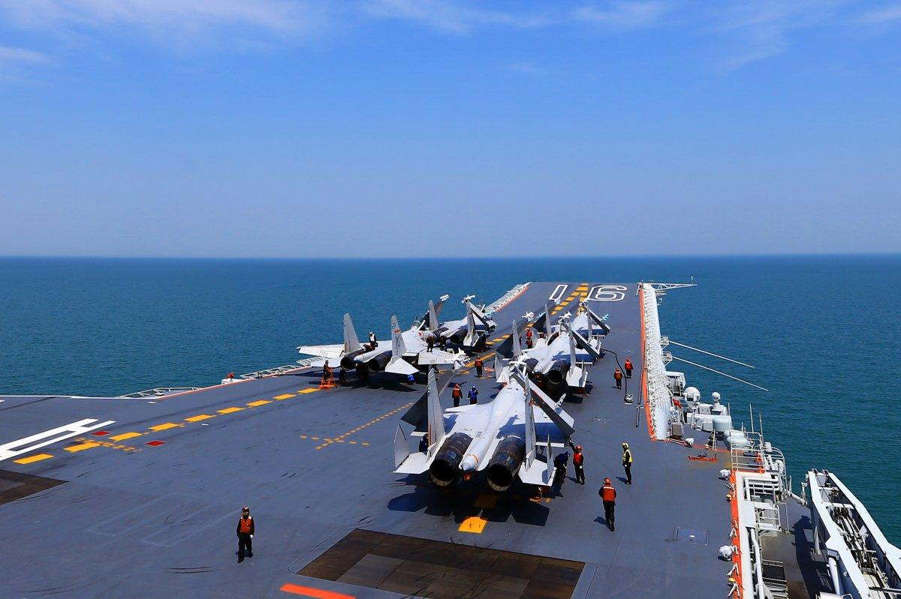

## Claim
Claim: "China and Japan plan to invade the Russian Federation."

## Actions
```
web_search("China Japan Russia invasion plans")
web_search("China Russia military alliance")
web_search("Japan Russia relations")
```

## Evidence
### Evidence from `web_search`
The provided web sources discuss the relationship between Japan and Russia. Japan-Russia relations have been strained, especially since 2022, when Japan imposed sanctions on Russia following the invasion of Ukraine, as detailed in an article from the South China Morning Post ([https://www.scmp.com/week-asia/politics/article/3296430/rock-bottom-100-years-japan-russia-ties-come-full-circle](https://www.scmp.com/week-asia/politics/article/3296430/rock-bottom-100-years-japan-russia-ties-come-full-circle)). The history of Japan-Russia relations, including the Russo-Japanese War and current relations, is discussed on Wikipedia ([https://en.wikipedia.org/wiki/Japan%E2%80%93Russia_relations](https://en.wikipedia.org/wiki/Japan%E2%80%93Russia_relations)).

The Tokyo Declaration on Japan-Russia Relations, from the Ministry of Foreign Affairs of Japan ([https://www.mofa.go.jp/region/n-america/us/q&a/declaration.html](https://www.mofa.go.jp/region/n-america/us/q&a/declaration.html)), discusses the importance of normalizing relations, promoting peace, and continuing dialogue.


## Elaboration
The evidence focuses on Japan-Russia relations, highlighting historical tensions and current strains due to the war in Ukraine. The sources also mention Japan's sanctions against Russia.

The provided sources do not mention any invasion plans by China or Japan against Russia.

The claim cannot be verified due to a lack of evidence.


## Actions
```
web_search("China Russia military conflict")
web_search("Japan Russia military conflict")
```

## Evidence
### Evidence from `web_search`
The search results include a Wikipedia article discussing the Sino-Soviet border conflict of 1969 ([https://en.wikipedia.org/wiki/Sino-Soviet_border_conflict](https://en.wikipedia.org/wiki/Sino-Soviet_border_conflict)) <image:i>. Another article from the Center for European Policy Analysis (CEPA) discusses military cooperation between Russia and China, noting China's cautious approach and joint military exercises ([https://cepa.org/comprehensive-reports/partnership-short-of-alliance-military-cooperation-between-russia-and-china/](https://cepa.org/comprehensive-reports/partnership-short-of-alliance-military-cooperation-between-russia-and-china/)) . A CNN article from July 4, 2025, reports on China's stance on the war in Ukraine, including strengthened ties with Russia ([https://www.cnn.com/2025/07/04/europe/china-ukraine-eu-war-intl](https://www.cnn.com/2025/07/04/europe/china-ukraine-eu-war-intl)) , .


### Evidence from `web_search`
The web sources discuss the Russo-Japanese War of 1904-1905, focusing on its historical context, the involvement of various nations, and its impact on international relations. One source is a Wikipedia article ([https://en.wikipedia.org/wiki/Russo-Japanese_War](https://en.wikipedia.org/wiki/Russo-Japanese_War)) detailing the war's causes, events, and outcomes.

Another source ([https://www.asianstudies.org/publications/eaa/archives/the-russo-japanese-war-and-world-history/](https://www.asianstudies.org/publications/eaa/archives/the-russo-japanese-war-and-world-history/)) highlights the global impact of the war, considering it a precursor to World War I, and includes images of soldiers ,  and .


## Elaboration
The evidence reveals that China and Russia have military cooperation, including joint exercises, but China maintains a cautious approach. Japan and Russia have strained relations, particularly due to the war in Ukraine. The evidence does not support the claim that China and Japan plan to invade Russia. The Sino-Soviet border conflict of 1969 and the Russo-Japanese War are mentioned as historical events.

The claim remains unverified due to a lack of evidence.


## Actions
```
web_search("China Russia military threat")
web_search("Japan Russia military threat")
```

## Evidence
### Evidence from `web_search`
The web sources discuss military tensions and activities involving China, Japan, and Russia. Al Jazeera reports that Russia and China have warned Japan about the deployment of US missiles, viewing it as a threat ([https://www.aljazeera.com/news/2025/8/30/russia-china-blast-deployment-of-us-typhon-missiles-to-japan](https://www.aljazeera.com/news/2025/8/30/russia-china-blast-deployment-of-us-typhon-missiles-to-japan)) <image:i>. Newsweek highlights joint military drills between China and Russia in the Sea of Japan, which Japan views with concern ([https://www.newsweek.com/china-russia-drills-trump-2108410](https://www.newsweek.com/china-russia-drills-trump-2108410)) 

### Evidence from `web_search`
From [Source](https://www.nbcnews.com/world/russia/russia-warns-us-south-korea-japan-forming-security-alliance-targeting-rcna217967): 
Content: The NBC News article, published on July 12, 2025, reports that Russia warned the U.S., South Korea, and Japan against forming a security alliance targeting North Korea.   The article mentions that Russia and North Korea are strengthening their ties, with North Korea supporting Russia's war against Ukraine. The article does not mention any invasion plans by China or Japan against Russia.


## Elaboration
The evidence indicates that China and Russia are conducting joint military drills, which Japan views with concern. Russia has also warned the U.S., South Korea, and Japan against forming a security alliance. However, the evidence does not support the claim that China and Japan plan to invade Russia.

The claim remains unverified.


## Final Judgement
The fact-check reveals that while there are military tensions and activities involving China, Japan, and Russia, including joint military drills between China and Russia, and strained relations between Japan and Russia, there is no evidence to support the claim that China and Japan plan to invade Russia.

`false`


### Verdict: FALSE

### Justification
The fact-check found no evidence to support the claim that China and Japan plan to invade Russia. While there are documented military tensions and activities involving these countries, including joint military drills between China and Russia and strained relations between Japan and Russia, the provided sources do not mention any invasion plans ([https://www.aljazeera.com/news/2025/8/30/russia-china-blast-deployment-of-us-typhon-missiles-to-japan](https://www.aljazeera.com/news/2025/8/30/russia-china-blast-deployment-of-us-typhon-missiles-to-japan), [https://www.newsweek.com/china-russia-drills-trump-2108410](https://www.newsweek.com/china-russia-drills-trump-2108410)).
