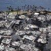

## Claim
Claim: "Russia offered assistance for the California wildfires from January 2025."

## Actions
```
web_search("Russia California wildfires assistance 2025")
```

## Evidence
### Evidence from `web_search`
Tasnim News Agency published an article on January 12, 2025, discussing Russia's comments on the California wildfires, including comments from Maria Zakharova. The article mentions that wildfires began to spread across Los Angeles County on January 7. ([https://www.tasnimnews.com/en/news/2025/01/12/3236714/russia-notes-us-hypocrisy-in-california-fire-case](https://www.tasnimnews.com/en/news/2025/01/12/3236714/russia-notes-us-hypocrisy-in-california-fire-case)) , 

The Dispatch published an article on January 15, 2025, discussing claims that Russia offered sanctuary to California fire victims. Vladimir Saldo offered to accept Americans who lost their homes in the California fires, but only those who haven't supported Ukraine since February 2022. ([https://thedispatch.com/article/assessing-claims-that-russia-offered-sanctuary-to-california-fire-victims/](https://thedispatch.com/article/assessing-claims-that-russia-offered-sanctuary-to-california-fire-victims/)) 

An NPR article, published on January 16, 2025, discusses how pro-Kremlin social media accounts spread a narrative about the Los Angeles wildfires. The article states that Russian news sites are spreading false or unverified narratives about the California fires. ([https://www.npr.org/2025/01/16/nx-s1-5259842/los-angeles-california-fires-russia-ukraine](https://www.npr.org/2025/01/16/nx-s1-5259842/los-angeles-california-fires-russia-ukraine)) , 


## Elaboration
The evidence indicates that Russia commented on the California wildfires and that Vladimir Saldo offered sanctuary to fire victims. However, the evidence does not explicitly state that Russia offered assistance for the California wildfires.

The NPR article suggests that Russian news sites spread false or unverified narratives about the fires. Therefore, the claim cannot be verified based on the provided evidence.

To verify the claim, information about any specific offers of assistance from Russia would be needed.


## Actions
```
web_search("Russia California wildfires assistance offer")
```

## Evidence
### Evidence from `web_search`
From [Source](https://www.voanews.com/a/russia-exploits-wildfires-in-los-angeles-to-push-anti-u-s-anti-ukraine-propaganda/7938909.html): 
Content: Voice of America published an article on January 16, 2025, discussing how Russia exploited the Los Angeles wildfires to push anti-US and anti-Ukraine propaganda. The article mentions Maria Zakharova, who accused the U.S. of hypocrisy regarding the use of inmate firefighters. The article also mentions that Lavrov claimed the damage from the fires was comparable to the U.S. aid to Ukraine. 


## Elaboration
The new evidence from Voice of America ([https://www.voanews.com/a/russia-exploits-wildfires-in-los-angeles-to-push-anti-u-s-anti-ukraine-propaganda/7938909.html](https://www.voanews.com/a/russia-exploits-wildfires-in-los-angeles-to-push-anti-u-s-anti-ukraine-propaganda/7938909.html)) does not mention any offers of assistance from Russia. Instead, it focuses on Russia's exploitation of the wildfires for propaganda purposes.

The evidence suggests that Russia used the wildfires to criticize the U.S. and promote anti-Ukraine narratives. However, there is still no mention of Russia offering any form of assistance.

Therefore, the claim remains unverified.


## Actions
```
web_search("Russia California wildfires aid offer details")
```

## Evidence
### Evidence from `web_search`
From [Source](https://www.gmfus.org/news/inflaming-divides-russian-narratives-california-wildfires): 
Content: The German Marshall Fund published an article on January 15, 2025, discussing how Russian state-affiliated accounts leveraged the California wildfires to sow division, undermine trust in relief efforts, and reduce public support for Ukraine. The article mentions that Russian government officials and state-affiliated media propagated narratives critical of the Biden administration. The article also mentions that Russian Foreign Minister Sergey Lavrov claimed the damage from the California fires was comparable to the amount Washington "pumped into Ukraine." The article does not mention any offers of assistance from Russia.


## Elaboration
The evidence consistently shows that Russia commented on the California wildfires and used them to criticize the U.S. and promote anti-Ukraine narratives. However, none of the provided sources mention Russia offering any form of assistance for the wildfires.

Therefore, the claim remains unverified.


## Final Judgement
The fact-check reveals that while Russia commented on the California wildfires in January 2025 and used them to criticize the U.S., there is no evidence to support the claim that Russia offered assistance. The search results highlight Russian propaganda and narratives related to the fires, but no offers of aid are mentioned.

`false`


### Verdict: FALSE

### Justification
The fact-check reveals that while Russia commented on the California wildfires in January 2025, there is no evidence to support the claim that Russia offered assistance. Sources like the [Tasnim News Agency](https://www.tasnimnews.com/en/news/2025/01/12/3236714/russia-notes-us-hypocrisy-in-california-fire-case), [The Dispatch](https://thedispatch.com/article/assessing-claims-that-russia-offered-sanctuary-to-california-fire-victims/), [NPR](https://www.npr.org/2025/01/16/nx-s1-5259842/los-angeles-california-fires-russia-ukraine), [Voice of America](https://www.voanews.com/a/russia-exploits-wildfires-in-los-angeles-to-push-anti-u-s-anti-ukraine-propaganda/7938909.html), and the [German Marshall Fund](https://www.gmfus.org/news/inflaming-divides-russian-narratives-california-wildfires) highlight Russian commentary and propaganda related to the fires, but no offers of aid are mentioned.
