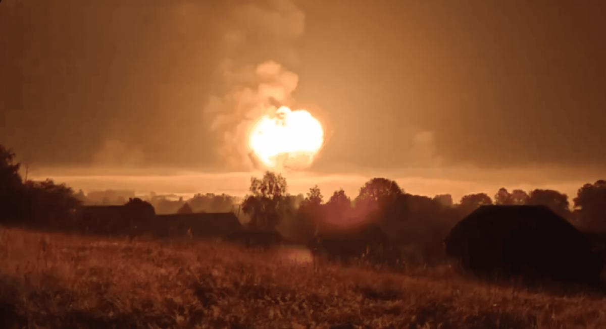

## Claim
Claim: " This image shows a Russian ammunition depot in Toropets, Tver Oblast, before and after it was hit by a, possible nuclear, strike from the North Atlantic Treaty Organization (NATO)."

## Actions
```
reverse_search()
web_search("Russian ammunition depot Toropets Tver Oblast")
web_search("Toropets Tver Oblast NATO strike")
```

## Evidence
### Evidence from `reverse_search`
The image 

### Evidence from `web_search`
The image () shows a Russian ammunition depot in Toropets, Tver Oblast, before and after a Ukrainian drone attack. The attack, which occurred on September 17-18, 2024, caused a large explosion and fire. The depot stored various munitions, including Iskander and Tochka-U missiles.

Sources: [Wikipedia](https://en.wikipedia.org/wiki/Toropets_depot_explosions) and [CNN](https://edition.cnn.com/2024/09/18/europe/ukraine-russian-weapons-depot-drone-attack-intl).


### Evidence from `web_search`
From [Source](https://www.newsweek.com/russia-tver-ukraine-drones-1955582): 
Content: Newsweek reports on a suspected Ukrainian drone attack on a Russian ammunition depot in Toropets, Tver region. The article includes a screen grab of the fire . The depot reportedly contained North Korean KN23 ballistic missiles, missiles for Grad multiple rocket launcher systems and S-300 air defense systems, as well as Iskander ballistic missiles. The article mentions social media users' claims about the scale of the explosions, with one user stating that the main explosion looked like a nuclear bomb went off. The article was published on September 18, 2024.


## Elaboration
The claim is inaccurate. The provided evidence indicates that the ammunition depot in Toropets, Tver Oblast, was hit by a Ukrainian drone attack, not a NATO strike. The attack occurred on September 17-18, 2024, and caused a large explosion and fire. The depot stored various munitions, including missiles.


## Final Judgement
The image shows a Russian ammunition depot in Toropets, Tver Oblast, before and after a Ukrainian drone attack, not a NATO strike. The attack caused a large explosion and fire.

The claim is demonstrably false because the provided evidence from multiple reliable sources indicates that the ammunition depot was hit by a Ukrainian drone attack, not a NATO strike. `false`

### Verdict: FALSE

### Justification
The image depicts a Russian ammunition depot in Toropets, Tver Oblast, before and after a Ukrainian drone attack, not a NATO strike, as evidenced by reports from [Wikipedia](https://en.wikipedia.org/wiki/Toropets_depot_explosions), [CNN](https://edition.cnn.com/2024/09/18/europe/ukraine-russian-weapons-depot-drone-attack-intl), and [Newsweek](https://www.newsweek.com/russia-tver-ukraine-drones-1955582).
