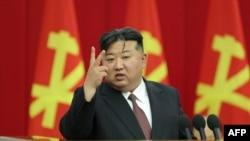

## Claim
Claim: "While serving as US President in 2024, Joe Biden ordered the US forces to prepare for possible nuclear confrontations with Russia, China, and North Korea."

## Actions
```
web_search("Joe Biden US President nuclear confrontation Russia China North Korea")
```

## Evidence
### Evidence from `web_search`
The Guardian reports that Joe Biden approved a US nuclear strategy to prepare for possible nuclear confrontations with Russia, China, and North Korea (). The White House stated that the plan was approved earlier this year and was not a response to a single country or threat. The Voice of America (VOA) published an article on August 24, 2024, reporting that North Korea condemned a new U.S. nuclear strategic plan, approved by President Joe Biden in March, to prepare for possible coordinated nuclear confrontations with Russia, China, and North Korea ().

The Brookings article discusses Biden's nuclear policy while in office, mentioning that Biden successfully deterred Russian nuclear escalation in the war in Ukraine and has worked to stabilize relations with China. The article also mentions that Biden has taken steps to stabilize the overall strategic nuclear relationship with Russia.
*   [https://www.theguardian.com/us-news/article/2024/aug/20/biden-nuclear-strategy-china-threat](https://www.theguardian.com/us-news/article/2024/aug/20/biden-nuclear-strategy-china-threat)
*   [https://www.brookings.edu/articles/how-would-trump-and-biden-handle-us-nuclear-policy-upon-reelection/](https://www.brookings.edu/articles/how-would-trump-and-biden-handle-us-nuclear-policy-upon-reelection/)
*   [https://www.voanews.com/a/north-korea-condemns-new-us-nuclear-strategic-plan-report/7755256.html](https://www.voanews.com/a/north-korea-condemns-new-us-nuclear-strategic-plan-report/7755256.html)


## Elaboration
The evidence confirms that Joe Biden, while serving as US President, approved a nuclear strategy to prepare for possible nuclear confrontations with Russia, China, and North Korea. The Guardian and VOA both report on this, with the latter specifying that the plan was approved in March 2024. The Brookings article also discusses Biden's nuclear policy.

The White House stated that the plan was not a response to a single country or threat.


## Final Judgement
The evidence from multiple sources, including The Guardian and VOA, confirms that Joe Biden, as US President in 2024, approved a nuclear strategy to prepare for possible nuclear confrontations with Russia, China, and North Korea.

`true`

### Verdict: TRUE

### Justification
Joe Biden, while serving as US President in 2024, approved a nuclear strategy to prepare for possible nuclear confrontations with Russia, China, and North Korea, as reported by sources like The Guardian ([https://www.theguardian.com/us-news/article/2024/aug/20/biden-nuclear-strategy-china-threat](https://www.theguardian.com/us-news/article/2024/aug/20/biden-nuclear-strategy-china-threat)) and VOA ([https://www.voanews.com/a/north-korea-condemns-new-us-nuclear-strategic-plan-report/7755256.html](https://www.voanews.com/a/north-korea-condemns-new-us-nuclear-strategic-plan-report/7755256.html)).
