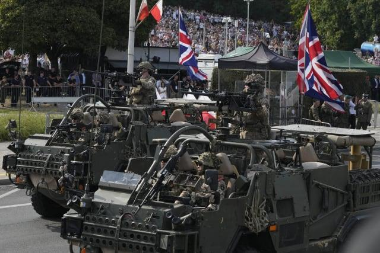

## Claim
Claim: " This image shows a military parade of Poland's army on August 14, 2024, preparing for war with Russia."

## Actions
```
web_search("Poland army parade August 14 2024")
image_search("Poland army parade August 14 2024")
reverse_search()
```

## Evidence
### Evidence from `web_search`
The web sources discuss Poland's Armed Forces Day, celebrated on August 15th, which commemorates the 1920 victory over Soviet Russia. The event includes military parades and equipment reviews. One article from the Associated Press ([https://apnews.com/article/poland-armed-forces-day-russia-army-parade-db5c8663bf0b6e3c403b0c8482da4aed](https://apnews.com/article/poland-armed-forces-day-russia-army-parade-db5c8663bf0b6e3c403b0c8482da4aed)) mentions a military parade in Warsaw on August 15, 2024, and includes the image 

### Evidence from `image_search`
The web sources describe military parades in Poland. Militarnyi.com reports on a large-scale parade dedicated to the Day of the Polish Army ([https://militarnyi.com/en/news/a-large-scale-parade-dedicated-to-the-day-of-the-polish-army-took-place-in-poland/](https://militarnyi.com/en/news/a-large-scale-parade-dedicated-to-the-day-of-the-polish-army-took-place-in-poland/)).

KSAT.com shows a military parade in Poland on August 15, 2024 ([https://www.ksat.com/news/world/2024/08/15/poland-showcases-its-growing-army-on-a-holiday-that-celebrates-its-historic-defeat-of-the-red-army/](https://www.ksat.com/news/world/2024/08/15/poland-showcases-its-growing-army-on-a-holiday-that-celebrates-its-historic-defeat-of-the-red-army/)). The image from the first source is , and the image from the second source is .


## Elaboration
The claim that the image shows a military parade on August 14, 2024, is inaccurate. The evidence indicates that the parade took place on August 15, 2024, as part of Poland's Armed Forces Day. The parade commemorates the victory over Soviet Russia.

The evidence does not support the claim that the parade was preparing for war with Russia.


## Final Judgement
The image is from a military parade in Poland on August 15, 2024, not August 14, 2024. The parade is part of the Armed Forces Day celebrations. The claim that the parade is preparing for war with Russia is not supported by the evidence. `false`

### Verdict: FALSE

### Justification
The image depicts a military parade in Poland on August 15, 2024, as part of the Armed Forces Day celebrations, as confirmed by sources like the Associated Press ([https://apnews.com/article/poland-armed-forces-day-russia-army-parade-db5c8663bf0b6e3c403b0c8482da4aed](https://apnews.com/article/poland-armed-forces-day-russia-army-parade-db5c8663bf0b6e3c403b0c8482da4aed)). The parade commemorates Poland's victory over Soviet Russia, and there is no evidence to support the claim that it was preparing for war.
