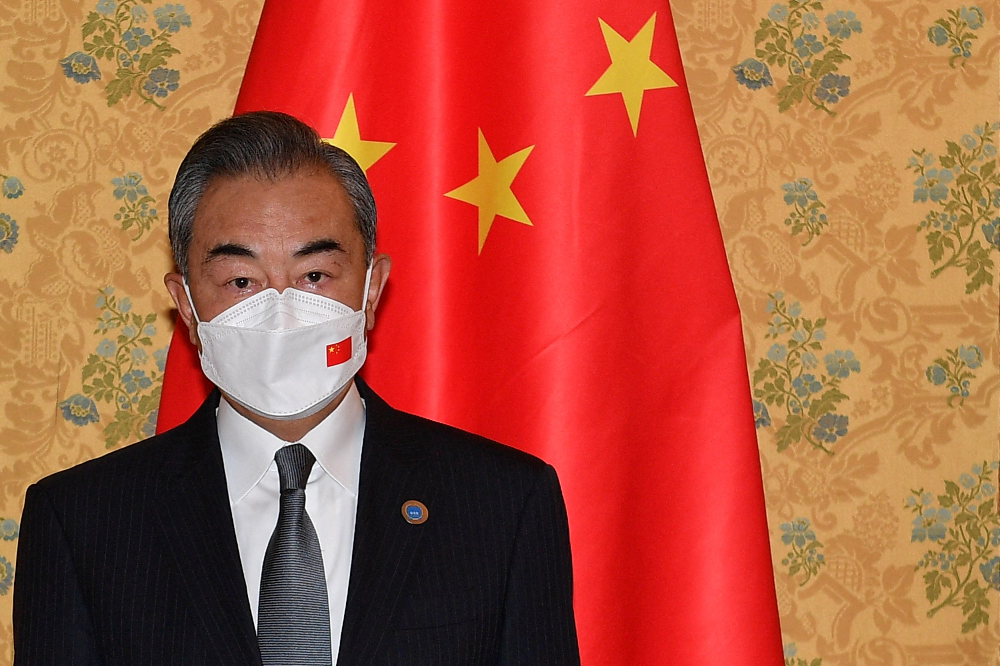
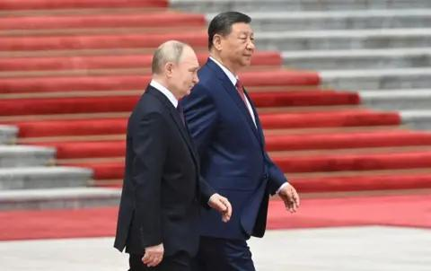
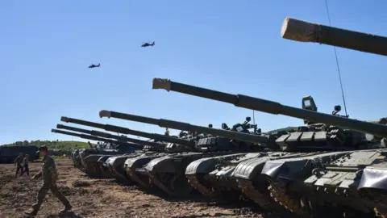
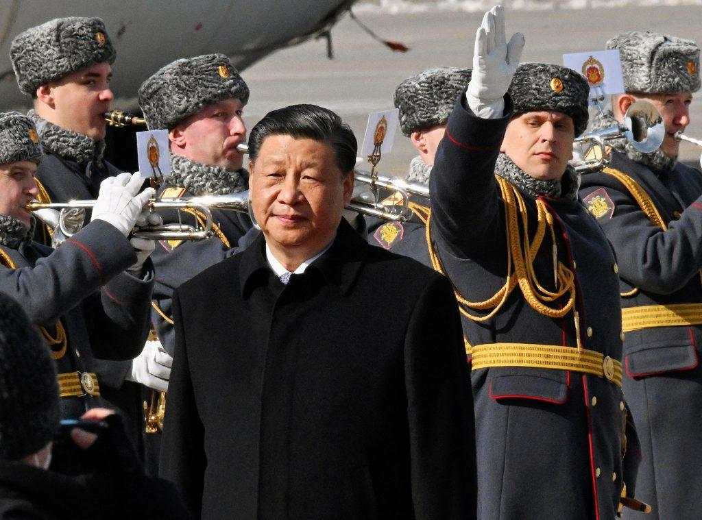
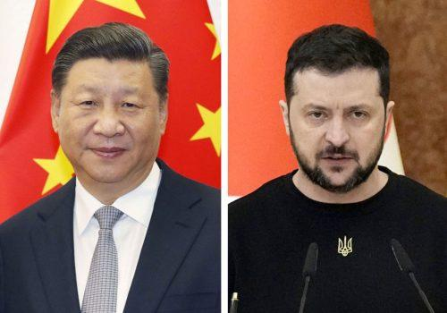
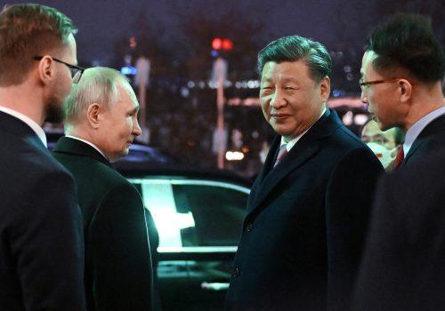
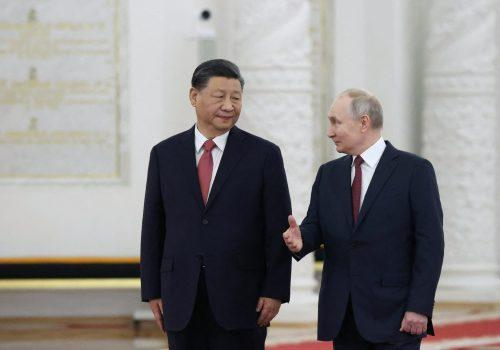
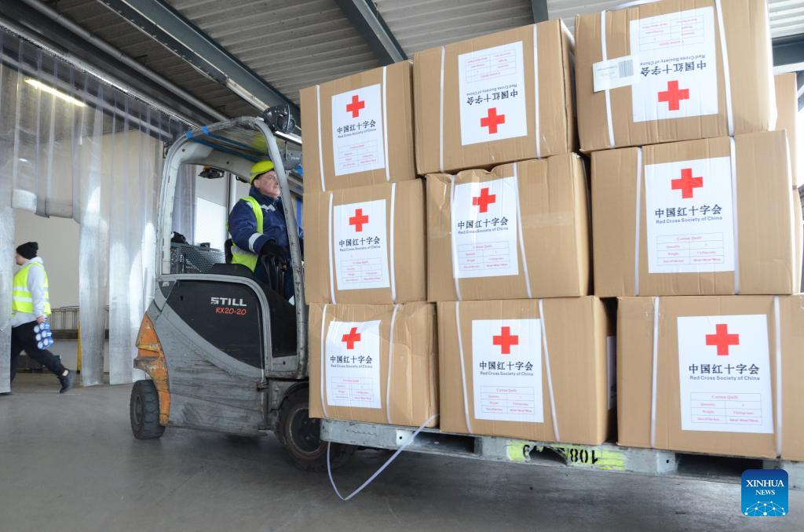

## Claim
Claim: " This image shows the Chinese Communist Party's Red Cross troops in Russia who have changed into winter clothes and set off for the Russian-Ukrainian front to aid Russia in rescuing its occupied territories."

## Actions
```
reverse_search()
web_search("Chinese Red Cross troops Russia Ukraine")
```

## Evidence
### Evidence from `reverse_search`
The reverse image search found the image on Wikipedia ([Airliner - Wikipedia](https://en.wikipedia.org/wiki/Airliner)) and Merriam-Webster ([AIRLINER Definition & Meaning - Merriam-Webster](https://www.merriam-webster.com/dictionary/airliner)). The Wikipedia article discusses airliners, while the Merriam-Webster entry defines the word "airliner". The Smithsonian National Air and Space Museum ([The Evolution of the Commercial Airliner](https://airandspace.si.edu/explore/stories/evolution-commercial-airliner)) also features the image and discusses the evolution of commercial airliners. 


### Evidence from `web_search`
CNN published an article on April 16, 2025, discussing the capture of Chinese nationals fighting for Russia in Ukraine, including an image of a captured Chinese national (). The Guardian reported on May 9, 2025, that Chinese troops marched with Russian forces in Moscow's Victory Day parade (, , ). The International Federation of Red Cross and Red Crescent Societies and the International Committee of the Red Cross published a report on the Red Cross Red Crescent Movement's response to the Russia-Ukraine conflict, mentioning the involvement of the Russian Red Cross Society and the Red Cross Society of China.


## Elaboration
The evidence suggests that the claim is partially accurate. The image is of an airliner. The web search results confirm the involvement of the Red Cross Society of China in the Russia-Ukraine conflict. However, the evidence does not explicitly state that the Chinese Red Cross troops have changed into winter clothes and set off for the Russian-Ukrainian front to aid Russia in rescuing its occupied territories. The evidence also shows that Chinese nationals were captured fighting for Russia in Ukraine and that Chinese troops marched with Russian forces in Moscow's Victory Day parade.

Therefore, the claim is partially supported, but the specific details about the troops' attire and mission are not confirmed by the evidence.

Insufficient information is available to verify the claim's veracity.


## Actions
```
web_search("Chinese Red Cross aid Russia Ukraine")
image_search("Chinese Red Cross troops Ukraine")
```

## Evidence
### Evidence from `web_search`
Reuters reported that China's Red Cross would provide humanitarian aid to Ukraine as soon as possible, while also noting China's refusal to condemn Russia's actions and the strong relationship between the two countries (). The BBC reported on China's support for Russia after sanctions were imposed, highlighting the increased trade between the two countries and China's denial of providing weapons to Russia (, ). CNN reported that the US warned China against providing lethal military aid to Russia.


### Evidence from `image_search`
The Center for European Policy Analysis (CEPA) shows an image of a vehicle with a Red Cross symbol (

## Elaboration
The new evidence provides additional context. The web search indicates that China's Red Cross has offered humanitarian aid to Ukraine, but China has not condemned Russia's actions and has increased trade with Russia. The image search shows a vehicle with a Red Cross symbol.

The claim is still not fully supported. While the Red Cross Society of China is involved, the evidence does not confirm that Chinese Red Cross troops have changed into winter clothes and set off for the Russian-Ukrainian front to aid Russia in rescuing its occupied territories. The evidence suggests a more nuanced situation, with China providing humanitarian aid to Ukraine while maintaining a close relationship with Russia.


## Actions
```
web_search("Chinese Red Cross Russia Ukraine military aid")
image_search("Chinese Red Cross Ukraine aid")
```

## Evidence
### Evidence from `web_search`
From [Source](https://www.atlanticcouncil.org/blogs/new-atlanticist/chinas-support-may-not-be-lethal-aid-but-its-vital-to-russias-aggression-in-ukraine/): 
Content: The Atlantic Council published an article on April 26, 2023, discussing China's support for Russia in the war against Ukraine. The article mentions that China's support may not be "lethal aid," but it is vital to Russia's aggression. The article also mentions that China's Xi Jinping and Ukrainian President Volodymyr Zelenskyy spoke for over an hour by phone on April 26. The article also states that China is providing equipment and materials critical for military uses, such as transport vehicles and semiconductors, which enables Russian military forces to sustain their offensive. , , , .


### Evidence from `image_search`
The China Daily reported that the Red Cross Society of China provided humanitarian aid to Ukraine, with an image of aid boxes being loaded onto a forklift (

## Elaboration
The latest evidence further clarifies China's position. The Atlantic Council article indicates that China provides equipment and materials critical for military uses to Russia, even if it's not "lethal aid." The image search shows the Red Cross Society of China providing humanitarian aid to Ukraine.

The claim is still not fully supported. While the Red Cross Society of China is involved in providing humanitarian aid, the evidence does not confirm that Chinese Red Cross troops have changed into winter clothes and set off for the Russian-Ukrainian front to aid Russia in rescuing its occupied territories. The evidence suggests a more complex situation, with China providing humanitarian aid to Ukraine while also supporting Russia's military efforts.


## Final Judgement
The image is of an airliner. The claim that the image shows Chinese Red Cross troops in Russia who have changed into winter clothes and set off for the Russian-Ukrainian front to aid Russia in rescuing its occupied territories is not supported by the evidence. The evidence indicates that China has provided humanitarian aid to Ukraine and has also supported Russia's military efforts. The claim is therefore misleading. `false`


### Verdict: FALSE

### Justification
The claim is **false**. While the image depicts an airliner, the assertion that it shows Chinese Red Cross troops aiding Russia in Ukraine is not supported. Evidence indicates that China has provided humanitarian aid to Ukraine while also supporting Russia's military efforts, making the claim misleading.
