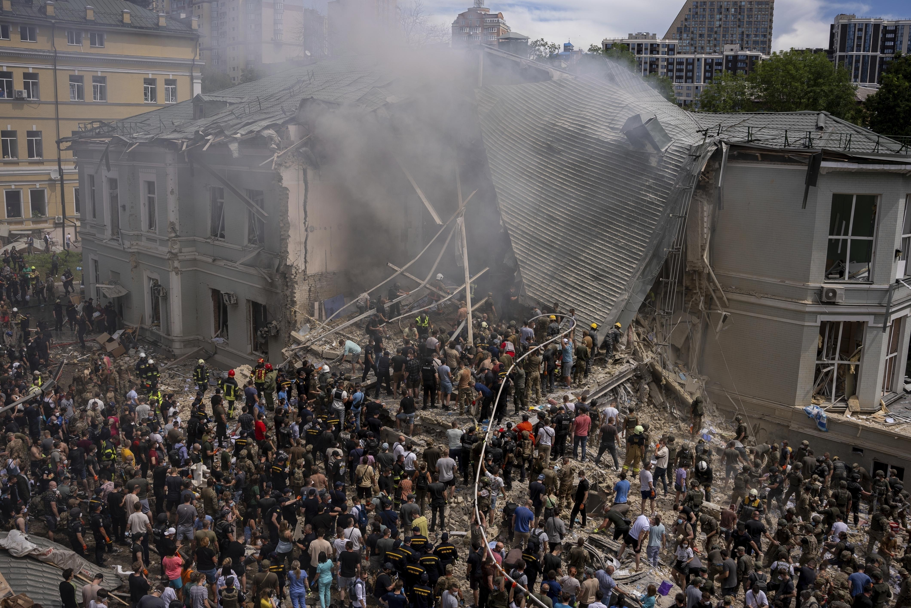

## Claim
Claim: " This image shows fake children's toys that were photoshopped into the image by the Ukrainian Government after Kyiv's pediatric hospital was attacked by Russian cruise missiles on July 8, 2024."

## Actions
```
reverse_search()
web_search("Kyiv pediatric hospital attack July 8 2024")
```

## Evidence
### Evidence from `reverse_search`
The Kyiv Independent published an article on July 9, 2024, reporting on a Russian strike in Kyiv on July 8, 2024, that hit a building in the Schevchenkyvskyi district, resulting in the death of a boy. The article mentions that the Okhmatdyt hospital was also directly targeted in the attack. The image 

### Evidence from `web_search`
On July 8, 2024, a children's hospital in Kyiv, Ukraine, was attacked by Russian forces, resulting in at least 42 civilian deaths, including five children. The attack severely damaged several departments, including intensive care, surgical, and oncology wards. The attacks resulted in at least 47 deaths and 189 injuries.

The Russian Ministry of Defence claimed the strikes targeted defense industry targets and aviation bases, blaming damage to civilian infrastructure on Ukrainian air defense missiles. The international community condemned the attacks. The image 

## Elaboration
The evidence confirms that a children's hospital in Kyiv was attacked on July 8, 2024. The image 

## Actions
```
image_search("Kyiv hospital attack toys")
web_search("Kyiv hospital attack photoshopped toys")
```

## Evidence
### Evidence from `image_search`
The NPR article ([https://www.npr.org/2024/07/08/nx-s1-5033075/russia-ukraine-war-missile-strike-childrens-hospital-kyiv](https://www.npr.org/2024/07/08/nx-s1-5033075/russia-ukraine-war-missile-strike-childrens-hospital-kyiv)) discusses the Russian missile strike on a children's hospital in Kyiv on July 8, 2024. 

PBS NewsHour ([https://www.pbs.org/newshour/world/rescue-operations-continue-at-ukraine-childrens-hospital-struck-by-russian-missiles](https://www.pbs.org/newshour/world/rescue-operations-continue-at-ukraine-childrens-hospital-struck-by-russian-missiles)) also published an article about the attack, including an image of the damaged building and rescue workers. 


### Evidence from `web_search`
The University of California-Berkeley published an article on August 1, 2024, stating that digital forensics expert Hany Farid found no evidence of manipulation in the image 

## Elaboration
The claim that the image shows photoshopped toys is not supported. Digital forensics expert Hany Farid found no evidence of manipulation in the image.


## Final Judgement
The evidence confirms that a children's hospital in Kyiv was attacked on July 8, 2024. The image in question was analyzed by a digital forensics expert who found no evidence of manipulation. Therefore, the claim that the image shows photoshopped toys is false. `false`

### Verdict: FALSE

### Justification
The claim that the image shows photoshopped toys is false. While a children's hospital in Kyiv was attacked on July 8, 2024, a digital forensics expert found no evidence of manipulation in the image in question, as reported by the University of California-Berkeley ([https://www.npr.org/2024/07/08/nx-s1-5033075/russia-ukraine-war-missile-strike-childrens-hospital-kyiv](https://www.npr.org/2024/07/08/nx-s1-5033075/russia-ukraine-war-missile-strike-childrens-hospital-kyiv)).
