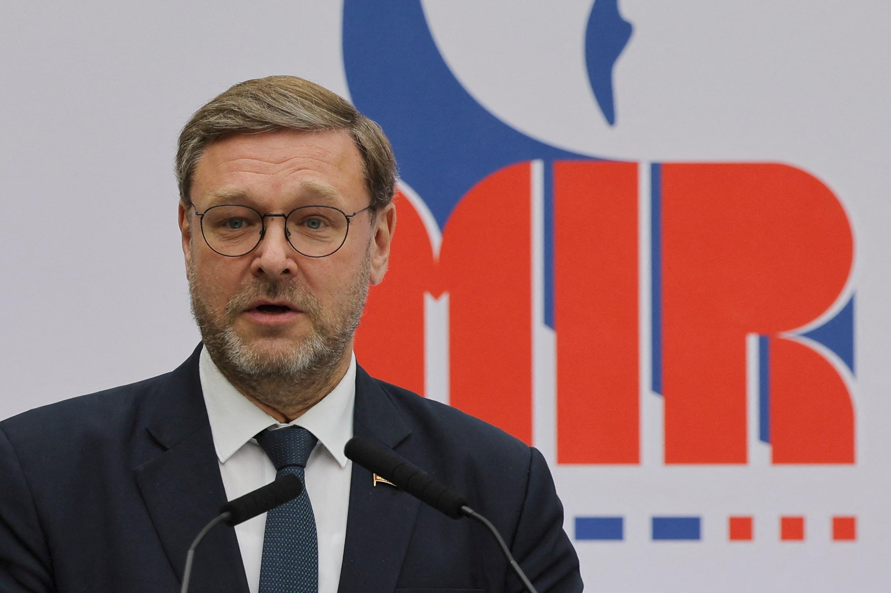

## Claim
Claim: " This is an authentic image of world leaders taking off their suits to symbolically support Ukraine at the London summit on Ukraine on March 2, 2025."

## Actions
```
web_search("London summit Ukraine March 2023")
image_search("European leaders support Ukraine London summit")
```

## Evidence
### Evidence from `web_search`
The 2025 London Summit on Ukraine, also known as the Securing Our Future London Summit, took place on March 2, 2025, in London, hosted by British Prime Minister Keir Starmer. The summit aimed to create a "coalition of the willing" in Europe to present a peace plan for the Russian invasion of Ukraine. Participants included leaders from 16 states, the EU, and NATO. Outcomes included a four-point plan and commitments from Starmer, including £1.6 billion in UK export finances for air defense missiles for Ukraine. The summit also aimed to build strong security guarantees for Ukraine to ensure a lasting ceasefire or peace deal. Articles from Le Monde and Reuters also covered the summit, with the former mentioning a peace plan and the latter reporting on Russian parliamentarians dismissing the summit.  

The summit was attended by leaders including Keir Starmer, Emmanuel Macron, and Volodymyr Zelensky.
[https://en.wikipedia.org/wiki/2025_London_Summit_on_Ukraine](https://en.wikipedia.org/wiki/2025_London_Summit_on_Ukraine)
[https://www.lemonde.fr/en/international/article/2025/03/03/at-london-summit-starmer-defends-french-british-peace-plan-for-ukraine_6738743_4.html](https://www.lemonde.fr/en/international/article/2025/03/03/at-london-summit-starmer-defends-french-british-peace-plan-for-ukraine_6738743_4.html)
[https://www.reuters.com/world/europe/russian-lawmaker-says-ukraine-can-only-count-improved-moscow-washington-ties-2025-03-02/](https://www.reuters.com/world/europe/russian-lawmaker-says-ukraine-can-only-count-improved-moscow-washington-ties-2025-03-02/)


### Evidence from `image_search`
Al Jazeera ([Source](https://www.aljazeera.com/news/2025/3/2/european-leaders-gather-in-london-to-strengthen-support-for-ukraine)) and Le Monde ([Source](https://www.lemonde.fr/en/international/article/2025/03/02/zelensky-joins-european-leaders-at-key-ukraine-summit-in-london_6738729_4.html)) both report on the London summit on Ukraine on March 2, 2023, and include photographs of the leaders. ABC News ([Source](https://abcnews.go.com/International/zelenskyy-set-european-summit-london-after-trump-showdown/story?id=119338966)) also reports on the European summit in London with Zelenskyy.

The images from the sources show the leaders at the summit, but none of them are taking off their suits. , , 


## Elaboration
The evidence confirms the existence of the London Summit on Ukraine on March 2, 2025, attended by European leaders, including Zelensky. However, the image search results show that the leaders did not take off their suits. Therefore, the claim is not supported by the evidence.


## Final Judgement
The London Summit on Ukraine did take place on March 2, 2025, and was attended by European leaders. However, the image search results show that the leaders did not take off their suits. Therefore, the claim is not supported by the evidence. `false`

### Verdict: FALSE

### Justification
The claim is false. While the London Summit on Ukraine did occur on March 2, 2025, and was attended by European leaders, including Zelensky, the image search results show that the leaders did not take off their suits, contradicting the claim.
