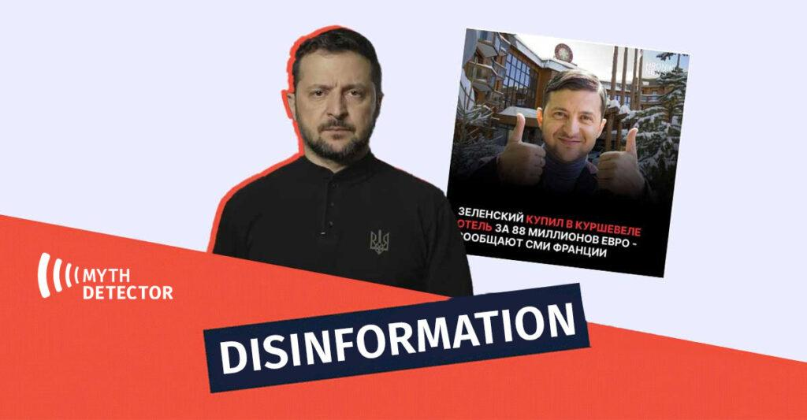
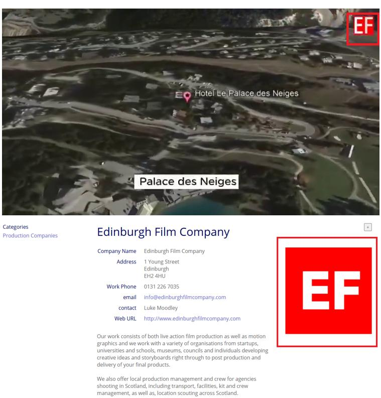

## Claim
Claim: "Ukrainian President Volodymyr Zelenskyy purchased an 88 million euro hotel in the Courchevel ski resort in France."

## Actions
```
web_search("Volodymyr Zelenskyy Courchevel hotel")
web_search("Zelenskyy hotel purchase France")
```

## Evidence
### Evidence from `web_search`
The Myth Detector ([https://mythdetector.com/en/that-volodymyr-zelenskyy/](https://mythdetector.com/en/that-volodymyr-zelenskyy/)) fact-checked the claim that Volodymyr Zelenskyy purchased an 88 million euro hotel in Courchevel, France, and found it to be disinformation . Ukrinform.net ([https://www.ukrinform.net/rubric-factcheck/3935929-russian-propaganda-falsely-claims-zelensky-bought-french-hotel-kulebas-son-acquired-iron-throne.html](https://www.ukrinform.net/rubric-factcheck/3935929-russian-propaganda-falsely-claims-zelensky-bought-french-hotel-kulebas-son-acquired-iron-throne.html)) also reported that Russian media falsely claimed Zelenskyy bought the Palace des Neiges hotel in Courchevel , , .

Inshorts ([https://inshorts.com/en/news/posts-falsely-claim-zelenskyy-bought-88-mn-euro-hotel-in-france----1734106048310](https://inshorts.com/en/news/posts-falsely-claim-zelenskyy-bought-88-mn-euro-hotel-in-france----1734106048310)) states that posts falsely claim Zelenskyy bought an €88-mn hotel in France, but according to Reuters, Zelenskyy did not buy a luxury hotel in Courchevel.


## Elaboration
The claim is false. Multiple sources, including Myth Detector ([https://mythdetector.com/en/that-volodymyr-zelenskyy/](https://mythdetector.com/en/that-volodymyr-zelenskyy/)), Ukrinform.net ([https://www.ukrinform.net/rubric-factcheck/3935929-russian-propaganda-falsely-claims-zelensky-bought-french-hotel-kulebas-son-acquired-iron-throne.html](https://www.ukrinform.net/rubric-factcheck/3935929-russian-propaganda-falsely-claims-zelensky-bought-french-hotel-kulebas-son-acquired-iron-throne.html)), and Inshorts ([https://inshorts.com/en/news/posts-falsely-claim-zelenskyy-bought-88-mn-euro-hotel-in-france----1734106048310](https://inshorts.com/en/news/posts-falsely-claim-zelenskyy-bought-88-mn-euro-hotel-in-france----1734106048310)), have debunked the claim, with Reuters also confirming that Zelenskyy did not purchase a luxury hotel in Courchevel.


## Final Judgement
The provided evidence indicates that the claim is false. Multiple fact-checking sources have debunked the claim that Volodymyr Zelenskyy purchased an 88 million euro hotel in Courchevel, France.

`false`

### Verdict: FALSE

### Justification
The claim that Volodymyr Zelenskyy purchased an 88 million euro hotel in Courchevel, France, is false. Fact-checks by Myth Detector ([https://mythdetector.com/en/that-volodymyr-zelenskyy/](https://mythdetector.com/en/that-volodymyr-zelenskyy/)), Ukrinform.net, and Inshorts ([https://inshorts.com/en/news/posts-falsely-claim-zelenskyy-bought-88-mn-euro-hotel-in-france----1734106048310](https://inshorts.com/en/news/posts-falsely-claim-zelenskyy-bought-88-mn-euro-hotel-in-france----1734106048310)) have debunked the claim, and Reuters also confirmed that Zelenskyy did not buy a luxury hotel in Courchevel.
