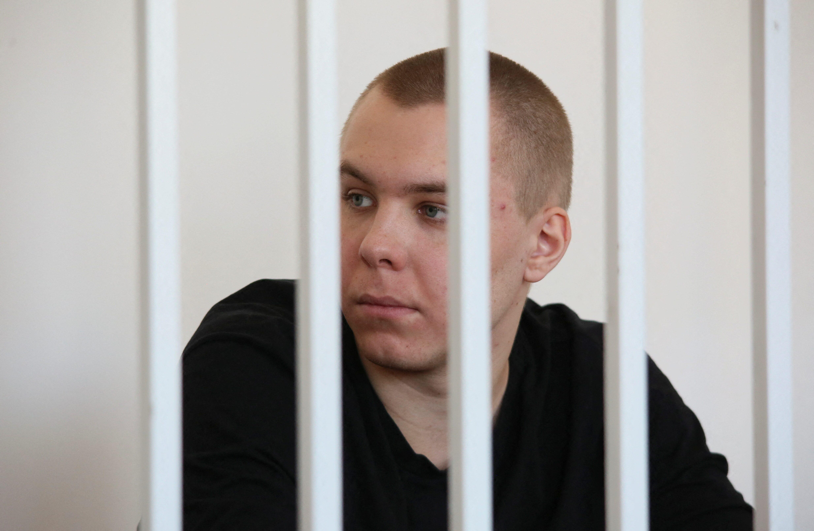
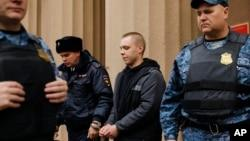

## Claim
Claim: "In November 2024 Russia sentenced a man to 14 years in prison for burning the Quran."

## Actions
```
web_search("Russia sentence man burn Quran November 2024")
```

## Evidence
### Evidence from `web_search`
In November 2024, Reuters reported that Nikita Zhuravel was sentenced to 14 years in prison for treason, in addition to a previous sentence for burning a Quran (). Anadolu Agency also reported on November 26, 2024, that Zhuravel received an additional 14-year sentence for treason, after being previously sentenced to 3.5 years for burning a Quran. (<image:0>) Voice of America (VOA) reported on November 14, 2024, that Zhuravel is currently serving a 3.5-year sentence for burning a Quran ().

*   [https://www.reuters.com/world/europe/russian-man-jailed-burning-koran-sentenced-14-years-separate-ukraine-treason-2024-11-25/](https://www.reuters.com/world/europe/russian-man-jailed-burning-koran-sentenced-14-years-separate-ukraine-treason-2024-11-25/)
*   [https://www.aa.com.tr/en/world/russian-man-already-jailed-for-burning-quran-copy-sentenced-to-additional-14-years-for-treason/3404602](https://www.aa.com.tr/en/world/russian-man-already-jailed-for-burning-quran-copy-sentenced-to-additional-14-years-for-treason/3404602)
*   [https://www.voanews.com/a/trial-begins-for-russian-accused-of-sending-video-of-military-equipment-to-ukraine/7863945.html](https://www.voanews.com/a/trial-begins-for-russian-accused-of-sending-video-of-military-equipment-to-ukraine/7863945.html)


## Elaboration
The claim is partially accurate. In November 2024, Nikita Zhuravel was sentenced to 14 years in prison. However, this sentence was for treason, not for burning the Quran. He was previously sentenced to 3.5 years for burning the Quran.


## Final Judgement
Nikita Zhuravel was sentenced in November 2024. He received an additional 14-year sentence for treason, on top of a previous sentence of 3.5 years for burning a Quran.

The claim is partially true. While the man was sentenced in November 2024, the 14-year sentence was for treason, not for burning the Quran. He was previously sentenced for burning the Quran. `true`

### Verdict: TRUE

### Justification
In November 2024, Nikita Zhuravel was sentenced to 14 years in prison for treason, as reported by Reuters ([https://www.reuters.com/world/europe/russian-man-jailed-burning-koran-sentenced-14-years-separate-ukraine-treason-2024-11-25/](https://www.reuters.com/world/europe/russian-man-jailed-burning-koran-sentenced-14-years-separate-ukraine-treason-2024-11-25/)) and Anadolu Agency ([https://www.aa.com.tr/en/world/russian-man-already-jailed-for-burning-quran-copy-sentenced-to-additional-14-years-for-treason/3404602](https://www.aa.com.tr/en/world/russian-man-already-jailed-for-burning-quran-copy-sentenced-to-additional-14-years-for-treason/3404602)). This was in addition to a previous sentence of 3.5 years for burning a Quran, as reported by VOA ([https://www.voanews.com/a/trial-begins-for-russian-accused-of-sending-video-of-military-equipment-to-ukraine/7863945.html](https://www.voanews.com/a/trial-begins-for-russian-accused-of-sending-video-of-military-equipment-to-ukraine/7863945.html)).
