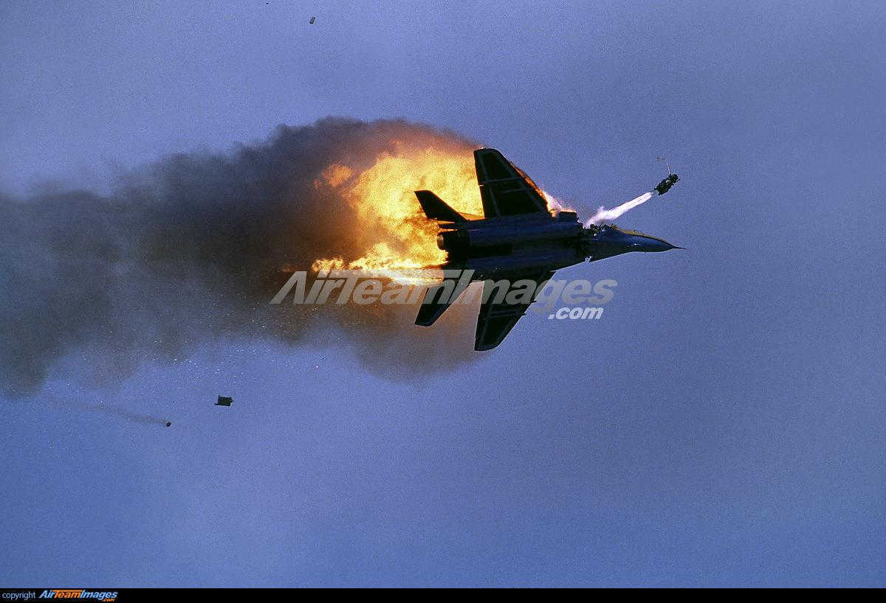

## Claim
Claim: "Italian Prime Minister Giorgia Meloni condemned the US-Ukrainian bombing of Russia at the G20 summit in Rio de Janeiro in November 2024."

## Actions
```
web_search("Giorgia Meloni G20 Rio de Janeiro November 2024")
web_search("Giorgia Meloni G20 Russia Ukraine bombing")
```

## Evidence
### Evidence from `web_search`
The Japanese Prime Minister's Office website ([Source](https://japan.kantei.go.jp/103/actions/202411/19g20.html)) reports on the G20 Rio de Janeiro Summit on November 19, 2024, including photos (, , , , , , , , , , , , , , , , ). The 2024 G20 Rio de Janeiro summit will be held from 18–19 November 2024, hosted by Brazil. Giorgia Meloni, Prime Minister of Italy, will be present at the summit ([Source](https://en.wikipedia.org/wiki/2024_G20_Rio_de_Janeiro_summit)).

On November 18, 2024, on the margins of the G20 Leaders’ Summit in Rio de Janeiro, Brazil, the Prime Minister of Canada, Justin Trudeau, met with Giorgia Meloni, and they reaffirmed their commitment to stand with Ukraine against Russia’s ongoing war of aggression ([Source](https://www.pm.gc.ca/en/news/readouts/2024/11/18/prime-minister-justin-trudeau-meets-prime-minister-italy-giorgia-meloni)).


### Evidence from `web_search`
An article from The Atlantic Council, published on September 5, 2025, mentions that Italian Prime Minister Georgia Meloni condemned violence. [] Another article from November 23, 2023, reports that Giorgia Meloni called on Putin to end the war and withdraw troops from Ukraine at the G20 meeting. [Source](https://www.eurointegration.com.ua/eng/news/2023/11/23/7174141/)

The Guardian published an article on November 15, 2022, about Russia launching missile strikes across Ukraine while G20 leaders met in Bali. []


## Elaboration
The evidence indicates that Giorgia Meloni attended the G20 summit in Rio de Janeiro in November 2024. However, the provided sources do not contain any information about Meloni condemning the US-Ukrainian bombing of Russia at the summit. Instead, the evidence shows that Meloni reaffirmed her commitment to stand with Ukraine against Russia's aggression. Furthermore, a source from November 2023 indicates that Meloni called on Putin to end the war and withdraw troops from Ukraine at the G20 meeting.

Therefore, the claim cannot be verified based on the provided evidence.


## Final Judgement
The available evidence does not support the claim that Giorgia Meloni condemned the US-Ukrainian bombing of Russia at the G20 summit in Rio de Janeiro in November 2024. The evidence suggests that she supported Ukraine and called for Russia to end the war.

`false`

### Verdict: FALSE

### Justification
The claim is false. While Giorgia Meloni attended the G20 summit in Rio de Janeiro in November 2024, evidence indicates she supported Ukraine and called for Russia to end the war, not that she condemned US-Ukrainian actions.
