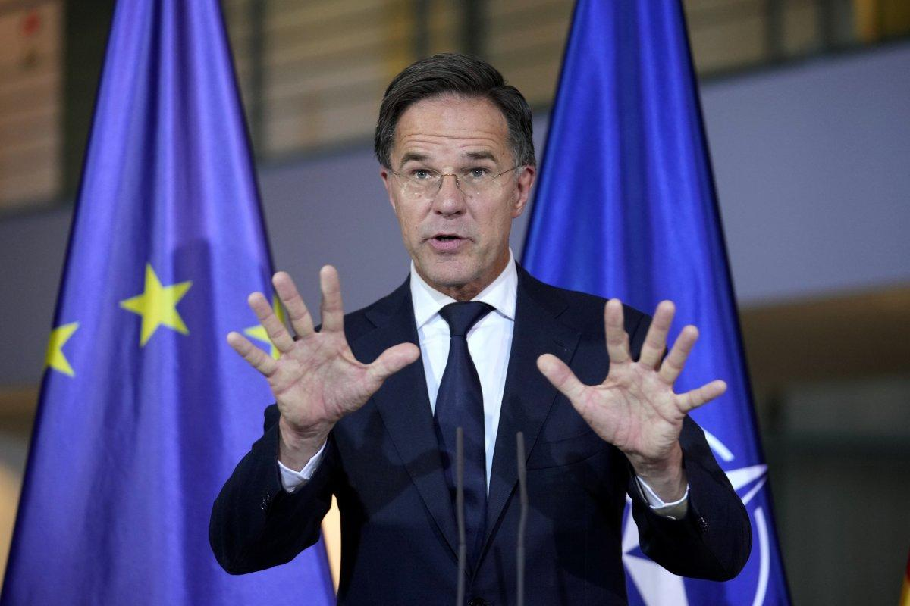

## Claim
Claim: "After Donald Trump won the US presidential election in 2024, NATO Secretary General Mark Rutte said that ‘If Trump surrenders Ukraine to Putin, he will personally expel the United States from the alliance’."

## Actions
```
web_search("Mark Rutte Trump Ukraine Putin NATO")
```

## Evidence
### Evidence from `web_search`
The NATO website ([https://www.nato.int/cps/en/natohq/opinions_237051.htm](https://www.nato.int/cps/en/natohq/opinions_237051.htm)) contains remarks by NATO Secretary General Mark Rutte with Donald J. Trump at the White House, discussing support for Ukraine. NPR ([https://www.npr.org/2025/07/14/nx-s1-5467272/russia-ukraine-war-trump-nato-weapons-tariffs](https://www.npr.org/2025/07/14/nx-s1-5467272/russia-ukraine-war-trump-nato-weapons-tariffs)) published an article on July 14, 2025, discussing President Trump's meeting with NATO Secretary-General Mark Rutte, including Trump's promise to provide weapons to Ukraine through NATO. 

CBS News reports that Donald Trump is set to meet with NATO Secretary General Mark Rutte. ,  The article mentions that Trump is considering authorizing fresh funding for Ukraine.


## Elaboration
The evidence indicates that Mark Rutte, the NATO Secretary General, met with Donald Trump to discuss support for Ukraine. However, the provided sources do not contain any statements from Rutte about expelling the United States from NATO if Trump surrenders Ukraine to Putin.

Therefore, the claim cannot be verified with the available information.


## Actions
```
web_search("Mark Rutte Trump expel US NATO Ukraine Putin")
```

## Evidence
### Evidence from `web_search`
Newsweek ([https://www.newsweek.com/did-nato-chief-vow-kick-us-out-over-trumps-ukraine-plan-what-we-know-mark-rutte-1983779](https://www.newsweek.com/did-nato-chief-vow-kick-us-out-over-trumps-ukraine-plan-what-we-know-mark-rutte-1983779)) reports that there is no evidence of Mark Rutte, the NATO Secretary General, saying he would expel the U.S. from NATO if Trump surrenders Ukraine to Putin. The claim originated from social media and was fact-checked by BBC Verify. , 

The NATO website ([https://www.nato.int/cps/en/natohq/opinions_237212.htm](https://www.nato.int/cps/en/natohq/opinions_237212.htm)) contains remarks by Rutte at a meeting hosted by Trump with Zelenskyy and other European leaders. Euronews ([https://www.euronews.com/my-europe/2024/11/20/no-natos-chief-has-not-threatened-to-expel-us](https://www.euronews.com/my-europe/2024/11/20/no-natos-chief-has-not-threatened-to-expel-us)) also states that Rutte did not threaten to expel the US and that NATO has no mechanism to expel a member.


## Elaboration
The claim is false. Newsweek ([https://www.newsweek.com/did-nato-chief-vow-kick-us-out-over-trumps-ukraine-plan-what-we-know-mark-rutte-1983779](https://www.newsweek.com/did-nato-chief-vow-kick-us-out-over-trumps-ukraine-plan-what-we-know-mark-rutte-1983779)) and Euronews ([https://www.euronews.com/my-europe/2024/11/20/no-natos-chief-has-not-threatened-to-expel-us](https://www.euronews.com/my-europe/2024/11/20/no-natos-chief-has-not-threatened-to-expel-us)) both report that Mark Rutte did not make the statement in the claim, and NATO has no mechanism to expel a member.


## Final Judgement
The claim that Mark Rutte said he would expel the United States from NATO if Trump surrendered Ukraine to Putin is false. Multiple sources, including Newsweek and Euronews, confirm that Rutte did not make such a statement. Furthermore, NATO does not have a mechanism to expel a member.

`false`

### Verdict: FALSE

### Justification
The claim is false. Multiple sources, including [Newsweek](https://www.newsweek.com/did-nato-chief-vow-kick-us-out-over-trumps-ukraine-plan-what-we-know-mark-rutte-1983779) and [Euronews](https://www.euronews.com/my-europe/2024/11/20/no-natos-chief-has-not-threatened-to-expel-us), state that Mark Rutte did not make the alleged statement, and NATO has no mechanism to expel a member.
