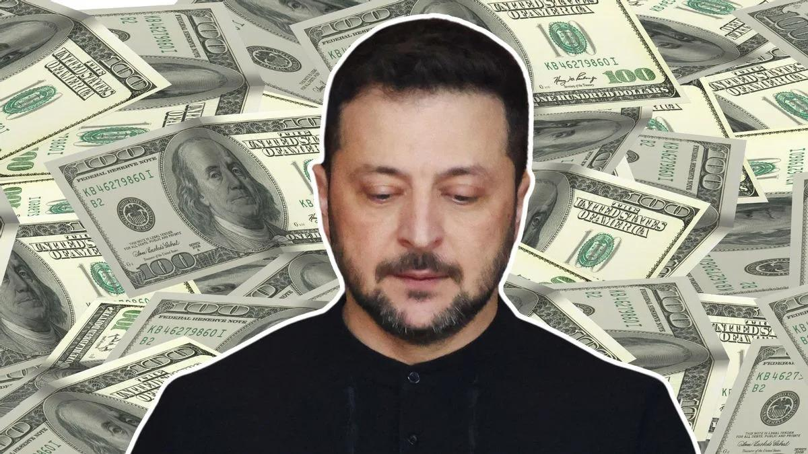

## Claim
Claim: "Ukrainian President Volodymyr Zelenskyy owns 15 homes including a $35 million home in Florida, has $1.2 billion in an overseas bank account, owns 15 homes, three private planes and has a monthly income of $11 million."

## Actions
```
web_search("Volodymyr Zelenskyy real estate holdings")
web_search("Volodymyr Zelenskyy financial assets")
```

## Evidence
### Evidence from `web_search`
A Yahoo News article fact-checked by Snopes rates the claim as "False". It states that Zelenskyy declared ownership of fewer than 15 properties, no planes, and an annual income of around $300,000. The article also mentions that there was no trace of a $35 million Florida mansion in Zelenskyy's name (, ).

The Times of India states that Zelenskyy's real estate portfolio is worth $4 million and includes two wholly owned apartments, two co-owned apartments, a commercial property, and five parking spaces (<image:k>). The OCCRP reported that Zelenskyy and his inner circle were beneficiaries of a network of offshore companies. The Pandora Papers show that Zelenskyy and his partners in comedy production owned a network of offshore companies related to their business (<image:k>).


### Evidence from `web_search`
Myth Detector states that Volodymyr Zelenskyy's income decreased after the war began, and his family's financial situation was affected by the temporary suspension of rental income from real estate. According to Forbes, Zelenskyy's net worth is less than $30 million. The article includes links to other articles debunking claims about Zelenskyy's real estate holdings. () [Source](https://mythdetector.com/en/change-during-the-russia-ukraine-war/)

AOL reports that Zelenskyy's 2018 financial disclosure listed total assets worth 37 million hryvnias. According to Celebrity Net Worth, Zelenskyy is worth roughly $1.5 million, not $1.5 billion, and his monthly income is $930. () [Source](https://www.aol.com/much-volodymyr-zelenskyy-worth-160047933.html)


## Elaboration
The claim is demonstrably false. Multiple sources, including Yahoo News ([https://news.yahoo.com/fact-check-false-claims-about-170000767.html](https://news.yahoo.com/fact-check-false-claims-about-170000767.html)) and AOL ([https://www.aol.com/much-volodymyr-zelenskyy-worth-160047933.html](https://www.aol.com/much-volodymyr-zelenskyy-worth-160047933.html)), debunk the assertion that Zelenskyy owns 15 homes, a $35 million Florida home, and has a monthly income of $11 million.

Evidence indicates Zelenskyy's real estate holdings are significantly less than 15 properties, with a portfolio worth approximately $4 million, as reported by The Times of India. Furthermore, his declared annual income is around $300,000, and his net worth is estimated to be between $1.5 million and $30 million, not $1.2 billion.

The evidence also reveals that Zelenskyy and his inner circle were involved in offshore companies, as reported by OCCRP and the Pandora Papers. However, this does not validate the claim about his assets.


## Final Judgement
The claim is false. The evidence from multiple sources, including Yahoo News and AOL, contradicts the claim that Zelenskyy owns 15 homes, a $35 million Florida home, and has a monthly income of $11 million.

`false`

### Verdict: FALSE

### Justification
The claim that Volodymyr Zelenskyy owns 15 homes, a $35 million home in Florida, has $1.2 billion in an overseas bank account, and a monthly income of $11 million is false. Fact-checks from sources like Yahoo News ([https://news.yahoo.com/fact-check-false-claims-about-170000767.html](https://news.yahoo.com/fact-check-false-claims-about-170000767.html)) and AOL ([https://www.aol.com/much-volodymyr-zelenskyy-worth-160047933.html](https://www.aol.com/much-volodymyr-zelenskyy-worth-160047933.html)) show that Zelenskyy's actual assets and income are significantly lower.
