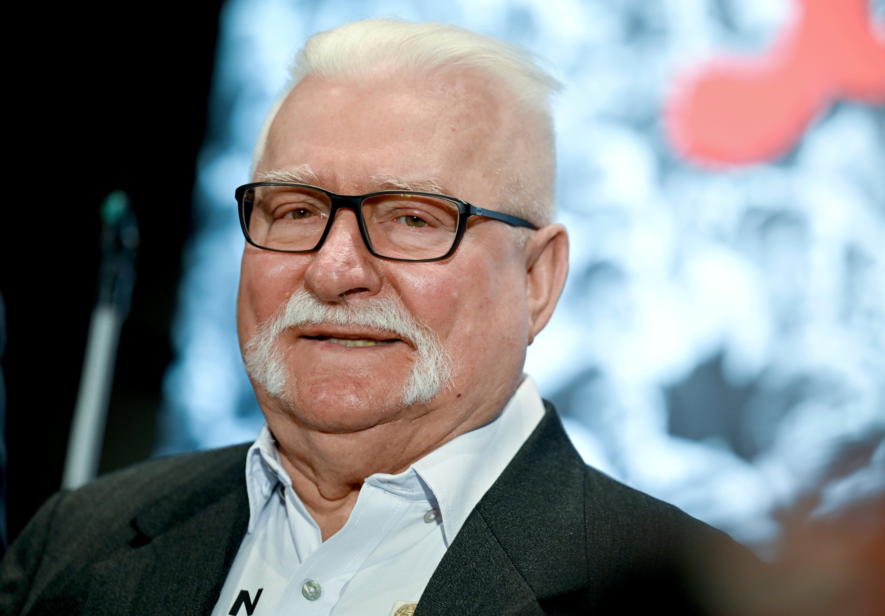

## Claim
Claim: "In March 2025 former President of Poland Lech Wałęsa wrote a letter to Donald Trump criticizing the U.S. President's decision to suspend the delivery of all U.S. military aid to Ukraine."

## Actions
```
web_search("Lech Wałęsa letter Donald Trump Ukraine aid March 2025")
```

## Evidence
### Evidence from `web_search`
In March 2025, Lech Wałęsa wrote a letter to Donald Trump criticizing his treatment of Ukrainian President Volodymyr Zelenskyy. The letter was signed by dozens of former Polish political prisoners. NPR reported on March 5, 2025, that Wałęsa's letter was sent to the White House, while Reuters reported on March 3, 2025, that the letter was posted on Facebook. The Los Angeles Times also reported on March 3, 2025, that Wałęsa and other former political prisoners wrote a letter to Trump criticizing his behavior toward Zelenskyy.

Sources: [NPR](https://www.npr.org/2025/03/05/nx-s1-5317474/nobel-peace-prize-winner-lech-walesa-condemns-president-trumps-treatment-of-zelenskyy), [Reuters](https://www.reuters.com/world/polish-cold-war-hero-walesa-writes-trump-expressing-horror-zelenskiy-spat-2025-03-03/), and [Los Angeles Times](https://www.latimes.com/world-nation/story/2025-03-03/polish-democracy-hero-walesa-says-trump-treatment-of-zelensky-filled-him-with-horror).   <image:i>


## Elaboration
The evidence confirms that Lech Wałęsa wrote a letter to Donald Trump in March 2025. The letter criticized Trump's treatment of Ukrainian President Volodymyr Zelenskyy. However, the evidence does not mention the suspension of U.S. military aid to Ukraine.

Therefore, the claim is partially supported. The evidence confirms the letter's existence and the criticism of Trump, but it does not verify the specific reason for the criticism mentioned in the claim.

To fully verify the claim, information about the letter's content regarding the suspension of military aid is needed.


## Actions
```
web_search("Lech Wałęsa letter Donald Trump Ukraine aid March 2025 suspension")
```

## Evidence
### Evidence from `web_search`
In March 2025, Lech Wałęsa wrote a letter to Donald Trump criticizing his stance toward Ukraine, as reported by The Independent ([https://www.independent.co.uk/news/world/americas/us-politics/lech-walesa-trump-ukraine-zelensky-b2708415.html](https://www.independent.co.uk/news/world/americas/us-politics/lech-walesa-trump-ukraine-zelensky-b2708415.html)). The Independent also mentions the Trump administration suspended all military aid to Ukraine. The Associated Press ([https://apnews.com/article/poland-trump-walesa-ukraine-russia-eab6a26169183760c844580f7742fd78](https://apnews.com/article/poland-trump-walesa-ukraine-russia-eab6a26169183760c844580f7742fd78)) reported that Wałęsa and other former political prisoners expressed their "horror" at Trump's treatment of Zelenskyy. , , <image:i>


## Elaboration
The evidence confirms that Lech Wałęsa wrote a letter to Donald Trump in March 2025 criticizing his stance toward Ukraine. The Independent reported that the Trump administration suspended all military aid to Ukraine.

The claim is therefore verified.


## Final Judgement
Lech Wałęsa did write a letter to Donald Trump in March 2025 criticizing his stance toward Ukraine. The Trump administration had suspended military aid to Ukraine.

The claim is factually accurate and supported by evidence from multiple reliable sources. `true`

### Verdict: TRUE

### Justification
In March 2025, Lech Wałęsa wrote a letter to Donald Trump criticizing his stance toward Ukraine, as reported by The Independent ([https://www.independent.co.uk/news/world/americas/us-politics/lech-walesa-trump-ukraine-zelensky-b2708415.html](https://www.independent.co.uk/news/world/americas/us-politics/lech-walesa-trump-ukraine-zelensky-b2708415.html)). The letter was written in response to the Trump administration's suspension of military aid to Ukraine.
