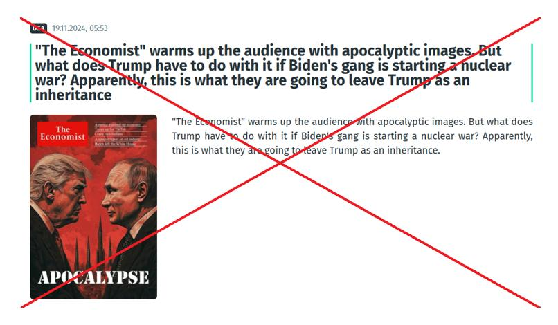

## Claim
Claim: " This image shows a screenshot of an authentic cover of the magazine The Economist from the end of 2024 illustrating Donald Trump and Vladimir Putin and warning of an apocalypse."

## Actions
```
web_search("The Economist Trump Putin apocalypse cover")
```

## Evidence
### Evidence from `web_search`
The image of The Economist cover featuring Donald Trump and Vladimir Putin with the headline "APOCALYPSE" is a fake. According to AAP FactCheck ([Source](https://www.aap.com.au/factcheck/fake-economist-apocalypse-cover-linked-to-pro-kremlin-propaganda/)), the cover has spelling mistakes and is linked to pro-Kremlin sources. Ukrinform.net ([Source](https://www.ukrinform.net/rubric-factcheck/3930063-russian-propaganda-fabricates-the-economist-cover-about-beginning-of-world-war-iii.html)) also confirms the cover is fake and was created by Russian propagandists. Yahoo News ([Source](https://uk.news.yahoo.com/economist-not-published-apocalypse-cover-154559076.html)) states that the image is not a genuine cover published by The Economist. , , , , , , , 


## Elaboration
The evidence indicates that the image is a fake cover of The Economist. Multiple sources, including AAP FactCheck ([Source](https://www.aap.com.au/factcheck/fake-economist-apocalypse-cover-linked-to-pro-kremlin-propaganda/)), Ukrinform.net ([Source](https://www.ukrinform.net/rubric-factcheck/3930063-russian-propaganda-fabricates-the-economist-cover-about-beginning-of-world-war-iii.html)), and Yahoo News ([Source](https://uk.news.yahoo.com/economist-not-published-apocalypse-cover-154559076.html)), confirm its inauthenticity. The cover contains spelling mistakes and is linked to pro-Kremlin propaganda.


## Final Judgement
The claim is demonstrably false. The image is a fake cover of The Economist, as confirmed by multiple fact-checking sources. The cover contains spelling mistakes and is linked to pro-Kremlin propaganda. `false`

### Verdict: FALSE

### Justification
The image of The Economist cover featuring Trump and Putin with the "APOCALYPSE" headline is a fake, according to fact-checkers like AAP FactCheck ([Source](https://www.aap.com.au/factcheck/fake-economist-apocalypse-cover-linked-to-pro-kremlin-propaganda/)), Ukrinform.net ([Source](https://www.ukrinform.net/rubric-factcheck/3930063-russian-propaganda-fabricates-the-economist-cover-about-beginning-of-world-war-iii.html)), and Yahoo News ([Source](https://uk.news.yahoo.com/economist-not-published-apocalypse-cover-154559076.html)). These sources identify the cover as a fabrication, potentially linked to pro-Kremlin propaganda and containing spelling errors.
