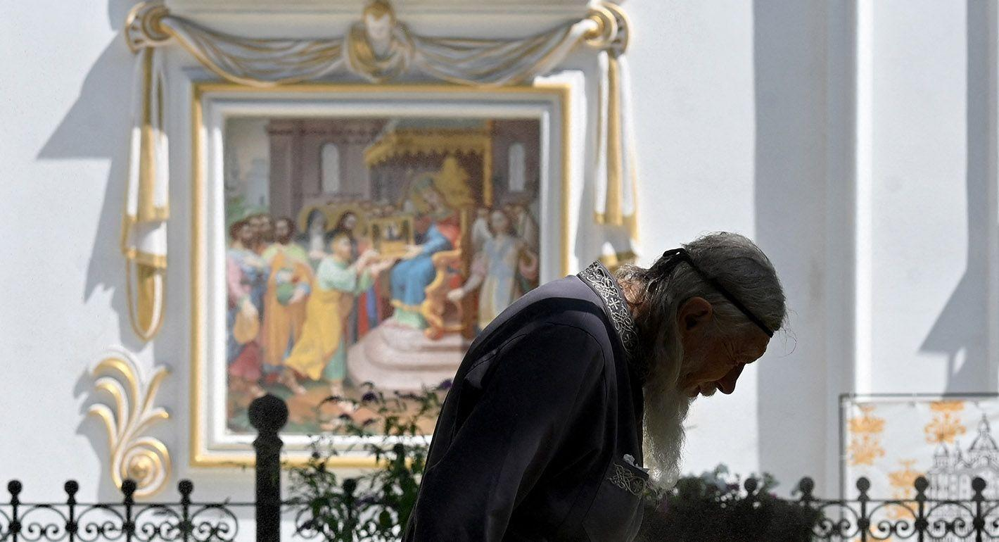

## Claim
Claim: "In August 2024, Ukraine passed legislation banning the Orthodox Church in Ukraine."

## Actions
```
web_search("Ukraine legislation ban Orthodox Church August 2024")
```

## Evidence
### Evidence from `web_search`
Several sources discuss a new Ukrainian law passed in August 2024 that bans religious organizations with ties to the Russian Orthodox Church, potentially affecting the Ukrainian Orthodox Church (<image:k>, ). Human Rights Watch published an article on October 30, 2024, discussing the law, while the European Parliament published a document on October 10, 2024, mentioning concerns from the UN and Pope Francis regarding the ban's potential violation of religious freedom and human rights.

The Carnegie Endowment for International Peace published an article on September 4, 2024, discussing the ban on the Ukrainian Orthodox Church of the Moscow Patriarchate (UOCMP).
*   [https://www.hrw.org/news/2024/10/30/ukraine-new-law-raises-religious-freedom-concerns](https://www.hrw.org/news/2024/10/30/ukraine-new-law-raises-religious-freedom-concerns)
*   [https://www.europarl.europa.eu/doceo/document/E-10-2024-001881\_EN.html](https://www.europarl.europa.eu/doceo/document/E-10-2024-001881_EN.html)
*   [https://carnegieendowment.org/russia-eurasia/politika/2024/08/zapret-upc-v-ukraine](https://carnegieendowment.org/russia-eurasia/politika/2024/08/zapret-upc-v-ukraine)


## Elaboration
The evidence confirms that Ukraine passed legislation in August 2024 that bans religious organizations with ties to the Russian Orthodox Church. This law has raised concerns about religious freedom and human rights.


## Final Judgement
The claim is supported by multiple sources that confirm the passage of legislation in August 2024 in Ukraine, which bans religious organizations with ties to the Russian Orthodox Church. Therefore, the claim is factually accurate. `true`

### Verdict: TRUE

### Justification
In August 2024, Ukraine passed legislation banning religious organizations with ties to the Russian Orthodox Church, as reported by sources such as the [Carnegie Endowment for International Peace](https://carnegieendowment.org/russia-eurasia/politika/2024/08/zapret-upc-v-ukraine). This law has raised concerns about religious freedom, as discussed by [Human Rights Watch](https://www.hrw.org/news/2024/10/30/ukraine-new-law-raises-religious-freedom-concerns) and the [European Parliament](https://www.europarl.europa.eu/doceo/document/E-10-2024-001881_EN.html).
