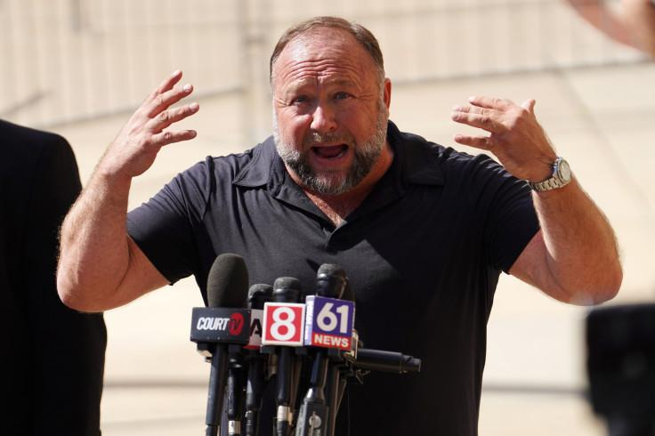
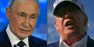

## Claim
Claim: "After InfoWars reporter Jamie White was shot dead on March 10, 2025 in Austin, Texas, it was revelaed that he was on a Ukranian enemies hit list."

## Actions
```
web_search("Jamie White shot dead Austin Texas March 10 2025")
web_search("Jamie White InfoWars Ukrainian hit list")
```

## Evidence
### Evidence from `web_search`
The provided web sources discuss the death of InfoWars reporter Jamie White in Austin, Texas, on March 10, 2025. White was shot while interrupting a vehicle burglary. Several suspects have been arrested. InfoWars called White's death "senseless" and "tragic."

The articles are from FOX 7 Austin ([https://www.fox7austin.com/news/infowars-writer-shooting-austin-police-jamie-white](https://www.fox7austin.com/news/infowars-writer-shooting-austin-police-jamie-white)), KVUE ([https://www.kvue.com/article/news/crime/jamie-white-murder-arrests-infowars/269-aa20c169-085c-4827-8e8c-ce8755a4b715](https://www.kvue.com/article/news/crime/jamie-white-murder-arrests-infowars/269-aa20c169-085c-4827-8e8c-ce8755a4b715)), and Fox News ([https://www.foxnews.com/us/police-release-more-details-murder-infowars-reporter-jamie-white-search-suspects-continues](https://www.foxnews.com/us/police-release-more-details-murder-infowars-reporter-jamie-white-search-suspects-continues)). The FOX 7 Austin article includes images , , , , . The Fox News article includes an image .


### Evidence from `web_search`
According to a Yahoo News article published by USA TODAY, Jamie White, an Infowars writer, was shot dead in Austin, Texas (). Alex Jones speculated that the killing "could’ve been a hit” orchestrated by Ukraine. The Latin Times reports that White was found dead in Austin, Texas, with gunshot wounds, and Alex Jones claims that White was murdered by Ukrainian forces and was on a Ukrainian hit list (, , , , , ). The "Investigate Earth Conspiracy Podcast" discusses the murder of Jamie White, an InfoWars journalist, in Austin, Texas, and suggests that White may have been on a Ukrainian NGO hit list ().

The articles can be found here: [Source](https://www.yahoo.com/news/alex-jones-blames-globalists-infowars-182655321.html), [Source](https://www.latintimes.com/infowars-reporter-assassinated-ukraine-outside-his-home-conspiracy-theorists-claim-578436), and [Source](https://open.spotify.com/episode/68lCuEsLtFn17oEIQBQGEk).


## Elaboration
The claim is partially supported by the evidence. The evidence confirms that Jamie White, an InfoWars reporter, was shot dead in Austin, Texas, on March 10, 2025. Alex Jones and the "Investigate Earth Conspiracy Podcast" suggest that White was on a Ukrainian hit list. However, there is no definitive evidence to confirm this.


## Actions
```
web_search("Ukrainian hit list Jamie White InfoWars")
```

## Evidence
### Evidence from `web_search`
The "Investigate Earth Conspiracy Podcast" suggests that Jamie White, an InfoWars journalist, may have been on a Ukrainian NGO hit list after being murdered in Austin, Texas. The search on Infowars.com for "Jamie White" yields no results.


## Elaboration
The claim that Jamie White was on a Ukrainian hit list is supported by claims from Alex Jones and the "Investigate Earth Conspiracy Podcast." However, the evidence does not provide any independent verification of this claim.


## Actions
```
web_search("Jamie White InfoWars Ukrainian hit list evidence")
```

## Evidence
### Evidence from `web_search`
From [Source](https://www.stopfake.org/en/fake-infowars-journalist-murdered-shortly-after-ukraine-put-him-on-their-kill-list/): 
Content: StopFake.org states that Jamie White was not on any "list of enemies of Ukraine" and that there is no evidence to support the claim. White's sister and law enforcement officials believe his death was unrelated to his journalistic activities. The article includes an image of a screenshot of a tweet by Jamie White, claiming he was on a Ukrainian "Enemies List" . The article also mentions that White spread disinformation and anti-Ukrainian conspiracy theories.


## Elaboration
The claim that Jamie White was on a Ukrainian enemies hit list is disputed. While Alex Jones and the "Investigate Earth Conspiracy Podcast" suggest this, StopFake.org states that there is no evidence to support the claim. Furthermore, White's sister and law enforcement officials believe his death was unrelated to his journalistic activities.


## Final Judgement
The evidence confirms that Jamie White was shot dead in Austin, Texas, on March 10, 2025. However, the claim that he was on a Ukrainian hit list is not supported by evidence. While some sources, like Alex Jones, suggest this, there is no independent verification. StopFake.org explicitly denies this claim.

`false`


### Verdict: FALSE

### Justification
The claim that Jamie White was on a Ukrainian hit list is **false**. While White was shot dead in Austin, Texas, on March 10, 2025, there is no evidence to support the claim that he was on a Ukrainian hit list. Sources like Alex Jones suggest this, but this is disputed by [StopFake.org](https://www.stopfake.org/en/fake-infowars-journalist-murdered-shortly-after-ukraine-put-him-on-their-kill-list/), and law enforcement officials believe his death was unrelated to his journalistic activities.
