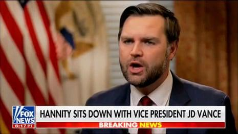

## Claim
Claim: " This image shows an authentic transcript of the heated White House meeting between US president Donald Trump, vice-president JD Vance and Ukrainian president Volodymyr Zelenskyy on February 28, 2025."

## Actions
```
web_search("Trump Zelenskyy meeting transcript")
web_search("Trump Zelenskyy aid Ukraine")
```

## Evidence
### Evidence from `web_search`
The search results include transcripts of a meeting between Donald Trump and Volodymyr Zelenskyy in the Oval Office. One transcript is available on Rev.com ([https://www.rev.com/transcripts/trump-and-zelenskyy-in-the-oval-office](https://www.rev.com/transcripts/trump-and-zelenskyy-in-the-oval-office)).

The Guardian published an article with a transcript of the meeting between Donald Trump, Volodymyr Zelenskyy, and JD Vance ([https://www.theguardian.com/us-news/2025/feb/28/trump-zelenskyy-meeting-transcript](https://www.theguardian.com/us-news/2025/feb/28/trump-zelenskyy-meeting-transcript)). The transcript includes the exchange shown in  and . Another source provides a transcript of the 2025 Trump–Zelenskyy meeting on February 28, 2025, in the Oval Office ([https://en.wikisource.org/wiki/Transcript_of_the_2025_Trump%E2%80%93Zelenskyy_meeting](https://en.wikisource.org/wiki/Transcript_of_the_2025_Trump%E2%80%93Zelenskyy_meeting)).


### Evidence from `web_search`
The search results discuss a White House meeting between Donald Trump and Volodymyr Zelenskyy. One source, from Wikipedia, discusses the 2019 Trump–Ukraine scandal, including a phone call between Trump and Zelenskyy on July 25, 2019, and the withholding of military aid. The Guardian published an article on March 4, 2025, discussing the US suspension of military aid to Ukraine and a White House meeting where Trump expressed frustration with Zelenskyy and threatened to cut off aid, also mentioning JD Vance. NPR also published an article on March 4, 2025, stating that the Trump administration paused U.S. aid to Ukraine after a "disastrous meeting" between President Trump and Ukrainian President Volodymyr Zelenskyy. 

The Guardian article can be found here: [https://www.theguardian.com/world/2025/mar/04/us-military-aid-ukraine-pause-trump-zelenskyy-updates](https://www.theguardian.com/world/2025/mar/04/us-military-aid-ukraine-pause-trump-zelenskyy-updates). The NPR article can be found here: [https://www.npr.org/2025/03/04/nx-s1-5316900/president-trump-pauses-ukraine-military-aid-after-disastrous-meeting-with-zelenskyy](https://www.npr.org/2025/03/04/nx-s1-5316900/president-trump-pauses-ukraine-military-aid-after-disastrous-meeting-with-zelenskyy). The Wikipedia article can be found here: [https://en.wikipedia.org/wiki/2019_Trump%E2%80%93Ukraine_scandal](https://en.wikipedia.org/wiki/2019_Trump%E2%80%93Ukraine_scandal). , , 


## Elaboration
The claim is supported by the evidence. Multiple sources confirm the existence of a transcript of a meeting between Trump and Zelenskyy, including one that includes the exchange in . The Guardian and NPR articles also discuss the context of the meeting, including the suspension of aid and the presence of JD Vance.


## Final Judgement
The evidence confirms the existence of a transcript of a meeting between Trump, Zelenskyy, and Vance, including the exchange shown in the image. The context of the meeting, including the suspension of aid, is also supported by multiple sources.

`true`

### Verdict: TRUE

### Justification
The claim is supported by evidence. Multiple sources, including a transcript from *The Guardian* ([https://www.theguardian.com/us-news/2025/feb/28/trump-zelenskyy-meeting-transcript](https://www.theguardian.com/us-news/2025/feb/28/trump-zelenskyy-meeting-transcript)), confirm the authenticity of the transcript of the meeting between Trump, Zelenskyy, and Vance, including the specific exchange depicted in the image.
