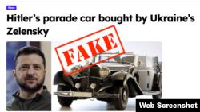
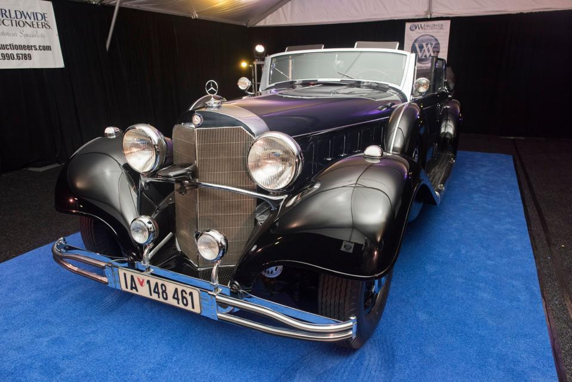

## Claim
Claim: " This image shows Hitler's parade car which was bought by the Ukrainian president Volodymyr Zelenskyy for 15 Million US-$."

## Actions
```
reverse_search()
web_search("Hitler parade car Zelenskyy")
```

## Evidence
### Evidence from `reverse_search`
Multiple sources debunk the claim that Volodymyr Zelenskyy bought Hitler's parade car. The Voice of America ([https://www.voanews.com/a/russian-propagandists-push-fake-story-that-zelenskyy-bought-hitler-s-car/7818175.html](https://www.voanews.com/a/russian-propagandists-push-fake-story-that-zelenskyy-bought-hitler-s-car/7818175.html)) and The Insider ([https://theins.ru/en/antifake/275232](https://theins.ru/en/antifake/275232)) report that the image of the car was doctored and the story is a hoax.

Truthmeter.mk ([https://truthmeter.mk/endless-inspiration-for-disinformation-zelenskys-new-alleged-luxury-is-hitlers-mercedes/](https://truthmeter.mk/endless-inspiration-for-disinformation-zelenskys-new-alleged-luxury-is-hitlers-mercedes/)) states that the claim is disinformation and the car was auctioned in Arizona, USA, as early as 2018.    


### Evidence from `web_search`
From [Source](https://www.forbes.com/sites/petersuciu/2024/10/09/despite-online-claims-ukraines-zelensky-didnt-buy-hitlers-car/): 
Content: The Forbes article, published on October 9, 2024, debunks the claim that Volodymyr Zelenskyy bought Hitler's parade car for $15 million. The article states that the story originated from a fake news site and was part of a disinformation campaign. The car in question is a Mercedes-Benz 770 Grosser Offener Tourenwagen, which was used by Hitler.  The article mentions that the car was previously listed by Worldwide Auctioneers in 2018. The article also mentions that the car is now in a private collection.


## Elaboration
The claim that Volodymyr Zelenskyy bought Hitler's parade car for $15 million is false. Multiple sources, including The Voice of America ([https://www.voanews.com/a/russian-propagandists-push-fake-story-that-zelenskyy-bought-hitler-s-car/7818175.html](https://www.voanews.com/a/russian-propagandists-push-fake-story-that-zelenskyy-bought-hitler-s-car/7818175.html)) and Forbes ([https://www.forbes.com/sites/petersuciu/2024/10/09/despite-online-claims-ukraines-zelensky-didnt-buy-hitlers-car/](https://www.forbes.com/sites/petersuciu/2024/10/09/despite-online-claims-ukraines-zelensky-didnt-buy-hitlers-car/)), debunk this story, identifying it as disinformation. The car was auctioned in Arizona, USA, as early as 2018 and is now in a private collection.


## Final Judgement
The claim is demonstrably false. Multiple reliable sources confirm that the story is a hoax and the car was not purchased by Zelenskyy. `false`

### Verdict: FALSE

### Justification
The claim that Volodymyr Zelenskyy bought Hitler's parade car is false. Multiple sources, including The Voice of America ([https://www.voanews.com/a/russian-propagandists-push-fake-story-that-zelenskyy-bought-hitler-s-car/7818175.html](https://www.voanews.com/a/russian-propagandists-push-fake-story-that-zelenskyy-bought-hitler-s-car/7818175.html)) and Forbes ([https://www.forbes.com/sites/petersuciu/2024/10/09/despite-online-claims-ukraines-zelensky-didnt-buy-hitlers-car/](https://www.forbes.com/sites/petersuciu/2024/10/09/despite-online-claims-ukraines-zelensky-didnt-buy-hitlers-car/)), confirm the story is disinformation. The car was auctioned in the USA and is now in a private collection.
