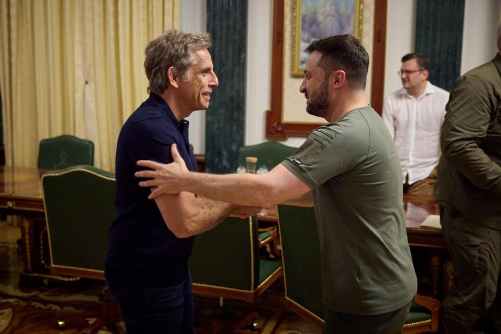

## Claim
Claim: " This image shows Ben Stiller and Ukrainian President Volodymyr Zelensky at their meeting on June 20, 2022, for which Stiller received $4 million from USAID."

## Actions
```
web_search("Ben Stiller Volodymyr Zelensky meeting June 20 2022")
web_search("Ben Stiller USAID Ukraine")
```

## Evidence
### Evidence from `web_search`
Ben Stiller met with Ukrainian President Volodymyr Zelenskyy in Kyiv on June 20, 2022, as part of his visit as a goodwill ambassador for the United Nations High Commissioner for Refugees (UNHCR) according to [ABC News](https://abcnews.go.com/International/ben-stiller-meets-volodymyr-zelenskyy-ukraine-world-refugee/story?id=85517989), [New York Post](https://nypost.com/2022/06/20/ben-stiller-met-with-zelensky-in-ukraine-on-world-refugee-day/) and [BBC](https://www.bbc.com/news/av/world-61875351). The ABC News article mentions Stiller visited occupied settlements around Kyiv and Irpin.

The articles do not mention Stiller receiving $4 million from USAID. , , , , 


### Evidence from `web_search`
The Vanity Fair article ([https://www.vanityfair.com/hollywood/story/ben-stiller-denies-elon-musks-retweet-claiming-usaid-funded-the-stars-trip-to-ukraine?srsltid=AfmBOoqmZtyUwoMPiFsX8zL7DdXJOT30rVSXIZLNyC8z9NQ6jnf-Uufb](https://www.vanityfair.com/hollywood/story/ben-stiller-denies-elon-musks-retweet-claiming-usaid-funded-the-stars-trip-to-ukraine?srsltid=AfmBOoqmZtyUwoMPiFsX8zL7DdXJOT30rVSXIZLNyC8z9NQ6jnf-Uufb)) and the Deadline Film + TV article ([https://www.imdb.com/news/ni65111956/](https://www.imdb.com/news/ni65111956/)) report that Ben Stiller denied claims that his trip to Ukraine in June 2022 was funded by USAID, stating that he self-funded the trip. The MSNBC's "Morning Joe" also reported that Ben Stiller debunked the claims.

The articles mention a video claiming USAID paid several actors, including Stiller, to visit Ukraine.  


## Elaboration
The claim that Ben Stiller received $4 million from USAID for his meeting with Volodymyr Zelensky on June 20, 2022, is not supported by the evidence. Multiple sources confirm the meeting took place on that date. However, these sources, including ABC News, New York Post, and BBC, do not mention any USAID funding. Furthermore, Ben Stiller himself denied claims that his trip was funded by USAID, stating that he self-funded the trip.


## Final Judgement
The evidence confirms that Ben Stiller met with Volodymyr Zelensky on June 20, 2022, but there is no evidence to support the claim that Stiller received $4 million from USAID. In fact, Stiller denied that his trip was funded by USAID. Therefore, the claim is false. `false`

### Verdict: FALSE

### Justification
The claim is false. While Ben Stiller did meet with Volodymyr Zelensky on June 20, 2022, as reported by [ABC News](https://abcnews.go.com/International/ben-stiller-meets-volodymyr-zelenskyy-ukraine-world-refugee/story?id=85517989), [New York Post](https://nypost.com/2022/06/20/ben-stiller-met-with-zelensky-in-ukraine-on-world-refugee-day/), and [BBC](https://www.bbc.com/news/av/world-61875351), there is no evidence to support the assertion that he received $4 million from USAID. Ben Stiller himself denied that his trip was funded by USAID, as reported by [Vanity Fair](https://www.vanityfair.com/hollywood/story/ben-stiller-denies-elon-musks-retweet-claiming-usaid-funded-the-stars-trip-to-ukraine?srsltid=AfmBOoqmZtyUwoMPiFsX8zL7DdXJOT30rVSXIZLNyC8z9NQ6jnf-Uufb).
