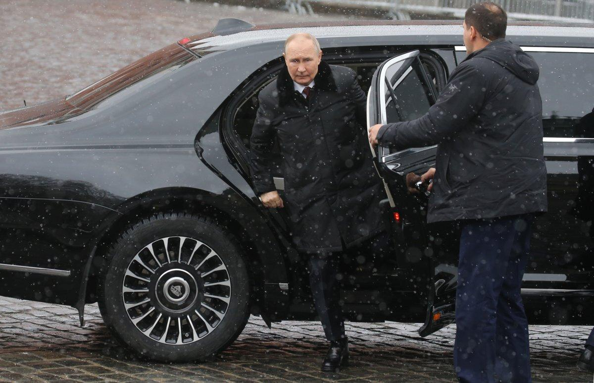

## Claim
Claim: "Russian President Vladimir Putin has died in an explosion in one of his limousines."

## Actions
```
web_search("Vladimir Putin explosion limousine")
```

## Evidence
### Evidence from `web_search`
The Economic Times reports that one of Vladimir Putin's official limousines exploded in central Moscow, raising security concerns, amid speculation about threats within Putin's inner circle and rumors about his health. The article mentions that the explosion happened only days after Ukrainian President Volodymyr Zelensky suggested that Russia could suffer a major setback in the war. The article includes an image of Putin  and was released on March 30, 2025. ([https://m.economictimes.com/news/international/world-news/blast-in-one-of-vladimir-putins-official-limousines-triggers-fresh-assassination-concerns/articleshow/119758547.cms](https://m.economictimes.com/news/international/world-news/blast-in-one-of-vladimir-putins-official-limousines-triggers-fresh-assassination-concerns/articleshow/119758547.cms))

The Kyiv Post reported on March 31, 2025, that one of Vladimir Putin's limousines caught fire after an explosion near the FSB headquarters in Moscow . The fire was thought to have started in the engine, and the Kremlin went to an even higher alert on the protection of its leader. ([https://www.kyivpost.com/post/49868](https://www.kyivpost.com/post/49868)) GB News published an article on April 25, 2025, by George Bunn, about an explosion . ([https://www.gbnews.com/news/world/vladimir-putin-chief-killed-moscow-car-explosion](https://www.gbnews.com/news/world/vladimir-putin-chief-killed-moscow-car-explosion))


## Elaboration
The evidence indicates that an explosion occurred involving one of Vladimir Putin's limousines. The Economic Times and Kyiv Post reported on the incident, with the latter mentioning the fire started in the engine. However, the evidence does not confirm that Putin died in the explosion. The GB News article, published on April 25, 2025, mentions an explosion, but it does not explicitly state that Putin died.

The available information does not verify the claim that Putin died in the explosion.

To verify the claim, information is missing about Putin's status following the explosion.


## Actions
```
web_search("Vladimir Putin death explosion limousine")
```

## Evidence
### Evidence from `web_search`
Newsweek reports that a limousine from Vladimir Putin's official motorcade caught fire near the FSB headquarters in Moscow . CNBC TV18 reports that one of Vladimir Putin's limousines caught fire after an explosion in Moscow near the FSB headquarters <image:0>. UA Wire reports that one of Vladimir Putin's luxury limousines exploded and caught fire near Moscow's FSB headquarters <image:0>.

The cause of the fire is unknown, and there were no reports of injuries. The articles do not mention whether Putin was in the vehicle at the time of the incident.


## Elaboration
The new evidence confirms that an explosion and fire occurred involving one of Putin's limousines near the FSB headquarters in Moscow. However, the evidence does not mention Putin's presence in the vehicle or any injuries.

The claim that Putin died in the explosion cannot be verified with the available information.


## Actions
```
web_search("Vladimir Putin health status after limousine explosion")
```

## Evidence
### Evidence from `web_search`
From [Source](https://bronx.com/putins-limo-blows-up-days-after-zelenskyy-said-he-would-die-soon/): 
Content: The Bronx.com reports that one of Vladimir Putin's limousines caught fire near Moscow's FSB headquarters on March 29, 2025. The article mentions that Ukrainian President Volodymyr Zelenskyy stated that Putin "will die soon" days before the incident. The article does not mention Putin's health status after the explosion. 


## Elaboration
The evidence indicates that one of Vladimir Putin's limousines exploded and caught fire near the FSB headquarters in Moscow. However, none of the provided sources confirm that Putin was in the vehicle or that he died in the explosion. Therefore, the claim cannot be verified.


## Final Judgement
The fact-check reveals that while there was an explosion involving one of Vladimir Putin's limousines, there is no evidence to support the claim that he died in the explosion. Multiple sources confirm the explosion and fire, but none mention Putin's presence in the vehicle or his death.

The most appropriate decision option is `false`.

### Verdict: FALSE

### Justification
The fact-check reveals that while there was an explosion involving one of Vladimir Putin's limousines, as reported by sources like the [Economic Times](https://m.economictimes.com/news/international/world-news/blast-in-one-of-vladimir-putins-official-limousines-triggers-fresh-assassination-concerns/articleshow/119758547.cms) and the [Kyiv Post](https://www.kyivpost.com/post/49868), there is no evidence to support the claim that he died in the explosion. The available information does not confirm Putin's presence in the vehicle or his death.
