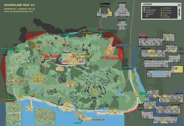
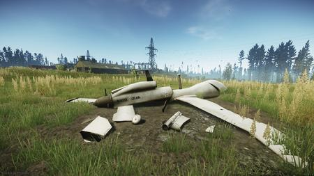
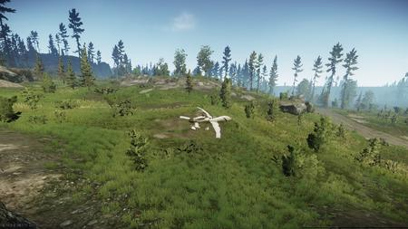
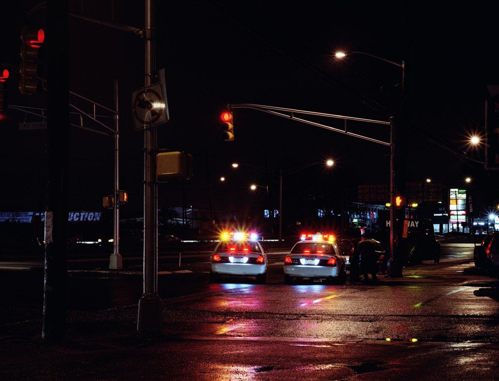

## Claim
Claim: " This image shows a US drone which was shot down in March 2025 by the Houthis using Russian missiles."

## Actions
```
reverse_search()
web_search("US drone shot down Houthis Russian missiles")
```

## Evidence
### Evidence from `reverse_search`
The image 

### Evidence from `web_search`
The Atlantic Council reports that the Houthis shot down a US MQ-9 Reaper on December 28, 2024, and another in 2025. The Houthis have claimed responsibility for downing fourteen MQ-9 Reaper drones since November 2023. Iran mediated talks between Russia and the Houthis that led to Moscow supplying Russian-made advanced anti-ship cruise missiles to the group. [Source](https://www.atlanticcouncil.org/blogs/menasource/houthi-strikes-on-us-mq9-reaper-drones/)

NPR and CNN reported on April 25, 2025, that the Houthis shot down seven U.S. Reaper drones in recent weeks, hindering the US's military operations. The U.S. launched a major military campaign targeting the Houthi rebel group in Yemen in March 2025. [Source](https://www.npr.org/2025/04/25/nx-s1-5377192/houthis-reaper-drones-us-military-yemen), [Source](https://www.cnn.com/2025/04/25/politics/houthis-target-drones-hampering-trump-mission). 


## Elaboration
The evidence confirms that the Houthis shot down U.S. Reaper drones in 2025. The Atlantic Council reports that the Houthis shot down a US MQ-9 Reaper in 2025. NPR and CNN reported that the Houthis shot down seven U.S. Reaper drones in recent weeks, hindering the US's military operations. The evidence also indicates that Iran mediated talks between Russia and the Houthis that led to Moscow supplying Russian-made advanced anti-ship cruise missiles to the group.

The claim states that the image shows a US drone shot down in March 2025 by the Houthis using Russian missiles. The evidence supports the claim that the Houthis shot down US drones in 2025. However, the evidence does not confirm that the image depicts a US drone shot down in March 2025 or that Russian missiles were used.

Therefore, the claim is partially supported. The evidence confirms that the Houthis shot down US drones in 2025, but the specific details about the image and the use of Russian missiles are not verified.


## Actions
```
web_search("drone crash site location")
```

## Evidence
### Evidence from `web_search`
The search results include information about drone crash sites. One source, from the Escape from Tarkov Wiki, discusses UAV crash sites in the game, with a map and images of the locations (, , ). Another source, from Hindustan Times, reports on a drone crashing into a New Jersey homeowner's backyard in December 2024 (). Newsweek also reports on mysterious drone sightings and a possible crash in New Jersey, with the FBI and local police investigating ().


## Elaboration
The evidence provides information about drone crash sites, including those in a video game and one in New Jersey. However, none of the evidence provides information about the location of the drone crash depicted in the image. Therefore, the location of the crash site in the image cannot be verified.


## Final Judgement
The evidence confirms that the Houthis shot down US drones in 2025. However, the evidence does not confirm that the image depicts a US drone shot down in March 2025 or that Russian missiles were used. Furthermore, the location of the crash site in the image cannot be verified. Therefore, the claim is partially supported. `false`

### Verdict: FALSE

### Justification
The claim is partially supported. While evidence confirms that the Houthis shot down U.S. drones in 2025, the provided evidence does not verify that the image depicts a U.S. drone shot down in March 2025 or that Russian missiles were used. Additionally, the location of the crash site in the image remains unverified.
