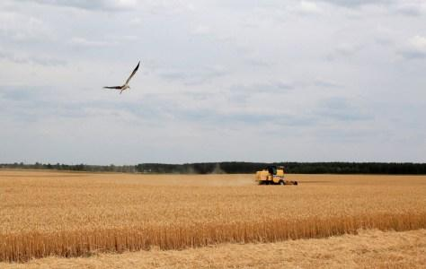
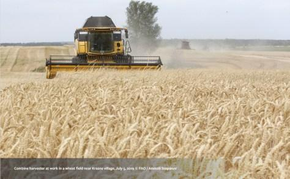
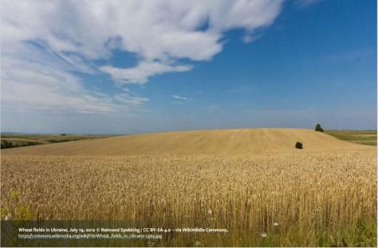
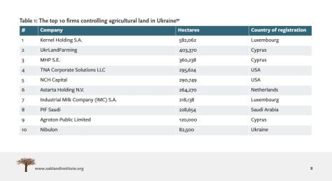

## Claim
Claim: "BlackRock has asked that Ukrainian soldiers not be buried on the land it owns in Ukraine."

## Actions
```
web_search("BlackRock Ukraine land burial policy")
web_search("BlackRock Ukraine land ownership")
```

## Evidence
### Evidence from `web_search`
The Asia Fact Check Lab ([https://www.rfa.org/english/news/afcl/afcl-blackrock-ukraine-land-08262024030948.html](https://www.rfa.org/english/news/afcl/afcl-blackrock-ukraine-land-08262024030948.html)) debunks the claim that BlackRock asked Ukraine not to bury soldiers on its land, stating the claim originated from a Bulgarian politician and was shared by Russian and Chinese media. The article includes images from Sputnik and other Chinese websites . The Myth Detector ([https://mythdetector.com/en/ukrainian-lands-and-banned-the-burial-of-military-personnel/](https://mythdetector.com/en/ukrainian-lands-and-banned-the-burial-of-military-personnel/)) fact-checks the claim, stating it is false and originated from a satirical Telegram channel .

The Oakland Institute report ([https://tlio.org.uk/war-and-theft-the-hostile-takeover-of-ukraines-agricultural-land-private-equitys-21st-century-war-for-global-enclosure-and-slavery/](https://tlio.org.uk/war-and-theft-the-hostile-takeover-of-ukraines-agricultural-land-private-equitys-21st-century-war-for-global-enclosure-and-slavery/)) discusses land ownership in Ukraine but does not mention BlackRock's policy on soldier burials. The report includes images of Ukrainian wheat fields , , , .


### Evidence from `web_search`
From [Source](https://www.europarl.europa.eu/doceo/document/E-10-2024-002526_EN.html): 
Content: The European Parliament discusses the purchase of Ukrainian farmland by multinational companies, including BlackRock. The document, dated November 13, 2024, questions the impact of this on EU food supply dependence and suggests the US is seeking to control Ukrainian farmland.


## Elaboration
The claim is false. Multiple sources, including the Asia Fact Check Lab ([https://www.rfa.org/english/news/afcl/afcl-blackrock-ukraine-land-08262024030948.html](https://www.rfa.org/english/news/afcl/afcl-blackrock-ukraine-land-08262024030948.html)) and Myth Detector ([https://mythdetector.com/en/ukrainian-lands-and-banned-the-burial-of-military-personnel/](https://mythdetector.com/en/ukrainian-lands-and-banned-the-burial-of-military-personnel/)), debunk the claim, citing its origin from a Bulgarian politician and a satirical Telegram channel, respectively.

The Oakland Institute report ([https://tlio.org.uk/war-and-theft-the-hostile-takeover-of-ukraines-agricultural-land-private-equitys-21st-century-war-for-global-enclosure-and-slavery/](https://tlio.org.uk/war-and-theft-the-hostile-takeover-of-ukraines-agricultural-land-private-equitys-21st-century-war-for-global-enclosure-and-slavery/)) discusses land ownership in Ukraine but does not mention BlackRock's policy on soldier burials.


## Final Judgement
The claim is demonstrably false, as multiple fact-checking sources have debunked it. `false`

### Verdict: FALSE

### Justification
The claim that BlackRock requested that Ukrainian soldiers not be buried on its land is false. Fact-checks by the Asia Fact Check Lab ([https://www.rfa.org/english/news/afcl/afcl-blackrock-ukraine-land-08262024030948.html](https://www.rfa.org/english/news/afcl/afcl-blackrock-ukraine-land-08262024030948.html)) and Myth Detector ([https://mythdetector.com/en/ukrainian-lands-and-banned-the-burial-of-military-personnel/](https://mythdetector.com/en/ukrainian-lands-and-banned-the-burial-of-military-personnel/)) show the claim originated from a Bulgarian politician and a satirical Telegram channel, respectively.
