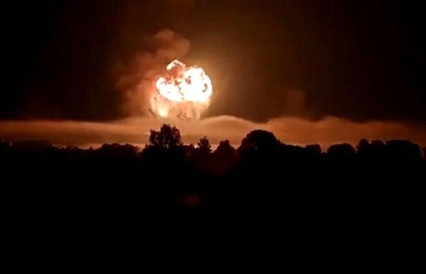

## Claim
Claim: " This image shows a Russian ammunition depot in Toropets, Tver Oblast, before and after it was hit by a, possible nuclear, strike from the North Atlantic Treaty Organization (NATO)."

## Actions
```
web_search("Russian ammunition depot Toropets Tver Oblast")
web_search("Toropets ammunition depot NATO strike")
```

## Evidence
### Evidence from `web_search`
The provided sources discuss a Ukrainian drone attack on a Russian ammunition depot in Toropets, Tver Oblast, Russia, on September 17-18, 2024. The attack resulted in explosions and fires. The depot stored various munitions, including missiles and artillery ammunition. The Wikipedia article ([https://en.wikipedia.org/wiki/Toropets_depot_explosions](https://en.wikipedia.org/wiki/Toropets_depot_explosions)) mentions CIA involvement and the ongoing Russo-Ukrainian War.

The CNN article ([https://edition.cnn.com/2024/09/18/europe/ukraine-russian-weapons-depot-drone-attack-intl](https://edition.cnn.com/2024/09/18/europe/ukraine-russian-weapons-depot-drone-attack-intl)) reports on the same attack, noting the depot stored Iskander and Tochka-U missile systems. Satellite images from Maxar Technologies show the depot before and after the explosion  and . The Ukrainian Security Service (SBU) claimed responsibility for the attack.


### Evidence from `web_search`
From [Source](https://www.cbsnews.com/news/ukraine-hits-russia-drone-attack-toropets-military-depot-explosions/): 
Content: The CBS News article discusses a Ukrainian drone attack on a military depot in Toropets, Russia, in the Tver region. The strike caused a large fire. The depot housed missiles, glide bombs, and artillery shells.  shows flames rising from an explosion. The article mentions that Ukraine has been pushing for approval from Western partners to use weapons to hit targets inside Russia.


## Elaboration
The evidence indicates that the ammunition depot in Toropets, Tver Oblast, Russia, was hit by a Ukrainian drone attack, not a NATO strike. The attack resulted in explosions and fires. The depot stored various munitions, including missiles and artillery ammunition.


## Final Judgement
The claim that the image shows a Russian ammunition depot hit by a NATO strike is false. Multiple sources confirm that the depot was attacked by Ukrainian drones. The evidence includes reports of explosions and fires at the depot, and the Ukrainian Security Service claimed responsibility for the attack.

`false`

### Verdict: FALSE

### Justification
The image depicts a Russian ammunition depot in Toropets, Tver Oblast, Russia, that was hit by a Ukrainian drone attack, not a NATO strike, as evidenced by reports of explosions and fires ([https://en.wikipedia.org/wiki/Toropets_depot_explosions](https://en.wikipedia.org/wiki/Toropets_depot_explosions), [https://edition.cnn.com/2024/09/18/europe/ukraine-russian-weapons-depot-drone-attack-intl](https://edition.cnn.com/2024/09/18/europe/ukraine-russian-weapons-depot-drone-attack-intl)).
