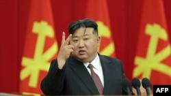

## Claim
Claim: "While serving as US President in 2024, Joe Biden ordered the US forces to prepare for possible nuclear confrontations with Russia, China, and North Korea."

## Actions
```
web_search("Joe Biden US President nuclear confrontation Russia China North Korea")
```

## Evidence
### Evidence from `web_search`
According to a The Guardian article published on August 20, 2024, Joe Biden approved a US nuclear strategy to prepare for possible nuclear confrontations with Russia, China, and North Korea (). The White House stated the plan was approved earlier in the year and was not a response to a single country or threat. The Voice of America (VOA) reported on August 24, 2024, that North Korea condemned the new U.S. nuclear strategic plan, which was approved by President Joe Biden in March, to prepare for possible coordinated nuclear confrontations with Russia, China, and North Korea ().

The Brookings article discusses Biden's nuclear policy, mentioning that Biden deterred Russian nuclear escalation in the war in Ukraine and worked to stabilize relations with China and Russia.

*   [https://www.theguardian.com/us-news/article/2024/aug/20/biden-nuclear-strategy-china-threat](https://www.theguardian.com/us-news/article/2024/aug/20/biden-nuclear-strategy-china-threat)
*   [https://www.brookings.edu/articles/how-would-trump-and-biden-handle-us-nuclear-policy-upon-reelection/](https://www.brookings.edu/articles/how-would-trump-and-biden-handle-us-nuclear-policy-upon-reelection/)
*   [https://www.voanews.com/a/north-korea-condemns-new-us-nuclear-strategic-plan-report/7755256.html](https://www.voanews.com/a/north-korea-condemns-new-us-nuclear-strategic-plan-report/7755256.html)


## Elaboration
The evidence confirms that Joe Biden, while serving as US President, approved a US nuclear strategy to prepare for possible nuclear confrontations with Russia, China, and North Korea. The Guardian article from August 20, 2024, and the VOA report from August 24, 2024, both support this. The White House stated the plan was approved earlier in the year.


## Final Judgement
The evidence from multiple sources, including The Guardian and Voice of America, confirms that Joe Biden, as US President in 2024, approved a nuclear strategy to prepare for potential confrontations with Russia, China, and North Korea.

`true`


### Verdict: TRUE

### Justification
Multiple sources, including a The Guardian article ([https://www.theguardian.com/us-news/article/2024/aug/20/biden-nuclear-strategy-china-threat](https://www.theguardian.com/us-news/article/2024/aug/20/biden-nuclear-strategy-china-threat)) and a Voice of America report ([https://www.voanews.com/a/north-korea-condemns-new-us-nuclear-strategic-plan-report/7755256.html](https://www.voanews.com/a/north-korea-condemns-new-us-nuclear-strategic-plan-report/7755256.html)), confirm that Joe Biden approved a US nuclear strategy to prepare for possible nuclear confrontations with Russia, China, and North Korea.
