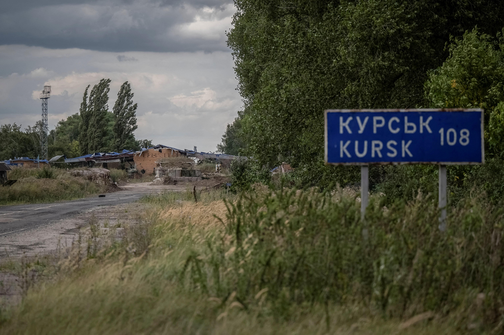

## Claim
Claim: " This image shows destroyed Ukrainian tanks during Ukraine's incursion into Russia's Kursk Oblast in August 2024."

## Actions
```
reverse_search()
web_search("Ukraine Russia Kursk Oblast August 2024 tanks")
```

## Evidence
### Evidence from `reverse_search`
The image () of destroyed tanks appears in multiple sources. Sputnik Africa published an article on October 17, 2024, stating that Ukraine has lost around 40 Leopard tanks since February 2022. The Moscow Times reported on June 13, 2023, that Russia captured German Leopard tanks in the Zaporizhzhia region. Defence Security Asia published an article on May 19, 2024, discussing the destruction of German-made Leopard tanks in Ukraine.

The sources include images of Leopard tanks and destroyed tanks (). The articles discuss the conflict between Russia and Ukraine, with Russia claiming to have destroyed or captured Western-supplied military equipment.


### Evidence from `web_search`
The search results discuss the 2024 Kursk offensive, which began on August 6, 2024, as part of the Russian invasion of Ukraine. The Armed Forces of Ukraine launched an incursion into Russia's Kursk Oblast. The article mentions the involvement of Ukrainian brigades, Russian forces, and North Korean forces. The article also mentions the number of casualties and equipment losses. The article includes a timeline of the campaign and mentions the capture of settlements and the destruction of bridges. The article also mentions the involvement of the 80th and 82nd Air Assault Brigades. ()

Reuters reports on August 26, 2024, that Russia said Ukraine had lost 73 tanks, 61 armored personnel carriers and 404 armored combat vehicles in the Kursk region. The article also mentions an incursion by Ukraine into the Kursk region. () The Al Jazeera article, published on August 29, 2024, discusses Ukraine's ground offensive inside Russian territory, specifically in the Kursk region. (<image:k>) shows a building on fire in Sudzha, Russia, after a cross-border incursion of Ukrainian troops into the Kursk region on August 7, 2024. The article mentions that Russia was moving its aircraft back from airfields near the Ukrainian border. The article also mentions that the Kursk offensive had greatly reduced Russia’s use of aviation against northeastern Ukraine.


## Elaboration
The evidence confirms that an incursion by Ukraine into Russia's Kursk Oblast occurred in August 2024. The search results mention the destruction of tanks and other military equipment during this offensive. The reverse image search reveals that the image (

## Final Judgement
The evidence confirms that an incursion by Ukraine into Russia's Kursk Oblast occurred in August 2024, and the image depicts destroyed tanks. The search results mention the destruction of tanks and other military equipment during this offensive. The reverse image search reveals that the image is associated with the conflict.

`true`

### Verdict: TRUE

### Justification
The image depicts destroyed tanks, and the search results confirm that Ukraine launched an incursion into Russia's Kursk Oblast in August 2024, during which tanks were destroyed, as reported by sources like Reuters and Al Jazeera.
