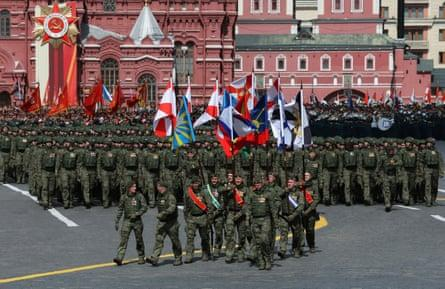
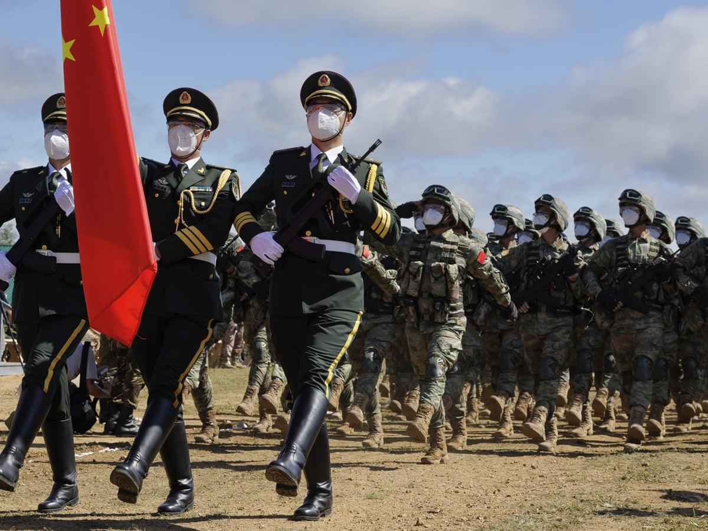

## Claim
Claim: " This image shows the Chinese Communist Party's Red Cross troops in Russia who have changed into winter clothes and set off for the Russian-Ukrainian front to aid Russia in rescuing its occupied territories."

## Actions
```
web_search("Chinese Red Cross troops Russia Ukraine")
image_search("Chinese Red Cross troops Russia")
```

## Evidence
### Evidence from `web_search`
CNN published an article on April 16, 2025, discussing the capture of Chinese nationals fighting for Russia in Ukraine. The article includes images of captured Chinese fighters and discusses their recruitment, the timing of their capture, and the potential political implications. The article mentions that Ukraine has identified 155 Chinese citizens fighting for Russia. ([https://www.cnn.com/2025/04/16/europe/ukraine-russia-chinese-nationals-intl-latam](https://www.cnn.com/2025/04/16/europe/ukraine-russia-chinese-nationals-intl-latam)) 

The Guardian published an article about Chinese troops marching with Russian forces in Moscow's Red Square for Victory Day. ([https://www.theguardian.com/weather/2025/may/09/chinese-troops-march-with-russian-forces-as-xi-joins-putin-for-victory-day-parade](https://www.theguardian.com/weather/2025/may/09/chinese-troops-march-with-russian-forces-as-xi-joins-putin-for-victory-day-parade)) , ,  The International Federation of Red Cross and Red Crescent Societies and the International Committee of the Red Cross published a report on the Russia-Ukraine international armed conflict, mentioning the Red Cross Society of China's involvement in supporting the response to the conflict. ([https://www.icrc.org/sites/default/files/document_new/file_list/red_cross_movement_activities_overview_ukraine_2022_3.pdf](https://www.icrc.org/sites/default/files/document_new/file_list/red_cross_movement_activities_overview_ukraine_2022_3.pdf))


### Evidence from `image_search`
The Guardian published an article about Russia and China launching large-scale military drills (). USNI News published an article discussing China and Russia's actions in Ukraine and near Taiwan, including an image of Chinese troops (). Al Jazeera published an article on March 25, 2023, which includes an image of Chinese soldiers ().

The articles can be found at the following URLs: [https://www.theguardian.com/world/2022/sep/01/russia-and-china-launch-large-scale-military-drills-amid-tensions-with-us](https://www.theguardian.com/world/2022/sep/01/russia-and-china-launch-large-scale-military-drills-amid-tensions-with-us), [https://news.usni.org/2021/04/14/cno-gilday-china-russia-deliberately-testing-allies-cohesion-in-actions-in-ukraine-near-taiwan](https://news.usni.org/2021/04/14/cno-gilday-china-russia-deliberately-testing-allies-cohesion-in-actions-in-ukraine-near-taiwan), and [https://www.aljazeera.com/news/2023/3/25/biden-says-no-sign-yet-of-china-sending-weapons-to-russia](https://www.aljazeera.com/news/2023/3/25/biden-says-no-sign-yet-of-china-sending-weapons-to-russia).


## Elaboration
The evidence suggests that the Red Cross Society of China has been involved in supporting the response to the Russia-Ukraine conflict. However, there is no direct evidence to support the claim that Chinese Red Cross troops have set off for the Russian-Ukrainian front to aid Russia in rescuing its occupied territories. The evidence does show Chinese nationals fighting for Russia in Ukraine and Chinese troops marching with Russian forces.

The claim's veracity cannot be fully determined due to the lack of specific information about the Red Cross troops' deployment to the front lines.


## Actions
```
reverse_search()
```

## Evidence
### Evidence from `reverse_search`
The reverse image search found the image on Wikipedia ([https://en.wikipedia.org/wiki/Airliner](https://en.wikipedia.org/wiki/Airliner)), the Smithsonian National Air and Space Museum, and Merriam-Webster ([https://www.merriam-webster.com/dictionary/airliner](https://www.merriam-webster.com/dictionary/airliner)). The Wikipedia article discusses airliners, the Smithsonian article discusses the evolution of commercial airliners, and Merriam-Webster defines "airliner." 


## Elaboration
The reverse image search results do not provide any information to support the claim. The image appears on websites discussing airliners, but there is no mention of the Chinese Red Cross troops or their activities in Russia or Ukraine.


## Actions
```
web_search("Chinese Red Cross Russia Ukraine aid")
```

## Evidence
### Evidence from `web_search`
Reuters, China Daily, and NBC News reported that the Chinese Red Cross provided humanitarian aid to Ukraine. Reuters and China Daily stated that the aid was worth 5 million yuan. NBC News mentioned that the aid would be provided "as soon as possible" and also noted China's friendship with Russia. The articles were published in March 2022. ([https://www.reuters.com/world/china-provide-5-mln-yuan-worth-humanitarian-assistance-ukraine-2022-03-09/](https://www.reuters.com/world/china-provide-5-mln-yuan-worth-humanitarian-assistance-ukraine-2022-03-09/), [https://global.chinadaily.com.cn/a/202203/22/WS62392e6fa310fd2b29e52706.html](https://global.chinadaily.com.cn/a/202203/22/WS62392e6fa310fd2b29e52706.html), [https://www.nbcnews.com/news/world/china-ukraine-aid-russia-rock-solid-rcna18937](https://www.nbcnews.com/news/world/china-ukraine-aid-russia-rock-solid-rcna18937)) 


## Elaboration
The evidence indicates that the Chinese Red Cross provided humanitarian aid to Ukraine in March 2022. However, the claim states that the Red Cross troops were setting off to aid Russia in rescuing its occupied territories. There is no evidence to support this claim. The image search results do not provide any information to support the claim.


## Final Judgement
The evidence suggests that the Chinese Red Cross provided humanitarian aid to Ukraine, but there is no evidence to support the claim that Chinese Red Cross troops have set off for the Russian-Ukrainian front to aid Russia. The image search results do not provide any information to support the claim. Therefore, the claim is not factually accurate. `false`

### Verdict: FALSE

### Justification
The claim is unsubstantiated. While the Chinese Red Cross provided humanitarian aid to Ukraine in March 2022, there is no evidence to support the assertion that Chinese Red Cross troops were deployed to assist Russia in its war efforts, and the image used in the claim is of an airliner, not of troops.
