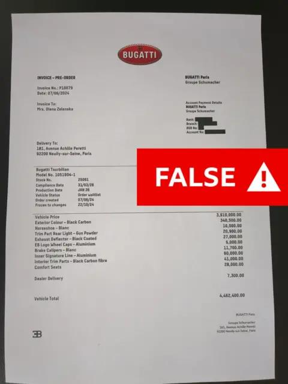

## Claim
Claim: "Ukrainian President Volodymyr Zelenskyy's wife bought a $5,000,000.00 Bugatti while vacationing in Paris."

## Actions
```
web_search("Volodymyr Zelenskyy wife Bugatti Paris")
```

## Evidence
### Evidence from `web_search`
Multiple sources, including the BBC ([https://www.bbc.com/news/articles/c72ver6172do](https://www.bbc.com/news/articles/c72ver6172do)), CBS News ([https://www.cbsnews.com/news/olena-zelenska-false-claim-she-bought-bugatti/](https://www.cbsnews.com/news/olena-zelenska-false-claim-she-bought-bugatti/)), and CNN ([https://www.cnn.com/2024/07/02/europe/deepfake-video-zelensky-wife-intl-latam](https://www.cnn.com/2024/07/02/europe/deepfake-video-zelensky-wife-intl-latam)), report that a deepfake video falsely claimed Olena Zelenska, the wife of Ukrainian President Volodymyr Zelenskyy, purchased a Bugatti in Paris. The BBC article states the story was fake news .

The reports indicate the video was part of a Russian disinformation campaign. Bugatti Paris denied the transaction and filed a criminal complaint .


## Elaboration
The evidence indicates the claim is false. Multiple news sources, including the BBC, CBS News, and CNN, report that the story about Olena Zelenska buying a Bugatti was a deepfake video and part of a Russian disinformation campaign. Bugatti Paris denied the transaction.


## Final Judgement
The claim that Ukrainian President Volodymyr Zelenskyy's wife bought a Bugatti in Paris is false. Multiple reputable news sources have reported that this story originated from a deepfake video and was part of a disinformation campaign. Bugatti Paris denied the transaction.

`false`


### Verdict: FALSE

### Justification
The claim is false. Multiple news outlets, including the BBC ([https://www.bbc.com/news/articles/c72ver6172do](https://www.bbc.com/news/articles/c72ver6172do)), reported that the story originated from a deepfake video and was part of a disinformation campaign. Bugatti Paris denied the transaction.
