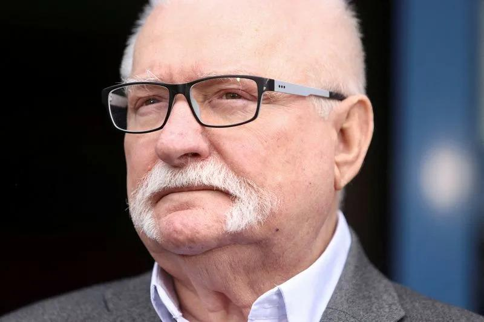

## Claim
Claim: "In March 2025 former President of Poland Lech Wałęsa wrote a letter to Donald Trump criticizing the U.S. President's decision to suspend the delivery of all U.S. military aid to Ukraine."

## Actions
```
web_search("Lech Wałęsa letter Donald Trump Ukraine aid March 2025")
```

## Evidence
### Evidence from `web_search`
In March 2025, Lech Wałęsa wrote a letter to Donald Trump criticizing his treatment of Ukrainian President Volodymyr Zelenskyy. NPR reported that Wałęsa's letter condemned Trump's actions, expressing concerns about his leniency towards Vladimir Putin, as stated in an article published on March 5, 2025 ([https://www.npr.org/2025/03/05/nx-s1-5317474/nobel-peace-prize-winner-lech-walesa-condemns-president-trumps-treatment-of-zelenskyy](https://www.npr.org/2025/03/05/nx-s1-5317474/nobel-peace-prize-winner-lech-walesa-condemns-president-trumps-treatment-of-zelenskyy)).

Reuters reported on March 3, 2025, that Wałęsa's letter criticized Trump's argument with Zelenskyy ([https://www.reuters.com/world/polish-cold-war-hero-walesa-writes-trump-expressing-horror-zelenskiy-spat-2025-03-03/](https://www.reuters.com/world/polish-cold-war-hero-walesa-writes-trump-expressing-horror-zelenskiy-spat-2025-03-03/)). The Los Angeles Times also reported on March 3, 2025, that Wałęsa and other former political prisoners wrote a letter to Trump criticizing his behavior toward Zelenskyy ([https://www.latimes.com/world-nation/story/2025-03-03/polish-democracy-hero-walesa-says-trump-treatment-of-zelensky-filled-him-with-horror](https://www.latimes.com/world-nation/story/2025-03-03/polish-democracy-hero-walesa-says-trump-treatment-of-zelensky-filled-him-with-horror)).   <image:i>


## Elaboration
The evidence confirms that Lech Wałęsa wrote a letter to Donald Trump in March 2025. The letter criticized Trump's treatment of Ukrainian President Volodymyr Zelenskyy. However, the provided evidence does not explicitly mention whether the letter specifically criticized Trump's decision to suspend the delivery of U.S. military aid to Ukraine.

The NPR article ([https://www.npr.org/2025/03/05/nx-s1-5317474/nobel-peace-prize-winner-lech-walesa-condemns-president-trumps-treatment-of-zelenskyy](https://www.npr.org/2025/03/05/nx-s1-5317474/nobel-peace-prize-winner-lech-walesa-condemns-president-trumps-treatment-of-zelenskyy)) and the Reuters article ([https://www.reuters.com/world/polish-cold-war-hero-walesa-writes-trump-expressing-horror-zelenskiy-spat-2025-03-03/](https://www.reuters.com/world/polish-cold-war-hero-walesa-writes-trump-expressing-horror-zelenskiy-spat-2025-03-03/)) focus on Wałęsa's criticism of Trump's behavior towards Zelenskyy. The Los Angeles Times article ([https://www.latimes.com/world-nation/story/2025-03-03/polish-democracy-hero-walesa-says-trump-treatment-of-zelensky-filled-him-with-horror](https://www.latimes.com/world-nation/story/2025-03-03/polish-democracy-hero-walesa-says-trump-treatment-of-zelensky-filled-him-with-horror)) also supports this.

Therefore, the claim is partially supported, but it lacks specific evidence regarding the suspension of military aid.


## Actions
```
web_search("Lech Wałęsa letter Donald Trump Ukraine military aid March 2025")
```

## Evidence
No new evidence found.

## Elaboration
The claim is not entirely supported by the evidence. While the evidence confirms that Lech Wałęsa wrote a letter to Donald Trump in March 2025 criticizing his treatment of Zelenskyy, there is no direct mention of the letter specifically addressing the suspension of U.S. military aid to Ukraine. Further information is needed to verify this aspect of the claim.


## Actions
```
web_search("Lech Wałęsa letter Donald Trump Ukraine aid suspension March 2025")
```

## Evidence
### Evidence from `web_search`
From [Source](https://ca.news.yahoo.com/polish-cold-war-hero-walesa-120858761.html): 
Content: Reuters reported that Lech Wałęsa, along with 39 former Polish political prisoners, signed a letter to Donald Trump in March 2025, criticizing Trump's argument with Ukrainian President Volodymyr Zelenskiy. The letter expressed "horror and distaste" at Trump's behavior and called on the U.S. to fulfill security guarantees given to Ukraine in 1994. The letter also stated that gratitude is due to Ukrainian soldiers for defending the values of the free world.  The article was published by Reuters.


## Elaboration
The evidence indicates that Lech Wałęsa, along with other former Polish political prisoners, wrote a letter to Donald Trump in March 2025. The letter criticized Trump's behavior towards Ukrainian President Volodymyr Zelenskyy and called on the U.S. to fulfill security guarantees given to Ukraine in 1994 ([https://ca.news.yahoo.com/polish-cold-war-hero-walesa-120858761.html](https://ca.news.yahoo.com/polish-cold-war-hero-walesa-120858761.html)).

While the letter expressed concerns about U.S. security guarantees, the evidence does not explicitly state that the letter specifically criticized Trump's decision to suspend the delivery of U.S. military aid to Ukraine.

Therefore, the claim is not entirely supported by the evidence.


## Final Judgement
The evidence confirms that Lech Wałęsa wrote a letter to Donald Trump in March 2025 criticizing his behavior towards Ukrainian President Volodymyr Zelenskyy and calling for the fulfillment of security guarantees. However, the evidence does not explicitly state that the letter specifically criticized Trump's decision to suspend the delivery of U.S. military aid to Ukraine. Therefore, the claim is not fully supported by the available information.

`not enough information`


### Verdict: NEI

### Justification
In March 2025, Lech Wałęsa wrote a letter to Donald Trump criticizing his behavior towards Ukrainian President Volodymyr Zelenskyy and urging the fulfillment of security guarantees, as reported by Reuters ([https://ca.news.yahoo.com/polish-cold-war-hero-walesa-120858761.html](https://ca.news.yahoo.com/polish-cold-war-hero-walesa-120858761.html)). However, the available evidence does not explicitly confirm that the letter specifically addressed or criticized Trump's decision to suspend U.S. military aid to Ukraine.
