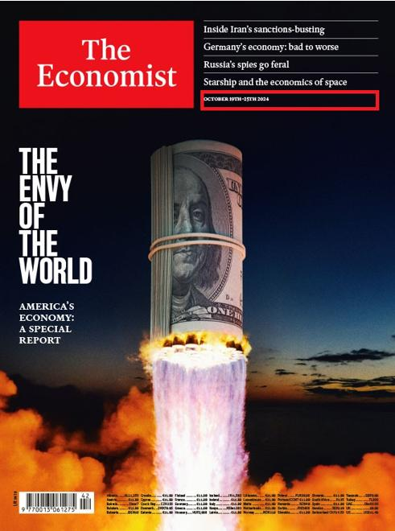
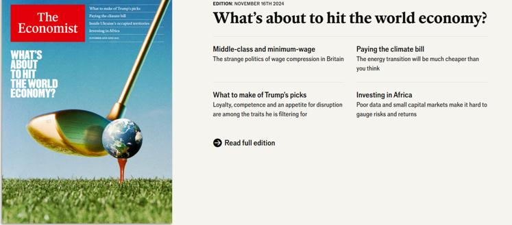

## Claim
Claim: " This image shows a screenshot of an authentic cover of the magazine The Economist from the end of 2024 illustrating Donald Trump and Vladimir Putin and warning of an apocalypse."

## Actions
```
web_search("The Economist cover Trump Putin apocalypse")
```

## Evidence
### Evidence from `web_search`
The image of The Economist cover featuring Donald Trump and Vladimir Putin with the headline "Apocalypse" is a fake. Ukrinform.net ([https://www.ukrinform.net/rubric-factcheck/3930063-russian-propaganda-fabricates-the-economist-cover-about-beginning-of-world-war-iii.html](https://www.ukrinform.net/rubric-factcheck/3930063-russian-propaganda-fabricates-the-economist-cover-about-beginning-of-world-war-iii.html)) states that the cover lacks a publication date, a standard feature of genuine Economist issues. The actual Economist issue published on November 16, 2024, features a globe being struck by a golf club.

PesaCheck ([https://pesacheck.org/altered-this-front-cover-was-not-published-by-the-economist-cd0c20d99b9b](https://pesacheck.org/altered-this-front-cover-was-not-published-by-the-economist-cd0c20d99b9b)) and AAP FactCheck ([https://www.aap.com.au/factcheck/fake-economist-apocalypse-cover-linked-to-pro-kremlin-propaganda/](https://www.aap.com.au/factcheck/fake-economist-apocalypse-cover-linked-to-pro-kremlin-propaganda/)) also confirm the image is altered. AAP FactCheck notes spelling mistakes in the cover lines and that the cover was pushed by a pro-Kremlin Telegram channel. , , , , , 


## Elaboration
The claim is false. The evidence indicates that the image is a fabricated cover of The Economist. Multiple sources, including Ukrinform.net ([https://www.ukrinform.net/rubric-factcheck/3930063-russian-propaganda-fabricates-the-economist-cover-about-beginning-of-world-war-iii.html](https://www.ukrinform.net/rubric-factcheck/3930063-russian-propaganda-fabricates-the-economist-cover-about-beginning-of-world-war-iii.html)), PesaCheck ([https://pesacheck.org/altered-this-front-cover-was-not-published-by-the-economist-cd0c20d99b9b](https://pesacheck.org/altered-this-front-cover-was-not-published-by-the-economist-cd0c20d99b9b)), and AAP FactCheck ([https://www.aap.com.au/factcheck/fake-economist-apocalypse-cover-linked-to-pro-kremlin-propaganda/](https://www.aap.com.au/factcheck/fake-economist-apocalypse-cover-linked-to-pro-kremlin-propaganda/)), confirm its inauthenticity. The actual cover from November 16, 2024, featured a different image. Furthermore, the fake cover contains spelling errors and was promoted by a pro-Kremlin Telegram channel.


## Final Judgement
The image is a fake cover of The Economist. The actual cover from November 16, 2024, featured a different image. The fake cover contains spelling errors and was promoted by a pro-Kremlin Telegram channel.

`false`


### Verdict: FALSE

### Justification
The image of The Economist cover depicting Trump and Putin with the headline "Apocalypse" is a fabrication. Multiple fact-checking sources, including Ukrinform.net, PesaCheck, and AAP FactCheck, confirm the image's inauthenticity, highlighting that the actual cover from November 16, 2024, featured a different image and that the fake cover contains spelling errors and was promoted by a pro-Kremlin Telegram channel.
