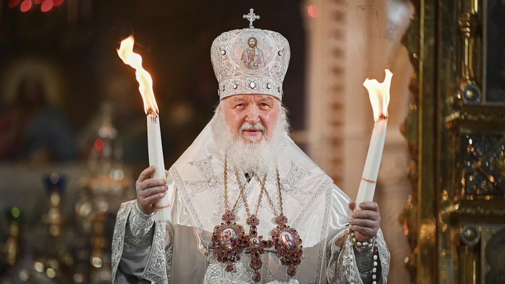
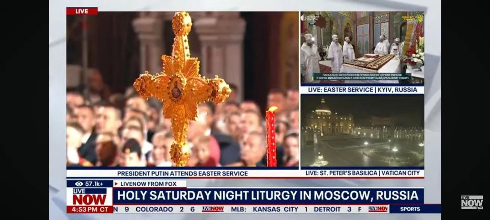
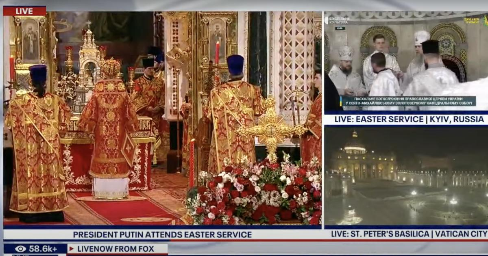

## Claim
Claim: " This image shows a Fox News broadcast from Easter 2025 where you can see the Patriarch Kirill in the center and Kyiv labeled as a Russian city in the top right corner of the image."

## Actions
```
image_search("Fox News Easter broadcast Patriarch Kirill")
web_search("Fox News Easter broadcast Kyiv Moscow")
```

## Evidence
### Evidence from `image_search`
The search results include screenshots from Fox News broadcasts. One source shows Patriarch Kirill (). Other sources show a Fox News broadcast of an Easter service that labels Kyiv as a Russian city (, ).

The sources are: [Source](https://www.foxnews.com/world/reporters-notebook-ukrainian-spiritual-leader-says-russian-orthodox-church-extension-kremlin), [Source](https://unn.ua/en/news/fox-news-showed-the-patriarch-of-the-russian-orthodox-church-kirill-at-night-and-labeled-kyiv-as-russia), and [Source](https://united24media.com/latest-news/fox-news-labels-kyiv-as-russia-during-easter-service-broadcast-7731).


### Evidence from `web_search`
The web sources discuss a Fox News broadcast from Easter 2025 that mislabeled Kyiv as a Russian city during its coverage of Easter services. The error, which appeared on LiveNOW from Fox, prompted the Ukrainian Ministry of Foreign Affairs to request an apology and investigation. LiveNOW from Fox issued an apology for the mistake. The broadcast included footage of Easter services, including one in Moscow and another in Kyiv, which was initially labeled "Kyiv, Ukraine" but later changed to "Kyiv, Russia" for about 20 minutes before being corrected. The claim is rated as "Mostly True".

Sources: [https://www.yahoo.com/news/fact-check-fox-livestream-news-233600386.html](https://www.yahoo.com/news/fact-check-fox-livestream-news-233600386.html), [https://www.aa.com.tr/en/russia-ukraine-war/ukraine-seeks-apology-from-fox-news-for-labeling-kyiv-russian-city-/3543703](https://www.aa.com.tr/en/russia-ukraine-war/ukraine-seeks-apology-from-fox-news-for-labeling-kyiv-russian-city-/3543703), [https://www.newsweek.com/fox-channel-ukraine-kyiv-russia-labeling-orthodox-easter-2061891](https://www.newsweek.com/fox-channel-ukraine-kyiv-russia-labeling-orthodox-easter-2061891).  


## Elaboration
The evidence confirms that the image is from a Fox News broadcast. The broadcast showed Patriarch Kirill and mislabeled Kyiv as a Russian city during an Easter service. The error was later corrected, and Fox News apologized for the mistake.


## Final Judgement
The claim is accurate. The image is from a Fox News broadcast that showed Patriarch Kirill and mislabeled Kyiv as a Russian city during an Easter service.

`true`

### Verdict: TRUE

### Justification
The claim is accurate. The image is from a Fox News broadcast that showed Patriarch Kirill and mislabeled Kyiv as a Russian city during an Easter service, as confirmed by multiple sources ([Source](https://www.foxnews.com/world/reporters-notebook-ukrainian-spiritual-leader-says-russian-orthodox-church-extension-kremlin), [Source](https://unn.ua/en/news/fox-news-showed-the-patriarch-of-the-russian-orthodox-church-kirill-at-night-and-labeled-kyiv-as-russia), [Source](https://united24media.com/latest-news/fox-news-labels-kyiv-as-russia-during-easter-service-broadcast-7731)). The error was later corrected, and Fox News apologized.
