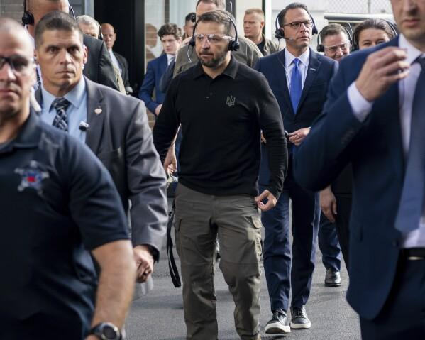
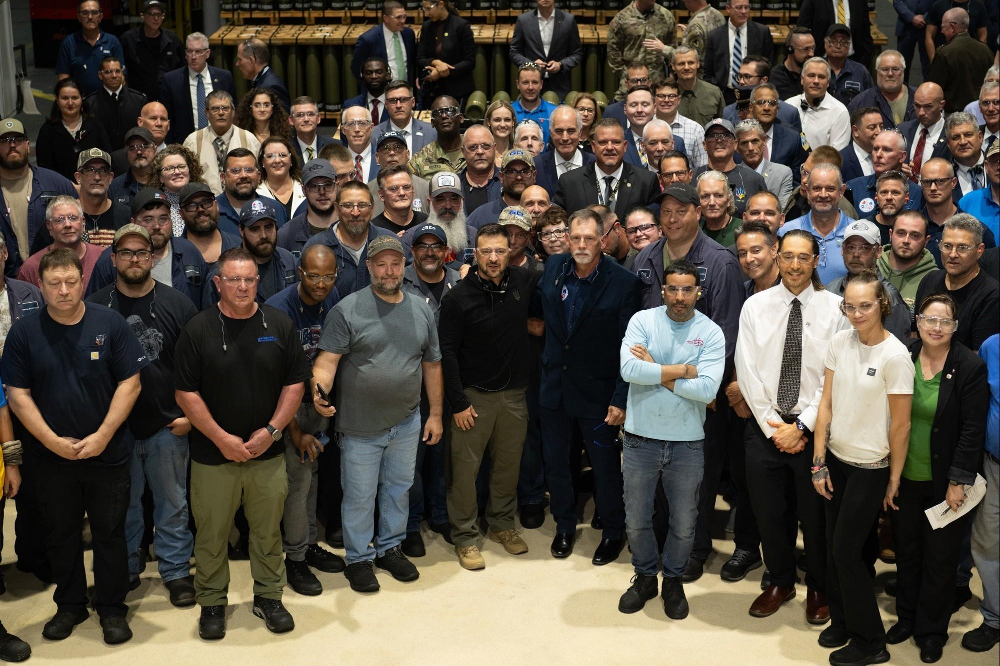
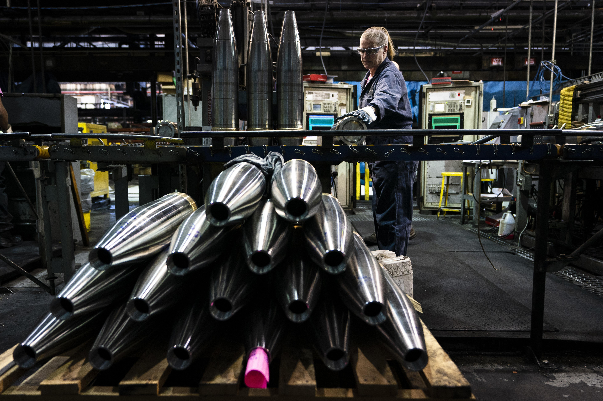

## Claim
Claim: "Ukrainian President Volodymyr Zelenskyy engaged in election interference by campaigning in Pennsylvania for Kamala Harris ahead of the US presidential election in 2024."

## Actions
```
web_search("Volodymyr Zelenskyy Kamala Harris Pennsylvania 2024")
```

## Evidence
### Evidence from `web_search`
Newsweek reports that JD Vance accused Volodymyr Zelenskyy of campaigning for Kamala Harris during the 2024 presidential race, citing Zelenskyy's visit to a munitions plant in Scranton, Pennsylvania. Representative James Comer is investigating the matter. ([https://www.newsweek.com/volodymyr-zelensky-jd-vance-campaign-kamala-harris-2024-election-2038060](https://www.newsweek.com/volodymyr-zelensky-jd-vance-campaign-kamala-harris-2024-election-2038060)) , , 

NBC News mentions that Zelenskyy's visit to a munitions factory in Scranton, Pennsylvania, was viewed by some Republicans as a signal of his preference in the November election. ([https://www.nbcnews.com/politics/2024-election/zelenskyys-meeting-harris-spat-trump-reveal-growing-partisan-divide-uk-rcna172648](https://www.nbcnews.com/politics/2024-election/zelenskyys-meeting-harris-spat-trump-reveal-growing-partisan-divide-uk-rcna172648)) ABC News reports on a meeting between Kamala Harris and Zelenskyy, and mentions Zelenskyy met with lawmakers at the Capitol. ([https://abcnews.go.com/Politics/harris-standing-zelenskyy-indirectly-jabs-trump-vance-ukraine/story?id=114219628](https://abcnews.go.com/Politics/harris-standing-zelenskyy-indirectly-jabs-trump-vance-ukraine/story?id=114219628)) , 


## Elaboration
The evidence indicates that there are accusations and concerns regarding Zelenskyy's actions potentially influencing the 2024 US presidential election. Newsweek reports that JD Vance accused Zelenskyy of campaigning for Kamala Harris, citing his visit to a munitions plant in Pennsylvania. NBC News mentions that some Republicans viewed Zelenskyy's visit to a munitions factory in Pennsylvania as a signal of his preference in the November election. ABC News reports on a meeting between Kamala Harris and Zelenskyy. Representative James Comer is investigating the matter.

The evidence does not explicitly confirm that Zelenskyy campaigned for Kamala Harris. However, it does show that his actions, such as visiting a munitions plant in Pennsylvania and meeting with Kamala Harris, have been interpreted by some as potential election interference.

To fully verify the claim, further information is needed to determine the nature of Zelenskyy's actions and whether they were intended to influence the election.


## Actions
```
web_search("Zelenskyy campaign activities Pennsylvania 2024")
```

## Evidence
### Evidence from `web_search`
CNN ([https://www.cnn.com/2024/09/23/europe/ukraine-zelensky-pennsylvania-us-visit-intl-hnk](https://www.cnn.com/2024/09/23/europe/ukraine-zelensky-pennsylvania-us-visit-intl-hnk)) reports that Volodymyr Zelenskyy toured a Pennsylvania ammunition plant on September 22, 2024, and met with Joe Biden and Kamala Harris. NBC Philadelphia ([https://www.nbcphiladelphia.com/news/national-international/ukraines-zelenskyy-visits-pennsylvania-ammunition-plant/3977332/](https://www.nbcphiladelphia.com/news/national-international/ukraines-zelenskyy-visits-pennsylvania-ammunition-plant/3977332/)) also reports on Zelenskyy's visit to the ammunition plant, which was part of a week that included talks with Biden and Harris. CNBC ([https://www.cnbc.com/2024/09/25/zelenskyy-insulted-him-house-gop-to-probe-ukraine-leaders-pa-trip-.html](https://www.cnbc.com/2024/09/25/zelenskyy-insulted-him-house-gop-to-probe-ukraine-leaders-pa-trip-.html)) states that House Oversight Chair James Comer opened an investigation into Zelenskyy's visit to the ammunition factory, claiming it was a campaign event for Kamala Harris. Republican House Speaker Mike Johnson also called the trip a partisan campaign event and election interference. Zelenskyy met with three Pennsylvania Democrats during the visit. , 


## Elaboration
The evidence confirms that Volodymyr Zelenskyy visited a Pennsylvania ammunition plant on September 22, 2024, and met with Joe Biden and Kamala Harris. Republican figures, including House Oversight Chair James Comer and Speaker Mike Johnson, have characterized this visit as a campaign event for Kamala Harris and potential election interference. The visit included meetings with Pennsylvania Democrats.

While the evidence does not explicitly state that Zelenskyy was campaigning for Harris, it does show that his actions were perceived as such by some, leading to investigations and accusations of election interference.


## Actions
```
image_search("Zelenskyy Pennsylvania ammunition plant")
```

## Evidence
### Evidence from `image_search`
The search results confirm that Volodymyr Zelenskyy visited a Pennsylvania ammunition plant. AP News, the U.S. Army website, and Politico all report on this visit. , , 


## Elaboration
The claim is partially supported by the evidence. The evidence confirms that Zelenskyy visited a Pennsylvania ammunition plant and met with Kamala Harris, which led to accusations of election interference. However, the evidence does not explicitly state that Zelenskyy was campaigning for Harris. The claim is based on interpretations of his actions by political figures.


## Final Judgement
The evidence shows that Zelenskyy visited a Pennsylvania ammunition plant and met with Kamala Harris, which led to accusations of election interference. However, there is no direct evidence that Zelenskyy was campaigning for Harris. Therefore, the claim is based on interpretations of his actions. `misleading`

### Verdict: MISLEADING

### Justification
The claim is misleading. While Volodymyr Zelenskyy visited a Pennsylvania ammunition plant and met with Kamala Harris, leading to accusations of election interference, there is no direct evidence that he was campaigning for her. The claim relies on interpretations of his actions by political figures, as reported by sources like [CNN](https://www.cnn.com/2024/09/23/europe/ukraine-zelensky-pennsylvania-us-visit-intl-hnk) and [CNBC](https://www.cnbc.com/2024/09/25/zelenskyy-insulted-him-house-gop-to-probe-ukraine-leaders-pa-trip-.html).
