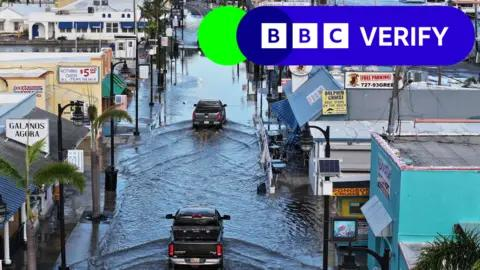

## Claim
Claim: "In remarks to reporters on September 29, 2024 US President Joe Biden announced that no more aid would be provided for the areas affected by Hurrican Helene, but 2.4 billion US-$ more for Ukraine."

## Actions
```
web_search("Joe Biden Hurricane Helene Ukraine aid September 29 2024")
```

## Evidence
### Evidence from `web_search`
The BBC published an article on October 9, 2024, discussing misinformation about the government's response to Hurricane Helene, including claims that government money earmarked for disaster victims has been spent on migrants, which the BBC states is false. The North Carolina National Guard completed 146 flight missions, resulting in the rescue of 538 people and 150 pets. ([https://www.bbc.com/news/articles/czd1q9q9gl9o](https://www.bbc.com/news/articles/czd1q9q9gl9o)) , , , 

Yahoo News, published by USA TODAY, fact-checks the claim that Biden said no more aid would be provided for Hurricane Helene victims, stating that Biden did not say this. It references a White House transcript of Biden's remarks on September 30, 2024, where he stated that more aid would be forthcoming. Biden announced a new $8 billion military aid package for Ukraine on September 30, 2024. ([https://www.yahoo.com/news/no-biden-didnt-hes-done-153402427.html](https://www.yahoo.com/news/no-biden-didnt-hes-done-153402427.html)) Le Monde reported on September 30, 2024, on President Joe Biden's remarks regarding the response to Hurricane Helene. Biden announced he would travel to North Carolina to monitor rescue efforts. ([https://www.lemonde.fr/en/united-states/article/2024/09/30/biden-pledges-to-aid-victims-of-hurrican-helene-as-long-as-it-takes_6727795_133.html](https://www.lemonde.fr/en/united-states/article/2024/09/30/biden-pledges-to-aid-victims-of-hurrican-helene-as-long-as-it-takes_6727795_133.html)) 


## Elaboration
The evidence contradicts the claim. Yahoo News, citing a White House transcript, states that Biden did not say no more aid would be provided for Hurricane Helene victims. Instead, he stated that more aid would be forthcoming.

Furthermore, the evidence indicates that Biden announced a new military aid package for Ukraine on September 30, 2024, not September 29, 2024, as the claim suggests.


## Final Judgement
The claim is demonstrably false. Multiple sources, including a White House transcript and news reports, confirm that Biden did not announce a cessation of aid for Hurricane Helene victims. Instead, he pledged further assistance. Additionally, the timing of the Ukraine aid announcement is misstated. `false`

### Verdict: FALSE

### Justification
The claim is false. According to a [Yahoo News article](https://www.yahoo.com/news/no-biden-didnt-hes-done-153402427.html) and a White House transcript, Biden did not announce a halt to aid for Hurricane Helene victims. Instead, he pledged further assistance. Additionally, the timing of the Ukraine aid announcement is misstated.
