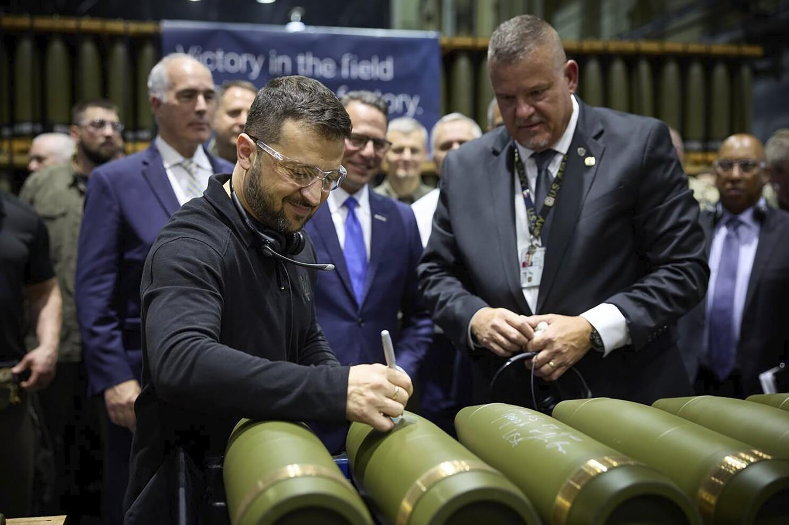

## Claim
Claim: " This image shows Ukrainian President Volodymyr Zelenskyy signing Israeli bombs intended for use against Palestinians in Gaza."

## Actions
```
image_search("Zelenskyy signing bombs")
reverse_search()
```

## Evidence
### Evidence from `image_search`
The Associated Press, Radio Free Europe/Radio Liberty, and BBC News all published images of Ukrainian President Volodymyr Zelenskyy signing artillery shells (, , ). The images are from different angles, but all show Zelenskyy signing the shells.

*   [https://apnews.com/article/zelenskyy-johnson-ambassador-ukraine-biden-harris-trump-d81b0a055d99cfd4804b3f2c00915d09](https://apnews.com/article/zelenskyy-johnson-ambassador-ukraine-biden-harris-trump-d81b0a055d99cfd4804b3f2c00915d09)
*   [https://www.rferl.org/a/zelenskiy-markarova-scranton-munitions-plant-johnson-harris/33135165.html](https://www.rferl.org/a/zelenskiy-markarova-scranton-munitions-plant-johnson-harris/33135165.html)
*   [https://www.bbc.com/news/articles/c5y30244467o](https://www.bbc.com/news/articles/c5y30244467o)


### Evidence from `reverse_search`
The image shows Ukrainian President Volodymyr Zelenskyy signing ammunition at the Scranton Army Ammunition Plant in Pennsylvania, USA, on September 23, 2024 (, , , ). The BBC published an article on September 26, 2024, discussing Zelensky's visit to the plant ([https://www.bbc.com/news/articles/c80rkv0k4j8o](https://www.bbc.com/news/articles/c80rkv0k4j8o), [https://www.bbc.co.uk/news/articles/c80rkv0k4j8o](https://www.bbc.co.uk/news/articles/c80rkv0k4j8o)).

The New York Post published an article on September 25, 2024, discussing Zelensky's visit, suggesting it appeared to be a partisan political event ([https://nypost.com/2024/09/25/opinion/zelenskys-arms-factory-visit-reeks-of-partisan-foreign-election-interference/](https://nypost.com/2024/09/25/opinion/zelenskys-arms-factory-visit-reeks-of-partisan-foreign-election-interference/)). None of the sources mention that the ammunition was intended for use against Palestinians in Gaza.


## Elaboration
The claim is inaccurate. The image shows Volodymyr Zelenskyy signing artillery shells at the Scranton Army Ammunition Plant in Pennsylvania, USA, on September 23, 2024. The evidence does not support the claim that the ammunition was Israeli bombs intended for use against Palestinians in Gaza.


## Final Judgement
The image shows Zelenskyy signing artillery shells at a plant in the USA, not Israeli bombs. The claim misrepresents the origin and purpose of the ammunition.

`misleading`

### Verdict: MISLEADING

### Justification
The image depicts Ukrainian President Volodymyr Zelenskyy signing artillery shells at the Scranton Army Ammunition Plant in Pennsylvania, USA, as confirmed by multiple sources, including the [Associated Press](https://apnews.com/article/zelenskyy-johnson-ambassador-ukraine-biden-harris-trump-d81b0a055d99cfd4804b3f2c00915d09), [Radio Free Europe/Radio Liberty](https://www.rferl.org/a/zelenskiy-markarova-scranton-munitions-plant-johnson-harris/33135165.html), and [BBC News](https://www.bbc.com/news/articles/c5y30244467o). The claim that the image shows Israeli bombs intended for use against Palestinians in Gaza is not supported by the evidence.
