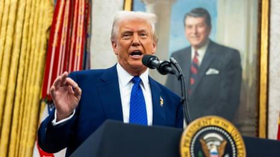

## Claim
Claim: "In February 2025 German Foreign Minister Annalena Baerbock threatened the US with severing ties amid US President Donald Trump's comments on Ukrainian President Volodymyr Zelenskyy and Ukraine."

## Actions
```
web_search("Annalena Baerbock Donald Trump Ukraine February 2025")
```

## Evidence
### Evidence from `web_search`
In February 2025, Reuters published an article stating that German Foreign Minister Annalena Baerbock said there must be no peace in Ukraine over the heads of Ukrainians and Europeans (<image:k>). The Guardian reported on February 12, 2025, that Baerbock said Ukraine’s interests must be protected in the upcoming negotiations regarding a ceasefire in Ukraine, which Donald Trump and Vladimir Putin agreed to negotiate (). A Wikipedia article discusses the 2025 Trump–Zelenskyy Oval Office meeting on February 28, 2025, and mentions that Baerbock said Trump's conduct represented a "new era of ruthlessness" (<image:i>).

The articles can be found at the following URLs: [https://www.reuters.com/world/europe/no-peace-over-heads-ukrainians-europeans-says-german-foreign-minister-2025-02-14/](https://www.reuters.com/world/europe/no-peace-over-heads-ukrainians-europeans-says-german-foreign-minister-2025-02-14/), [https://www.theguardian.com/us-news/2025/feb/12/trump-putin-ukraine-ceasefire](https://www.theguardian.com/us-news/2025/feb/12/trump-putin-ukraine-ceasefire), and [https://en.wikipedia.org/wiki/2025_Trump%E2%80%93Zelenskyy_Oval_Office_meeting](https://en.wikipedia.org/wiki/2025_Trump%E2%80%93Zelenskyy_Oval_Office_meeting).


## Elaboration
The evidence indicates that in February 2025, Annalena Baerbock commented on Donald Trump's actions and statements regarding Ukraine. Specifically, she stated that Ukraine's interests must be protected in ceasefire negotiations and described Trump's conduct as a "new era of ruthlessness." However, the provided evidence does not mention Baerbock threatening the US with severing ties.

Therefore, the claim cannot be fully verified based on the available information. The evidence does not support the assertion that Baerbock threatened to sever ties with the US.

To verify the claim, information about whether Baerbock threatened to sever ties with the US is missing.


## Actions
```
web_search("Annalena Baerbock sever ties US February 2025")
```

## Evidence
### Evidence from `web_search`
In February 2025, a fact-check from aol.com ([https://www.aol.com/fact-check-germany-did-not-142747218.html](https://www.aol.com/fact-check-germany-did-not-142747218.html)) stated that Annalena Baerbock did not threaten to cut diplomatic ties with the United States (, ). Press TV ([https://www.presstv.ir/Detail/2025/02/22/743256/German-FM--Europeans-to-put-pressure-on-US,-keep-US-from-bilateral-relations-with-Russia](https://www.presstv.ir/Detail/2025/02/22/743256/German-FM--Europeans-to-put-pressure-on-US,-keep-US-from-bilateral-relations-with-Russia)) reported that Baerbock urged European allies to pressure the US to prevent an alliance with Russia (). Yahoo News ([https://www.yahoo.com/news/europeans-ramp-pressure-us-german-143422657.html](https://www.yahoo.com/news/europeans-ramp-pressure-us-german-143422657.html)) stated that Baerbock said European allies should put more pressure on the US to avoid losing Washington as a partner ().


## Elaboration
The evidence confirms that Annalena Baerbock did not threaten to sever ties with the US in February 2025. A fact-check from aol.com explicitly states this. Instead, Baerbock urged European allies to pressure the US to maintain the partnership.


## Final Judgement
The evidence indicates that Annalena Baerbock did not threaten to sever ties with the US in February 2025. While she did comment on US actions regarding Ukraine and urged European allies to pressure the US, there is no evidence to support the claim that she threatened to sever ties.

`false`

### Verdict: FALSE

### Justification
Based on the evidence, the claim is false. A fact-check from aol.com explicitly states that Annalena Baerbock did not threaten to cut diplomatic ties with the United States in February 2025 ([https://www.aol.com/fact-check-germany-did-not-142747218.html](https://www.aol.com/fact-check-germany-did-not-142747218.html)). Instead, she urged European allies to pressure the US.
