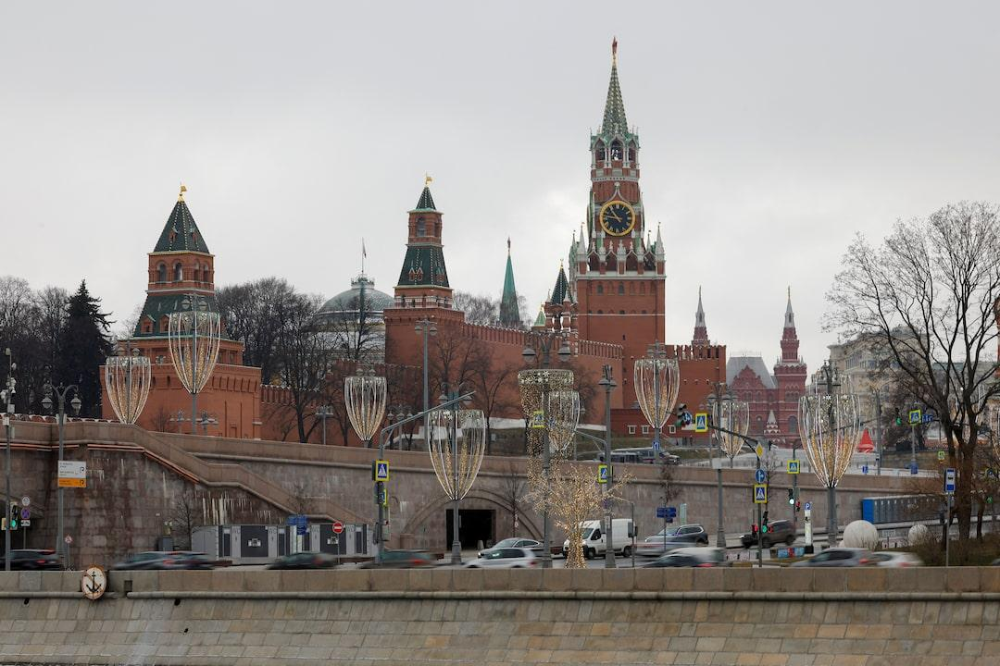

## Claim
Claim: "After a call with Russia's President Vladimir Putin on February 12, 2025, US President Donald Trump announced that he had reached an agreement to end the war in Ukraine."

## Actions
```
web_search("Donald Trump Vladimir Putin call February 12 2025 Ukraine war agreement")
```

## Evidence
### Evidence from `web_search`
On February 12, 2025, Donald Trump and Vladimir Putin had a phone call, and Trump shared details of the conversation and agreed to begin peace talks, according to [Wikipedia](https://en.wikipedia.org/wiki/February_2025_Putin%E2%80%93Trump_call). The White House stated that Trump and Putin agreed to start talks toward a ceasefire in Ukraine, beginning with a 30-day halt to strikes on energy infrastructure, as reported by [NPR](https://www.npr.org/2025/03/18/nx-s1-5331887/trump-putin-ukraine-call) .

Reuters reported that Trump said both Putin and Zelenskyy expressed a desire for peace in separate phone calls with him, and Trump ordered top U.S. officials to begin talks on ending the war in Ukraine, as stated in [Reuters](https://www.reuters.com/world/trump-says-he-discussed-ending-ukraine-war-with-russias-putin-2025-02-12/) . Trump and Putin discussed "getting a ceasefire in the not-too-distant future."


## Elaboration
The evidence indicates that after the call on February 12, 2025, Trump announced the beginning of peace talks and ordered top U.S. officials to start talks on ending the war in Ukraine. The White House stated that Trump and Putin agreed to start talks toward a ceasefire.

The evidence does not explicitly state that Trump announced he had reached an agreement to end the war. Instead, it suggests that talks were initiated with the goal of achieving a ceasefire.


## Final Judgement
The claim is partially accurate. While the call did occur and talks were initiated, the evidence does not support the claim that an agreement to end the war was reached.

`misleading`


### Verdict: MISLEADING

### Justification
Following a call with Vladimir Putin on February 12, 2025, Donald Trump announced the initiation of peace talks and ordered U.S. officials to begin talks on ending the war in Ukraine, as reported by [Reuters](https://www.reuters.com/world/trump-says-he-discussed-ending-ukraine-war-with-russias-putin-2025-02-12/) and [NPR](https://www.npr.org/2025/03/18/nx-s1-5331887/trump-putin-ukraine-call). However, the evidence does not support the claim that Trump announced he had reached an agreement to end the war.
