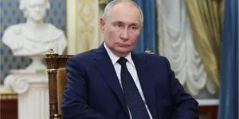

## Claim
Claim: " This image shows an authentic Russian passport of deposed Syrian dictator Bashar al-Assad."

## Actions
```
reverse_search()
web_search("Bashar al-Assad Russian passport")
```

## Evidence
### Evidence from `reverse_search`
The image in question, , appears in multiple sources. One source is a Wikipedia article about East Slavic names ([https://en.wikipedia.org/wiki/East_Slavic_name](https://en.wikipedia.org/wiki/East_Slavic_name)). Another source is Wikimedia Commons, which shows a Russian passport issued in 2004 ([https://commons.wikimedia.org/wiki/File:Pasport_RF.jpg](https://commons.wikimedia.org/wiki/File:Pasport_RF.jpg)). The third source is a website discussing Russian internal passports ([https://ukrainian-passport.com/blog/internal-russian-passport/](https://ukrainian-passport.com/blog/internal-russian-passport/)).


### Evidence from `web_search`
An AOL article from January 8, 2025, fact-checks an image of a passport claimed to belong to Bashar al-Assad and states that the image is fake and photoshopped. The original passport image was found on Wikipedia. ()

The Wikipedia article discusses the Syrian civil war and mentions Bashar al-Assad's birthdate (September 11, 1965) and that he fled to Moscow and was granted political asylum in November 2024. () An article from NV.ua discusses the arrest of Bashar al-Assad's relatives at Beirut airport on December 28, who were attempting to leave using fake passports. ()


## Elaboration
The evidence suggests the image of the passport is fake. The AOL article explicitly states that the image is photoshopped. The original passport image was found on Wikipedia. Additionally, the NV.ua article mentions the arrest of Bashar al-Assad's relatives using fake passports.


## Final Judgement
The image of the passport is fake. The AOL article explicitly states that the image is photoshopped. The original passport image was found on Wikipedia. Additionally, the NV.ua article mentions the arrest of Bashar al-Assad's relatives using fake passports. `false`

### Verdict: FALSE

### Justification
The claim is false. The image of the passport has been identified as photoshopped by an AOL article, and the original image was found on Wikipedia. Furthermore, there is evidence of Bashar al-Assad's relatives using fake passports, as reported by NV.ua.
