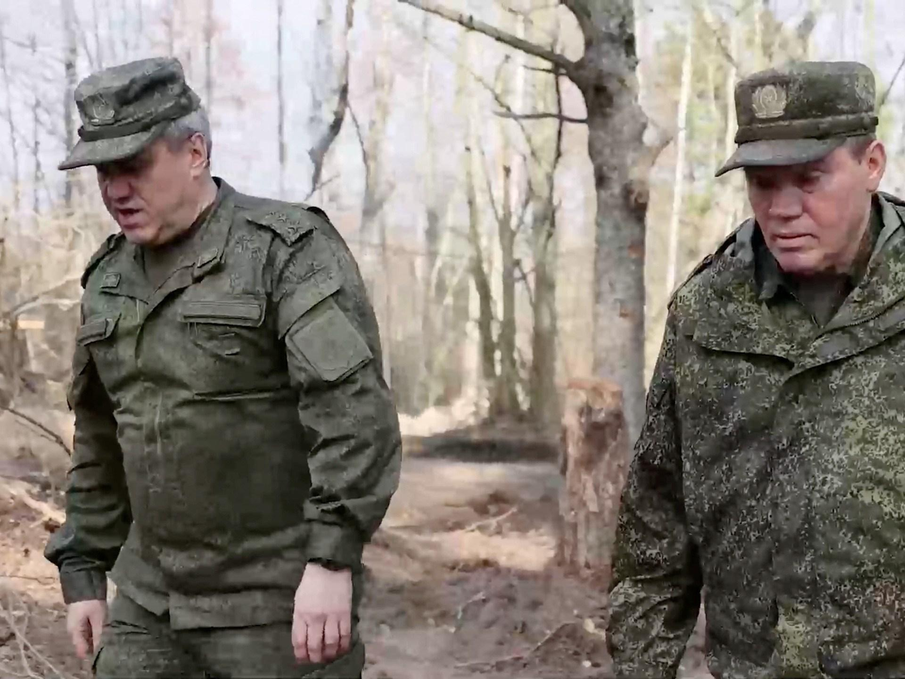

## Claim
Claim: " This image shows American mercenaries participating in Ukraine's incursion into Russia's Kursk Oblast in August 2024."

## Actions
```
image_search("American mercenaries Ukraine Russia Kursk Oblast")
reverse_search()
```

## Evidence
### Evidence from `image_search`
Al Jazeera discusses the recapture of Kursk by Russian forces (). The BBC News website contains an image of Ukrainian soldiers (). The Telegraph published an article on August 14, 2024, about Ukraine seizing land, mentioning the border region and including a photograph of Ukrainian servicemen near the Russian border ().

*   [https://www.aljazeera.com/news/2025/3/13/russian-forces-recapture-kursk-raising-questions-about-us-ukraine-cutoff](https://www.aljazeera.com/news/2025/3/13/russian-forces-recapture-kursk-raising-questions-about-us-ukraine-cutoff)
*   [https://www.bbc.com/news/articles/c984g10e22lo](https://www.bbc.com/news/articles/c984g10e22lo)
*   [https://www.ukrainianphotographers.com/en/news-articles/foreign-mercenaries-in-the-kursk-region](https://www.ukrainianphotographers.com/en/news-articles/foreign-mercenaries-in-the-kursk-region)

### Evidence from `reverse_search`
The image () appears in articles discussing the retreat of Russian forces from Balakleya in the Kharkiv region during the Ukrainian counteroffensive in September 2022. The articles, published on Apostrophe.ua, Charter97.org, and cripo.com.ua, mention the liberation of towns and include a photo of Ukrainian soldiers, one of whom is taking a selfie, with a dead soldier in the background. The cripo.com.ua article also mentions the date of the beginning of the counteroffensive, August 29, 2022.

The articles can be found at the following URLs: [https://apostrophe.ua/news/society/2022-09-08/rasplata-za-ilovaysk-okkupantyi-ponesli-ogromnyie-poteri-pri-begstve-iz-balaklei-video/278880](https://apostrophe.ua/news/society/2022-09-08/rasplata-za-ilovaysk-okkupantyi-ponesli-ogromnyie-poteri-pri-begstve-iz-balaklei-video/278880), [https://charter97.org/ru/news/2022/9/9/514837/](https://charter97.org/ru/news/2022/9/9/514837/), and [https://cripo.com.ua/vojna-s-rf/rossyjskye-vojska-begut-pod-natyskom-vsu-mnenye-ekspertov-y-rossyjskyh-voennyh/](https://cripo.com.ua/vojna-s-rf/rossyjskye-vojska-begut-pod-natyskom-vsu-mnenye-ekspertov-y-rossyjskyh-voennyh/).


## Elaboration
The claim is inaccurate. The image depicts events from September 2022, specifically the Ukrainian counteroffensive in the Kharkiv region, not August 2024 in the Kursk Oblast. The image was used in articles discussing the retreat of Russian forces from Balakleya.


## Final Judgement
The image is from September 2022, showing Ukrainian forces in the Kharkiv region, not August 2024 in the Kursk Oblast. The claim misrepresents the context of the image. `misleading`

### Verdict: MISLEADING

### Justification
The image in the claim is from September 2022 and shows Ukrainian forces in the Kharkiv region, not American mercenaries in the Kursk Oblast in August 2024. The image was used in articles discussing the Ukrainian counteroffensive and the retreat of Russian forces from Balakleya ([Apostrophe.ua](https://apostrophe.ua/news/society/2022-09-08/rasplata-za-ilovaysk-okkupantyi-ponesli-ogromnyie-poteri-pri-begstve-iz-balaklei-video/278880), [Charter97.org](https://charter97.org/ru/news/2022/9/9/514837/), and [cripo.com.ua](https://cripo.com.ua/vojna-s-rf/rossyjskye-vojska-begut-pod-natyskom-vsu-mnenye-ekspertov-y-rossyjskyh-voennyh/)).
