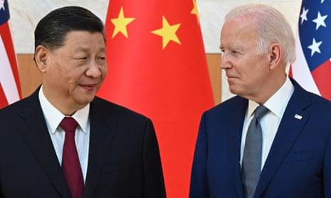

## Claim
Claim: "While serving as US President in 2024, Joe Biden ordered the US forces to prepare for possible nuclear confrontations with Russia, China, and North Korea."

## Actions
```
web_search("Joe Biden orders US forces nuclear confrontation Russia China North Korea")
```

## Evidence
### Evidence from `web_search`
According to The Guardian, Joe Biden approved a US nuclear strategy to prepare for possible coordinated nuclear confrontations with Russia, China, and North Korea. The White House stated that the plan was approved earlier this year and was not a response to a single country or threat. ()

PBS News reported that Joe Biden authorized Ukraine to use U.S.-supplied long-range missiles to strike deeper inside Russia. () The Brookings article discusses Biden's nuclear policy and mentions that Biden has successfully deterred Russian nuclear escalation in Ukraine and worked to stabilize relations with China.
*   [https://www.theguardian.com/us-news/article/2024/aug/20/biden-nuclear-strategy-china-threat](https://www.theguardian.com/us-news/article/2024/aug/20/biden-nuclear-strategy-china-threat)
*   [https://www.pbs.org/newshour/world/biden-gives-ukraine-permission-to-use-u-s-supplied-missiles-for-deeper-strikes-inside-russia](https://www.pbs.org/newshour/world/biden-gives-ukraine-permission-to-use-u-s-supplied-missiles-for-deeper-strikes-inside-russia)
*   [https://www.brookings.edu/articles/how-would-trump-and-biden-handle-us-nuclear-policy-upon-reelection/](https://www.brookings.edu/articles/how-would-trump-and-biden-handle-us-nuclear-policy-upon-reelection/)


## Elaboration
The Guardian reports that Joe Biden approved a US nuclear strategy to prepare for possible coordinated nuclear confrontations with Russia, China, and North Korea. The White House stated that the plan was approved earlier this year.


## Final Judgement
The evidence indicates that Joe Biden, as US President, approved a nuclear strategy to prepare for potential nuclear confrontations with Russia, China, and North Korea. This information is supported by a credible source, The Guardian. Therefore, the claim is accurate. `true`


### Verdict: TRUE

### Justification
According to a report in *The Guardian* ([https://www.theguardian.com/us-news/article/2024/aug/20/biden-nuclear-strategy-china-threat](https://www.theguardian.com/us-news/article/2024/aug/20/biden-nuclear-strategy-china-threat)), Joe Biden approved a US nuclear strategy to prepare for possible nuclear confrontations with Russia, China, and North Korea.
