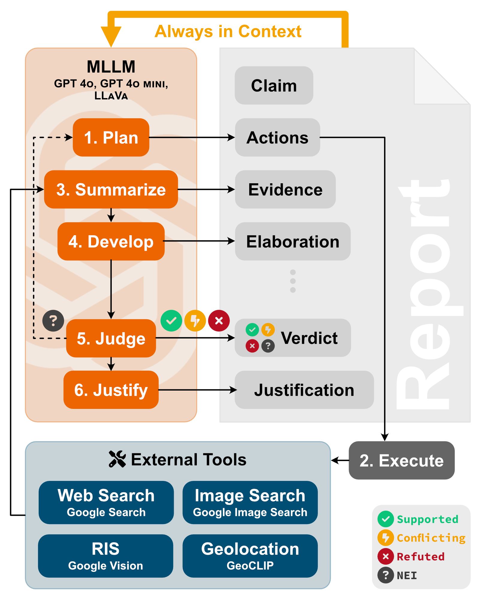
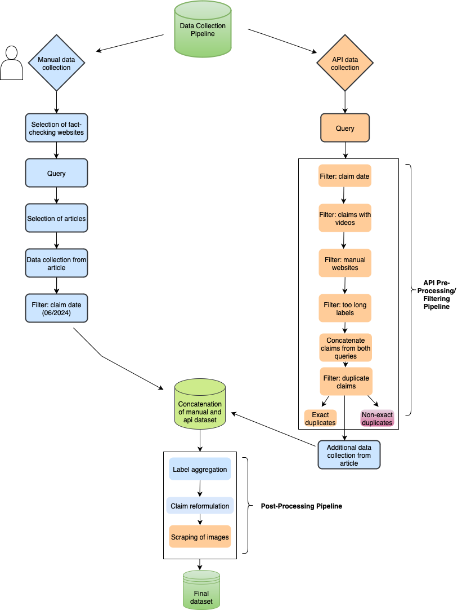

# Master Thesis: Automated Multimodal Fact-Checking with an MLLM-Based Agentic System Evaluated on Two New Datasets: The Gaza and Ukraine Wars

<table>
<tr>
<td width="50%">
  
</td>
<td width="50%">
  
</td>
</tr>
</table>

This master thesis evaluated the MLLM-based agentic system **DEFAME (Dynamic Evidence-based FAct-checking with Multimodal Experts)** [GitHub Repo](https://github.com/multimodal-ai-lab/DEFAME) [📄 Paper](https://arxiv.org/abs/2412.10510) on two new datasets, which, in contrast to existing datasets, (a) focus on high-stake contexts where much misinformation is existent, (b) were sourced after the knowledge cutoff of the used MLLM (Gemini 2.0-Flash-Lite; [June 2024](https://cloud.google.com/vertex-ai/generative-ai/docs/models/gemini/2-0-flash-lite)) and (c) contain two new claim types: claims with AI-generated and altered images. 

The thesis contributes to the literature of automated multimodal fact-checking by: 
1. creating the Gaza-Israel dataset and Ukraine-Russia dataset that cover four claim 
types (text-only claims, claims with normal images, claims with AI-generated images 
and claims with altered images) and recent claims from July 2024 - April 2025
2. evaluating DEFAME on the two new datasets with a two-level approach: a dataset and claim-type level
3. revealing reliability problems in the ground truth labels of existing professional fact-checking websites
4. identifying new failure reasons of DEFAME


## Table of Contents
- [DEFAME](#defame)
    - [Installation](#installation)
    - [Usage](#usage)
- [Datasets: Gaza-Israel & Ukraine-Russia](#datasets-gaza-israel--ukraine-russia)
- [Evaluation](#evaluation)
- [License](#license)


## DEFAME

### Installation

To evaluate DEFAME on the two new datasets you first need to clone the repository: 
 ```bash
 git clone https://github.com/FabiLochner/Master-Thesis-Automated-Multimodal-Fact-Checking
 cd DEFAME
 ```

Second, you need to install DEFAME either via Docker or manually. For the thesis, Docker was used. 

#### Option A: Docker (Easiest, Fastest)

If you have [Docker](https://www.docker.com/) installed, from the project root simply run
```bash
docker compose up -d
docker compose exec defame bash
```
This will download and execute the [latest docker image](https://hub.docker.com/r/tudamailab/defame) provided by the DEFAME authors. It opens a shell. You can continue with [Usage](#usage) from here.

#### Option B: Manual Installation (Most Flexible)

Follow these steps:

1. Optional: Set up a virtual environment and activate it:
    ```bash
    python -m venv venv
    source venv/bin/activate  # On Windows: venv\Scripts\activate
    ```

2. Install required packages:
    ```bash
    pip install -r requirements.txt
    python -c "import nltk; nltk.download('wordnet')"
    ```

    If you have a CUDA-enabled GPU and the CUDA toolkit installed, also run:
    ```bash
    pip install -r requirements_gpu.txt
    ```


### Usage

#### Preparing Datasets

1. The Gaza-Israel and Ukraine-Russia datasets are provided in the DEFAME directory:
   ```plaintext
   data/
   ├── gaza_israel/
   │   ├── images/
   │   ├── gaza_israel_dataset_combined_010724_300425_final_binary.csv
   │   └── gaza_israel_dataset_combined_010724_300425_final.csv
   ├── ukraine_russia/
   │   ├── images/
   │   ├── ukraine_russia_dataset_combined_010724_300425_final_binary.csv
   │   └── ukraine_russia_dataset_combined_010724_300425_final.csv
   ```

2. Due to reliability problems in the ground truth labels from the fact-checking websites used to create the Gaza-Israel and Ukraine-Russia datasets, the original four final labels (True, False, Misleading, Not Enough Information) were aggregated to two labels (True, False). Thus, the `gaza_israel_dataset_combined_010724_300425_final_binary.csv` and `ukraine_russia_dataset_combined_010724_300425_final_binary.csv` were used for the DEFAME evaluation. For more details on the label aggregation, please see the `lochner_master_thesis.pdf`file. 

3. The path to the datasets is already provided in the `data_root_dir` variable inside `config/globals.py`. DEFAME will automatically locate and process the datasets with `gaza_israel` and `ukraine_russia`. To avoid overwriting the results of a dataset evaluation, you need to adjust the path in the `result_base_dir` inside `config/globals.py`, which is currently set to `result_base_dir = working_dir / "out/gaza_israel"`. 

#### Run a Dataset Evaluation
All execution scripts are located in (subfolders of) `scripts/`.
> [!NOTE]
> Whenever running a script, ensure the project root to be the working directory. You can accomplish that by using the `-m` parameter as in the commands below (note the script path notation):

**Hardware requirements**: CPU-only is sufficient if you refrain from using a local LLM.

**Output location**: All generated reports, statistics, logs etc. will be saved in `out/` by default.


Dataset evaluations were run with the use of YAML configuration files (as recommended by the DEFAME authors). See `config/gaza_israel` and `config/ukraine_russia` for the five DEFAME variants that were tested in the ablation study of this thesis: `default.yaml`, `no_geolocate.yaml`, `no_image_search.yaml`, `no_ris.yaml` and `no_web_search.yaml`. You just need to copy the config's file path into `run_config.py` and run
```bash
python -m scripts.run_config
```

Note: In the yaml files in `config/gaza_israel` and `config/ukraine_russia`, the number of workers can be set with the paramter `n_workers`. To avoid workers dieing, please set this parameter and the memory limit in the docker desktop app according to your available RAM. 

#### APIs

To run DEFAME, external APIs were required for the MLLM and the tools used. All API keys are saved inside `config/api_keys.yaml`. The API keys used in the master thesis were removed from the yaml file and deactivated before making the GitHub repo public to avoid abuse. A few tools need additional set up, see the tool-specific setup guidelines below. Here's an overview of all APIs used:

| API             | Free | DEFAME component   | Costs (Master Thesis)                                 |
|-----------------|------|---------------------------------------------------|------|
| Gemini         | ❌    | MLLM used in DEFAME (Gemini 2.0 Flash-Lite)     | 10-15€ |
| Serper          | ❌    | Web Search and Image Search | 0€ |
| Google Vision   | ❌    | Reverse Image Search                  | 0€ |
| Firecrawl       | ✔️   | Scraping of URLs returned from tools use, e.g., news articles                  | 0€ |


##### Gemini API
You will need the [Gemini API](https://ai.google.dev/gemini-api/docs) if you want to use the MLLM used in this thesis: Gemini 2.0 Flash-Lite.

##### Serper API
The [Serper API](https://serper.dev) serves standard Google Web Search and Google Image Search. The API provides 2.500 free queries. To avoid API costs, one can create multiple accounts with different e-mail addresses. 

##### Google Vision API
The [Google Cloud Vision API](https://console.cloud.google.com/marketplace/product/google/vision.googleapis.com) is required to perform Reverse Image Search. Follow these steps, to set it up:
1. In the [Google Cloud Console](https://console.cloud.google.com), create a new Project.
2. Go to the [Service Account](https://console.cloud.google.com/iam-admin/serviceaccounts) overview and add a new Service Account.
3. Open the new Service Account, go to "Keys" and generate a new JSON key file.
4. Save the downloaded key file at the path `config/google_service_account_key.json`.


## Datasets: Gaza-Israel & Ukraine-Russia

The figure below gives a high-level overview of the data collection pipeline to create the Gaza-Israel and Ukraine-Russia dataset that cover four claim types from July 2024 - April 2025. The database symbol represents a dataset, the diamond symbol the data collection type and the rectangular form represents one step in the pipeline. The blue color denotes a manual step, the orange color a computational step and the purple color a hybrid step with manual and computational parts. The green color denotes a dataset. 


The coding files are within the `gaza_ukraine_datasets` folder which has the following file structure:

```plaintext
gaza_ukraine_datasets/
├── claims_pre_and_post_processing/
│   ├── ...
│   ├── claims_postprocessing_claim_reformulation.ipynb
│   ├── claims_postprocessing_label_aggregation.ipynb
│   ├── claims_postprocessing_remove_whitespace_label.ipynb
│   ├── claims_preprocessing_api_datasets_sampling.ipynb
│   ├── claims_preprocessing_embedding_LLM.ipynb
│   ├── claims_preprocessing.ipynb
│   └── ...
├── gaza_israel/
│   ├── API_data_collection/
│   ├── Combined_datasets/
│   └── Manual_data_collection/
├── label_aggregation_binary/
│   ├── label_aggregation_binary.ipynb/
├── scrape_images/
│   ├── images/
│   ├── scrape_images.ipynb/
└── ukraine_russia/
    ├── API_data_collection/
    ├── Combined_datasets/
    └── Manual_data_collection/
```

All files for the manual data collection are stored in the folders `{gaza_israel, ukraine_russia}/Manual_data_collection`. 

The API data collection uses [Google's Fact Check Claim Search API](https://developers.google.com/fact-check/tools/api/). It was implemented in Docker with the `DEFAME/scripts/scrape_claims.py` file and used the queries: *Gaza*, *Israel*, *Ukraine*, *Russia*. The resulting json files were copied to the folders `{gaza_israel, ukraine_russia}/API_data_collection`.

The `claims_pre_and_post_processing` folder contains all the scripts which applied the pre- and post-processing pipelines illustrated in the figure above. The `claims_preprocessing.ipynb` script contains all steps of the pre-processing pipeline except for the last step: filtering out non-exact duplicative claims. 
For this, different text-embedding models with different thresholds were tested/used in the `claims_preprocessin_embedding.ipynb` script and the results were manually verified. 

Next, for the API claims additonal data was manually collected from the fact-checking articles in the `claims_preprocessing_api_datasets_sampling.ipynb` script. This data was not returned by the API, was also collected during the manual data collection and is necessary for running and evaluating DEFAME: the URL of images, the context/label explanation given by the fact-checking websites and information about the type of a claim: a text-only claim, a claim with a normal image, a claim with an AI-generated image or a claim with an altered image.

After the manual and API claims were concatenated, the labels were aggregated into four labels in the `claims_postprocessing_label_aggregation.ipynb` script: *True*, *False*, *Misleading*, *Not Enough Information*. The number and type of the labels was inspired by existing multimodal fact-checking datasets such as [MOCHEG](https://github.com/PLUM-Lab/Mocheg), [VERITE](https://github.com/stevejpapad/image-text-verification) and [CLAIMREVIEW2024+](https://huggingface.co/datasets/MAI-Lab/ClaimReview2024plus).

Next, the claims were reformulated into a consistent format that contains all relevant information for a fact-check (e.g., names of official persons, time and place of a referenced event) and makes the claims less ambigious. See the script `claims_postprocessing_claim_reformulation.ipynb`.  

Finally, for all claims with a normal, AI-generated or altered image, the image was scraped in the script `scrape_images/scrape_images.ipynb`. 

Since preliminary experiments with DEFAME revealed reliability problems with the ground-truth labels used by the fact-checking websites, the sub-labels *False*, *Misleading* and *Not Enough Information* were aggregated into one label *False* (see `label_aggreation_binary/label_aggregation_binary.ipynb`). This was done, because across and within the used fact-checking websites, these three labels were not used consistently and reliably. For more details see `evaluation/gt_label_check/{gaza_israel, ukraine_russia}`.


