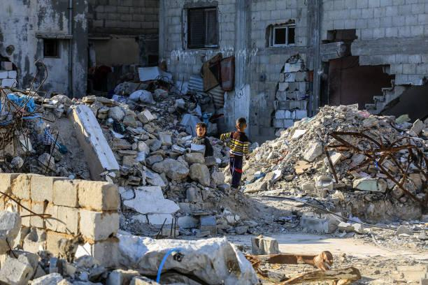
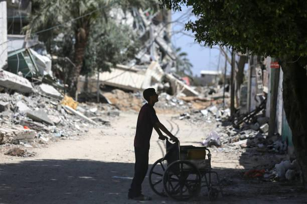
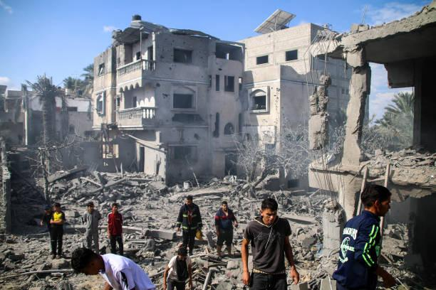

## Claim
Claim: " This is an authentic image of a mother holding the bones of her son in Gaza in March 2025. After more than a year and a half of searching for him under the rubble of their bombed-out house."

## Actions
```
reverse_search()
```

## Evidence
No new evidence found.

## Elaboration
Insufficient information to verify the claim. The reverse image search did not yield any results.


## Actions
```
web_search("Gaza mother holding skeleton")
web_search("Gaza conflict images")
```

## Evidence
### Evidence from `web_search`
The image () of a woman holding a skeleton, purportedly in Gaza, is AI-generated. According to [news.abplive.com](https://news.abplive.com/fact-check/viral-image-of-gazan-woman-golding-child-s-remains-is-digitally-generated-1760363), the image was created by "in.visualart" using Photoshop and AI tools. PesaCheck ([pesacheck.org](https://pesacheck.org/false-this-photo-of-a-mother-holding-her-sons-decomposing-bones-is-ai-generated-eba63f96c61d)) also confirms the image is AI-generated.

The BBC ([bbc.com](https://www.bbc.com/news/articles/c6269pd5y2ko)) published an article about the search for missing people in Gaza, including images of human remains found in the rubble (), and a resident who found a skeleton in his home (). The article also mentions a 13-year-old girl, Aya al-Dabeh, who was killed while staying in a school ().


### Evidence from `web_search`
The Al Jazeera article ([https://www.aljazeera.com/gallery/2025/1/15/israels-war-on-gaza-15-months-15-pictures](https://www.aljazeera.com/gallery/2025/1/15/israels-war-on-gaza-15-months-15-pictures)) presents images documenting the impact of the war on Gaza over a 15-month period, including destruction, casualties, and difficult living conditions. The Getty Images search result ([https://www.gettyimages.com/photos/gaza-war](https://www.gettyimages.com/photos/gaza-war)) contains images related to the Gaza war, such as destruction, people searching for survivors, and the aftermath of bombings. The CNN article ([https://www.cnn.com/2024/10/05/world/gallery/israel-gaza-anniversary](https://www.cnn.com/2024/10/05/world/gallery/israel-gaza-anniversary)) presents a photo gallery of images from the Israel-Hamas war, including scenes of airstrikes, damage, and funerals.

The Al Jazeera article includes images , , , , , , , . The Getty Images search result includes images , , . The CNN article includes images <image:i>, <image:j>, <image:k>, <image:l>, <image:m>, <image:n>, <image:o>, <image:p>, <image:q>, <image:r>, <image:s>, <image:t>, <image:u>.


## Elaboration
The claim is false. The image () is AI-generated, according to multiple sources ([news.abplive.com](https://news.abplive.com/fact-check/viral-image-of-gazan-woman-golding-child-s-remains-is-digitally-generated-1760363), [pesacheck.org](https://pesacheck.org/false-this-photo-of-a-mother-holding-her-sons-decomposing-bones-is-ai-generated-eba63f96c61d)).


## Final Judgement
The image in the claim is AI-generated, and therefore the claim is false.

`false`


### Verdict: FALSE

### Justification
The claim is false. The image of the woman holding a skeleton is AI-generated, as confirmed by [news.abplive.com](https://news.abplive.com/fact-check/viral-image-of-gazan-woman-golding-child-s-remains-is-digitally-generated-1760363) and [pesacheck.org](https://pesacheck.org/false-this-photo-of-a-mother-holding-her-sons-decomposing-bones-is-ai-generated-eba63f96c61d).
