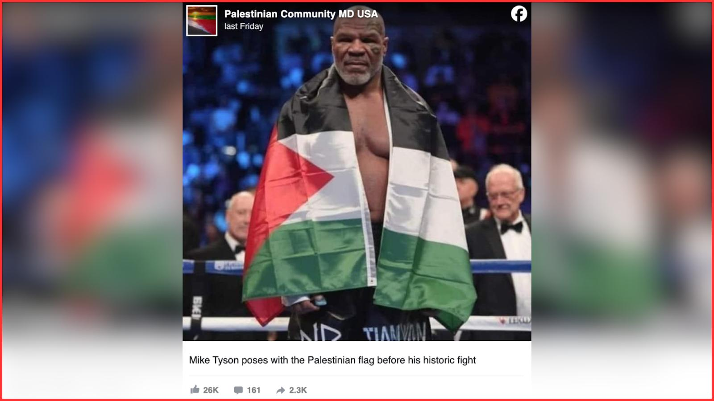
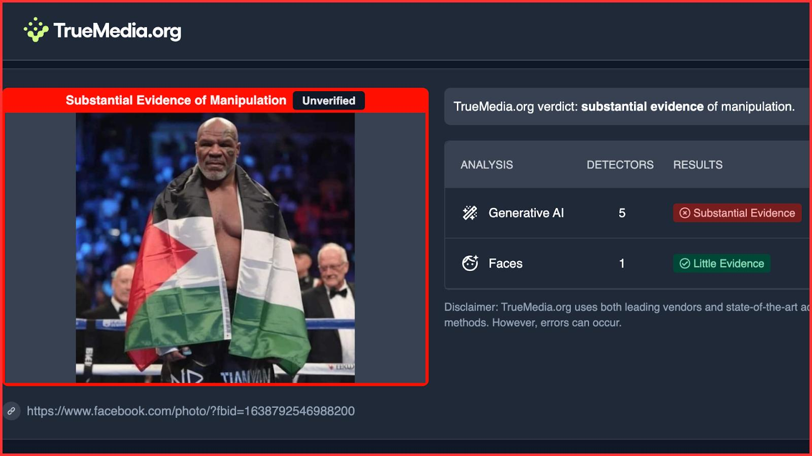
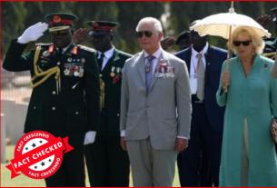
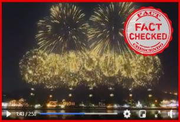
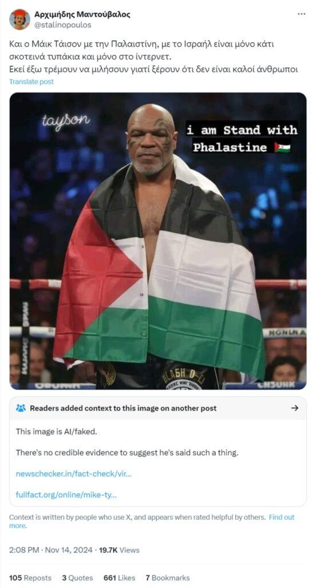

## Claim
Claim: " This is an authentic image of Mike Tyson posing with the Palestinian flag in the ring before his fight against Jake Paul on November, 15, 2024."

## Actions
```
reverse_search()
web_search("Mike Tyson Palestinian flag")
```

## Evidence
### Evidence from `reverse_search`
From [Source](https://srilanka.factcrescendo.com/english/ai-generated-image-falsely-shows-mike-tyson-with-palestinian-flag/): Found exact image on website with title: Mike Tyson did not pose with the Palestine flag
Content: The website srilanka.factcrescendo.com published on July 20, 2025, states that the image  is AI-generated and not an authentic photo. The website provides evidence from AI image detectors and Getty Images, which do not show Mike Tyson with the Palestinian flag. The website also mentions that the fight between Jake Paul and Mike Tyson took place on November 16, 2024. , , , , , , , , , , , .


### Evidence from `web_search`
The University at Buffalo published an article stating that Mike Tyson did not pose with the Palestinian flag before his fight against Jake Paul, referencing a Reuters fact-check. The image of Mike Tyson with the Palestinian flag is not real and was created using an artificial intelligence tool. , , 

Sources: [https://engineering.buffalo.edu/computer-science-engineering/news-and-events/news.host.html/content/shared/engineering/home/articles/media-mentions/2024-media-coverage/fact-check--mike-tyson-did-not-pose-with-palestinian-flag-ahead-.detail.html](https://engineering.buffalo.edu/computer-science-engineering/news-and-events/news.host.html/content/shared/engineering/home/articles/media-mentions/2024-media-coverage/fact-check--mike-tyson-did-not-pose-with-palestinian-flag-ahead-.detail.html) and [https://www.factchecker.gr/2024/11/16/ai-generated-image-of-mike-tyson-with-palestinian-flag/](https://www.factchecker.gr/2024/11/16/ai-generated-image-of-mike-tyson-with-palestinian-flag/).


## Elaboration
The claim is false. The image of Mike Tyson with the Palestinian flag is AI-generated and not an authentic photo. The fight between Jake Paul and Mike Tyson took place on November 16, 2024.


## Final Judgement
The claim is demonstrably false. Multiple sources confirm that the image is AI-generated and not an authentic photo of Mike Tyson.
`false`

### Verdict: FALSE

### Justification
The claim is false. Multiple sources, including fact-checking websites and news articles, confirm that the image of Mike Tyson with the Palestinian flag is AI-generated and not a real photograph. The image has been debunked by sources such as [srilanka.factcrescendo.com](https://srilanka.factcrescendo.com/english/ai-generated-image-falsely-shows-mike-tyson-with-palestinian-flag/) and the [University at Buffalo](https://engineering.buffalo.edu/computer-science-engineering/news-and-events/news.host.html/content/shared/engineering/home/articles/media-mentions/2024-media-coverage/fact-check--mike-tyson-did-not-pose-with-palestinian-flag-ahead-.detail.html).
