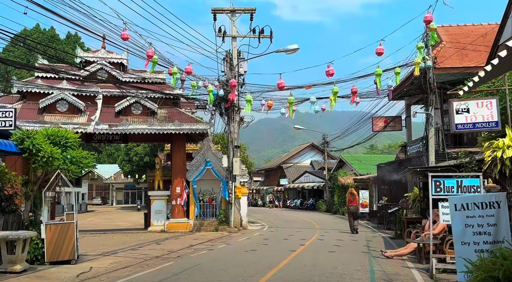

## Claim
Claim: " This image shows Israelis who have stopped fighting the wars in Gaza and Lebanon and moved to become 'settlers' in Pai District, Mae Hong Son Province, Thailand, in February 2025."

## Actions
```
web_search("Israelis settlers Pai District Mae Hong Son Thailand")
image_search("Israelis settlers Pai District Thailand")
```

## Evidence
### Evidence from `web_search`
The Bangkok Post ([https://www.bangkokpost.com/thailand/general/2966381/no-israeli-settlement-or-business-dominance-found-in-northern-thailands-pai](https://www.bangkokpost.com/thailand/general/2966381/no-israeli-settlement-or-business-dominance-found-in-northern-thailands-pai)) reported on February 23, 2025, that police in Pai district, Mae Hong Son, Thailand, found no Israeli influence, settlements, or business dominance, with 4,573 Israelis visiting and only 24 seeking to extend their stay. The Nation Thailand ([https://www.nationthailand.com/news/tourism/40046434](https://www.nationthailand.com/news/tourism/40046434)) published an article on February 18, 2025, refuting claims of an Israeli "promised land" in Pai district, clarifying that the reported figure of 30,000 Israeli tourists refers to the total number of Israeli visitors over the past year, not a permanent settlement.

Khaosod English ([https://www.khaosodenglish.com/featured/2025/02/23/why-some-thais-fear-israelis-turning-pai-into-an-occupied-land/](https://www.khaosodenglish.com/featured/2025/02/23/why-some-thais-fear-israelis-turning-pai-into-an-occupied-land/)) discussed fears among some Thais that Israelis are turning Pai District into an occupied land, with the Prime Minister assuring the public that these fears are unsubstantiated. The article also mentions the Israeli Embassy in Bangkok urging Israeli tourists to respect local culture and laws. The image  is included in the article.


### Evidence from `image_search`
From [Source](https://www.scmp.com/week-asia/lifestyle-culture/article/3299193/young-israelis-rile-thailands-pai-town-their-bad-behaviour): 
Content: The South China Morning Post published an article about young Israelis in Pai, Thailand. 


## Elaboration
The evidence indicates that the claim is false. The Bangkok Post and The Nation Thailand refuted claims of Israeli settlements in Pai District, Mae Hong Son, Thailand. The image 

## Final Judgement
The provided evidence indicates that the claim is false. Multiple sources, including The Bangkok Post and The Nation Thailand, have refuted the existence of Israeli settlements in Pai District, Mae Hong Son, Thailand. The image is associated with articles discussing the presence of Israelis in Pai, but not as settlers.

`false`


### Verdict: FALSE

### Justification
The claim is false. Multiple sources, including the [Bangkok Post](https://www.bangkokpost.com/thailand/general/2966381/no-israeli-settlement-or-business-dominance-found-in-northern-thailands-pai) and [The Nation Thailand](https://www.nationthailand.com/news/tourism/40046434), refute the existence of Israeli settlements in Pai District, Mae Hong Son, Thailand. The image is associated with articles discussing the presence of Israelis in Pai, but not as settlers.
