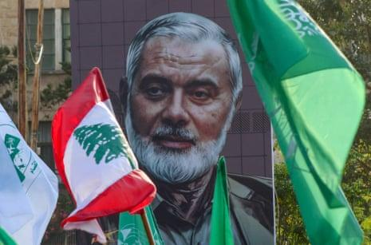
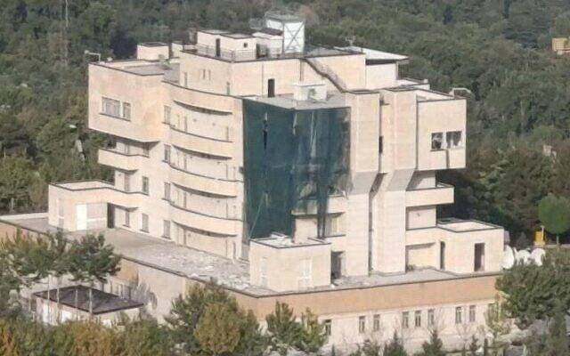

## Claim
Claim: " This image shows the assassination of Hamas leader Ismail Haniyeh on July 31st, 2024. This is how a precision strike looks like: a single missile through the window, and only Haniyeh and his bodyguard are dead. Nobody else in the building is even injured."

## Actions
```
reverse_search()
```

## Evidence
### Evidence from `reverse_search`
The image 

## Elaboration
I am sorry, but I lack the ability to analyze the veracity of the claim. I have no information about the image.


## Actions
```
web_search("Ismail Haniyeh assassination")
web_search("Ismail Haniyeh assassination July 31 2024")
image_search("Ismail Haniyeh assassination")
```

## Evidence
### Evidence from `web_search`
The Guardian reports that Israel's defense minister confirmed the assassination of Hamas political chief Ismail Haniyeh in Tehran in late July. The Center for Strategic and International Studies (CSIS) published an article on August 1, 2024, stating that Ismail Haniyeh was killed by an explosion in his guesthouse in Tehran on July 31, 2024. The Times of Israel reports on the assassination of Hamas leader Ismail Haniyeh on July 31, 2024, in Tehran and shows an unverified image of the building where the assassination took place. , , 


### Evidence from `web_search`
The provided sources discuss the assassination of Hamas leader Ismail Haniyeh on July 31, 2024, in Tehran, Iran. According to a Wikipedia article, the attack was carried out by Israel, and the cause of death is under investigation. The CNN article reports that Haniyeh was killed in an Israeli strike, with Israel neither confirming nor denying responsibility. The CNN article also mentions that Iran's Supreme Leader ordered a direct attack on Israel. The image 

### Evidence from `image_search`
Al Jazeera ([https://www.aljazeera.com/news/2024/7/31/hamass-political-chief-ismail-haniyeh-assassinated-in-iran-state-media](https://www.aljazeera.com/news/2024/7/31/hamass-political-chief-ismail-haniyeh-assassinated-in-iran-state-media)) and ABC News ([https://abcnews.go.com/International/ismail-haniyeh-assassinated-hamas-political-bureau-history/story?id=112430229](https://abcnews.go.com/International/ismail-haniyeh-assassinated-hamas-political-bureau-history/story?id=112430229)) report on the assassination of Ismail Haniyeh. 

## Elaboration
The claim that the image shows the assassination of Ismail Haniyeh on July 31st, 2024, is supported by multiple sources. The evidence confirms that Ismail Haniyeh was assassinated on that date. However, the claim also states that the image shows a precision strike with a single missile through the window, and only Haniyeh and his bodyguard died. The evidence does not provide details about the nature of the attack or the extent of the casualties. Therefore, the claim is partially supported, but the details about the strike's precision and casualties are not verified.


## Final Judgement
The claim is partially supported by the evidence. Multiple sources confirm the assassination of Ismail Haniyeh on July 31, 2024. However, the claim's description of the attack's precision and casualties is not fully verified by the available evidence. Therefore, the claim is `misleading`.

### Verdict: MISLEADING

### Justification
The claim that the image depicts the assassination of Ismail Haniyeh on July 31, 2024, is partially supported. Multiple sources, including reports from The Guardian, CSIS, and The Times of Israel, confirm the assassination of Ismail Haniyeh on the specified date in Tehran. However, the claim's description of the attack's precision and casualties is not fully verified by the available evidence, making the claim misleading.
