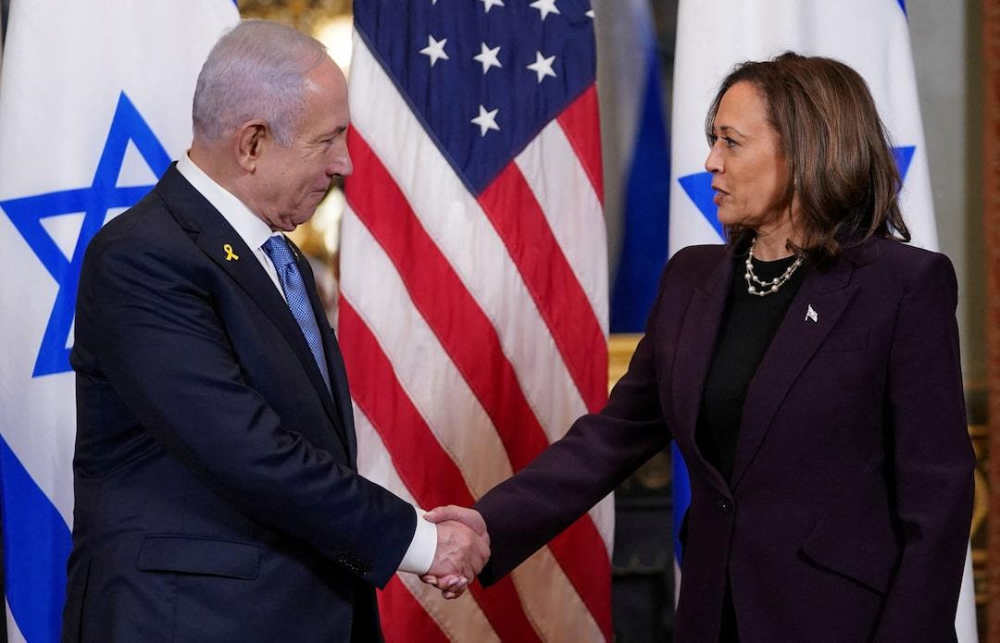

## Claim
Claim: "On July 22, 2024, Vice President Kamala Harris said, 'Our support for Israel will continue' amid Israeli Prime Minister Benjamin Netanyahu’s visit to the United States."

## Actions
```
web_search("Kamala Harris Israel support July 22 2024")
```

## Evidence
### Evidence from `web_search`
On July 22, 2024, the website boughtbyzionism.org published an article discussing Vice President Kamala Harris's support for Israel, mentioning her endorsement by the Jewish Democratic Coalition of America on the same day. The article includes an image of protestors holding signs against Harris's support for Israel .

A Reuters article from July 21, 2024, discusses Kamala Harris's foreign policy, stating her support for Israel has been as strong as Biden's, while also noting she has, at times, been more critical of Israel's military approach . A USA TODAY article published on July 23, 2024, discusses Harris's statements on the Israel-Gaza conflict, including her call for a cease-fire in Gaza in March and her concerns about the humanitarian situation. The article also mentions Harris's involvement in Biden's calls with Israeli Prime Minister Benjamin Netanyahu.
*   [https://www.boughtbyzionism.org/vpharriscomplicit](https://www.boughtbyzionism.org/vpharriscomplicit)
*   [https://www.reuters.com/world/us/tougher-tone-israel-steady-nato-how-harris-foreign-policy-could-look-2024-07-21/](https://www.reuters.com/world/us/tougher-tone-israel-steady-nato-how-harris-foreign-policy-could-look-2024-07-21/)
*   [https://www.usatoday.com/story/news/politics/elections/2024/07/22/kamala-harris-gaza-israel-hamas-policy/74499016007/](https://www.usatoday.com/story/news/politics/elections/2024/07/22/kamala-harris-gaza-israel-hamas-policy/74499016007/)


## Elaboration
The evidence suggests that on July 22, 2024, Kamala Harris's support for Israel was a topic of discussion. The website boughtbyzionism.org published an article on that day discussing her support for Israel. A Reuters article from July 21, 2024, also mentions her support for Israel. However, the provided evidence does not explicitly state whether Harris made the specific statement "Our support for Israel will continue" on July 22, 2024, or if it was made amid Israeli Prime Minister Benjamin Netanyahu’s visit to the United States.

Therefore, the claim cannot be fully verified with the available information.


## Actions
```
web_search("Kamala Harris Netanyahu visit July 2024 Israel support")
```

## Evidence
### Evidence from `web_search`
On July 25, 2024, Kamala Harris met with Israeli Prime Minister Benjamin Netanyahu in Washington, D.C., according to reports from the New Jersey Monitor, CNN, and Reuters. The New Jersey Monitor article mentions Harris expressing concern about the human suffering in Gaza and her support for a two-state solution. The CNN article highlights Harris's "unwavering support for Israel" and her remarks following the meeting. Reuters reports that Harris pressured Netanyahu to help reach a Gaza ceasefire deal, stating, "It is time for this war to end."   

*   [https://newjerseymonitor.com/2024/07/25/vp-harris-meets-with-netanyahu-to-discuss-israel-hamas-war-in-gaza/](https://newjerseymonitor.com/2024/07/25/vp-harris-meets-with-netanyahu-to-discuss-israel-hamas-war-in-gaza/)
*   [https://www.cnn.com/2024/07/25/politics/kamala-harris-israel-policy](https://www.cnn.com/2024/07/25/politics/kamala-harris-israel-policy)
*   [https://www.reuters.com/world/us/biden-harris-meet-netanyahu-separately-gaza-ceasefire-2024-07-25/](https://www.reuters.com/world/us/biden-harris-meet-netanyahu-separately-gaza-ceasefire-2024-07-25/)


## Elaboration
The evidence indicates that Kamala Harris met with Benjamin Netanyahu on July 25, 2024, and expressed "unwavering support for Israel." However, the evidence does not confirm whether Harris made the specific statement "Our support for Israel will continue" on July 22, 2024, or at any other time.


## Actions
```
web_search("Kamala Harris statement Israel support July 22 2024")
```

## Evidence
### Evidence from `web_search`
An NPR article from August 23, 2024, discusses Kamala Harris's stance on the Israel-Hamas war, mentioning her meeting with Benjamin Netanyahu on July 25, 2024, and her "unwavering commitment to Israel." The article includes a quote from Harris: "Let me be clear, I will always stand up for Israel's right to defend itself and I will always ensure Israel has the ability to defend itself." ,  An Al-Monitor article published on July 23, 2024, discusses Harris's statements on the Israel-Gaza war and includes an image of Harris on July 22, 2024 .

*   [https://www.npr.org/2024/08/23/g-s1-19232/kamala-harris-israel-gaza-dnc](https://www.npr.org/2024/08/23/g-s1-19232/kamala-harris-israel-gaza-dnc)
*   [https://www.al-monitor.com/originals/2024/07/what-kamala-harris-has-said-israel-gaza-war](https://www.al-monitor.com/originals/2024/07/what-kamala-harris-has-said-israel-gaza-war)


## Elaboration
The evidence provides an Al-Monitor article that includes an image of Kamala Harris on July 22, 2024. However, the evidence does not contain the specific statement "Our support for Israel will continue" from that date. The NPR article from August 23, 2024, quotes Harris saying, "Let me be clear, I will always stand up for Israel's right to defend itself and I will always ensure Israel has the ability to defend itself." This statement, while related to support for Israel, is not the same as the one in the claim.

Therefore, the claim remains unverified.


## Final Judgement
The available evidence does not confirm that Kamala Harris made the specific statement "Our support for Israel will continue" on July 22, 2024, amid Israeli Prime Minister Benjamin Netanyahu’s visit to the United States. While there is evidence of her support for Israel and her meeting with Netanyahu, the exact quote is not found in the provided sources.

`not enough information`


### Verdict: NEI

### Justification
The claim cannot be verified. While Kamala Harris expressed support for Israel, including during a meeting with Benjamin Netanyahu, the specific statement "Our support for Israel will continue" on July 22, 2024, is not found in the provided sources. The search results show her support for Israel, as reported by [Reuters](https://www.reuters.com/world/us/tougher-tone-israel-steady-nato-how-harris-foreign-policy-could-look-2024-07-21/) and [CNN](https://www.cnn.com/2024/07/25/politics/kamala-harris-israel-policy), but not the exact quote.
