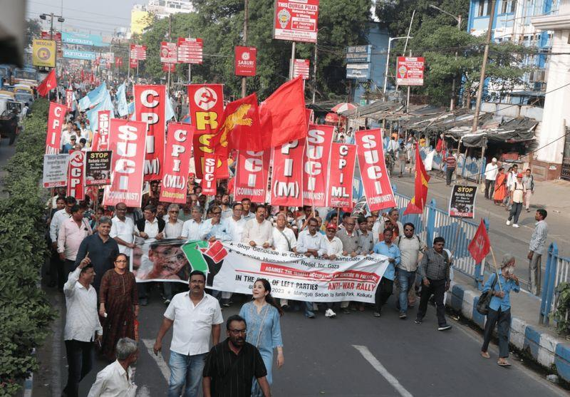
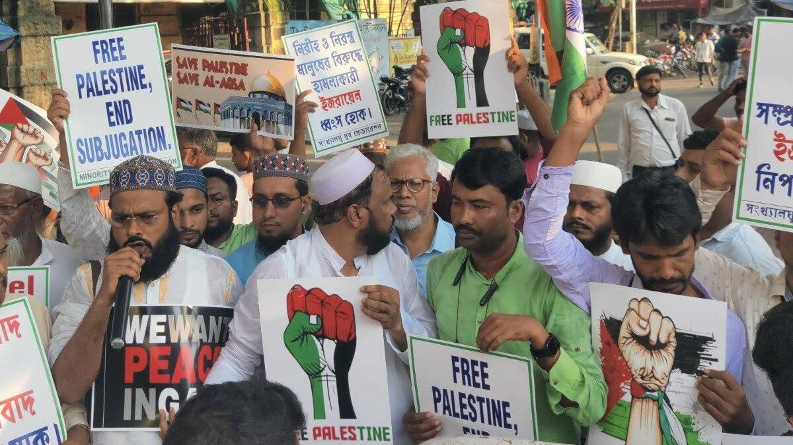
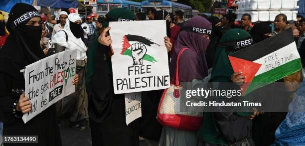

## Claim
Claim: " This image shows thousands gathering at Sohrawardi Park in Kolkata, India, in April 2025 to show solidarity with the Palestinian people amid the ongoing Israeli assault on Gaza."

## Actions
```
geolocate()
reverse_search()
image_search("protest Kolkata India Palestine")
```

## Evidence
### Evidence from `geolocate`
The most likely countries where the image was taken are: {'Bangladesh': 0.88, 'Pakistan': 0.07, 'India': 0.02, 'Palestine': 0.02, 'Albania': 0.0, 'Andorra': 0.0, 'Argentina': 0.0, 'Australia': 0.0, 'Austria': 0.0, 'Belgium': 0.0}

### Evidence from `image_search`
The Wire published an article about a march in Kolkata against the "genocide in Palestine" in 2023, organized by left parties. ([https://thewire.in/rights/genocide-in-palestine-left-parties-march-in-kolkata-question-indian-govts-stand](https://thewire.in/rights/genocide-in-palestine-left-parties-march-in-kolkata-question-indian-govts-stand)) India Today also reported on protestors marching in Kolkata in support of Palestine. ([https://www.indiatoday.in/cities/kolkata/story/protestors-in-kolkata-march-in-support-of-palestine-2448209-2023-10-12](https://www.indiatoday.in/cities/kolkata/story/protestors-in-kolkata-march-in-support-of-palestine-2448209-2023-10-12))

Getty Images has images of a pro-Palestine protest in Kolkata, India. ([https://www.gettyimages.com/editorial-images/news/event/pro-palestine-protest-in-kolkata/776058436](https://www.gettyimages.com/editorial-images/news/event/pro-palestine-protest-in-kolkata/776058436)) , , and  are included in the search results.


## Elaboration
The evidence suggests that the image is likely from a protest in Kolkata, India, as indicated by the `geolocate` results and confirmed by the image search results. The image search results also show that there were pro-Palestine protests in Kolkata. However, the exact location within Kolkata and the date (April 2025) mentioned in the claim are not confirmed by the evidence.

Therefore, the claim is partially supported. The location and the cause of the protest are likely correct, but the specific location (Sohrawardi Park) and the date (April 2025) are not verified.


## Final Judgement
The image is likely from a pro-Palestine protest in Kolkata, India. However, the claim's specific details about the location (Sohrawardi Park) and the date (April 2025) are not confirmed by the evidence. Therefore, the claim is `misleading`.

### Verdict: MISLEADING

### Justification
The image likely depicts a pro-Palestine protest in Kolkata, India, as supported by the `geolocate` results and image search results, which found reports of similar protests in Kolkata ([https://thewire.in/rights/genocide-in-palestine-left-parties-march-in-kolkata-question-indian-govts-stand](https://thewire.in/rights/genocide-in-palestine-left-parties-march-in-kolkata-question-indian-govts-stand), [https://www.indiatoday.in/cities/kolkata/story/protestors-in-kolkata-march-in-support-of-palestine-2448209-2023-10-12](https://www.indiatoday.in/cities/kolkata/story/protestors-in-kolkata-march-in-support-of-palestine-2448209-2023-10-12)). However, the claim's specific details about the location (Sohrawardi Park) and the date (April 2025) are not confirmed.
