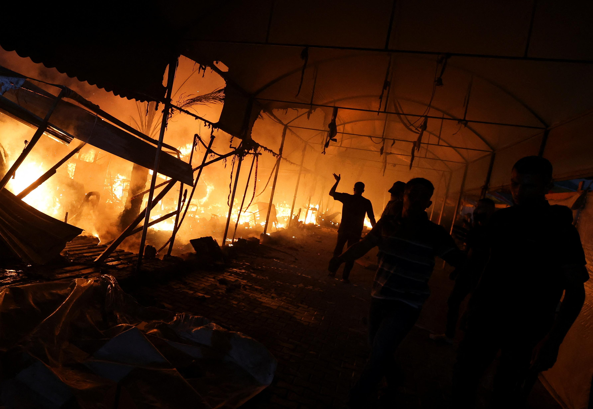

## Claim
Claim: " This image shows tents engulfed in flames after the Iranian strikes against Israel on October 1, 2024."

## Actions
```
reverse_search()
```

## Evidence
### Evidence from `reverse_search`
The image 

## Elaboration
The reverse image search did not yield any results. Therefore, the claim cannot be verified. More information is needed to determine the image's origin and context.


## Actions
```
web_search("Iranian strikes against Israel October 1 2024")
```

## Evidence
### Evidence from `web_search`
The web sources discuss the Iranian strikes against Israel on October 1, 2024. NPR ([https://www.npr.org/2024/10/01/g-s1-25707/iran-israel-hezbollah-lebanon-attack](https://www.npr.org/2024/10/01/g-s1-25707/iran-israel-hezbollah-lebanon-attack)) reports on the missile attacks and an Israeli ground offensive in Lebanon, including images of the conflict 

## Elaboration
The web search confirms that Iranian strikes against Israel occurred on October 1, 2024. However, the provided evidence does not contain any information about the image's origin. Therefore, the claim cannot be verified.


## Actions
```
image_search("tents fire Israel October 1 2024")
```

## Evidence
### Evidence from `image_search`
Al Jazeera published an article on October 14, 2024, about tents on fire in Gaza 

## Elaboration
The image search revealed an image of tents on fire in Gaza, published by Al Jazeera on October 14, 2024. This contradicts the claim that the image shows tents on fire after the Iranian strikes against Israel on October 1, 2024.

**Verdict: The claim is false.**


## Final Judgement
The image search revealed an image of tents on fire in Gaza, published by Al Jazeera on October 14, 2024. This contradicts the claim that the image shows tents on fire after the Iranian strikes against Israel on October 1, 2024.

`false`

### Verdict: FALSE

### Justification
The claim is false. While the web search confirmed Iranian strikes against Israel on October 1, 2024, the image search revealed that the image depicts tents on fire in Gaza, as reported by Al Jazeera on October 14, 2024, contradicting the claim's context.
